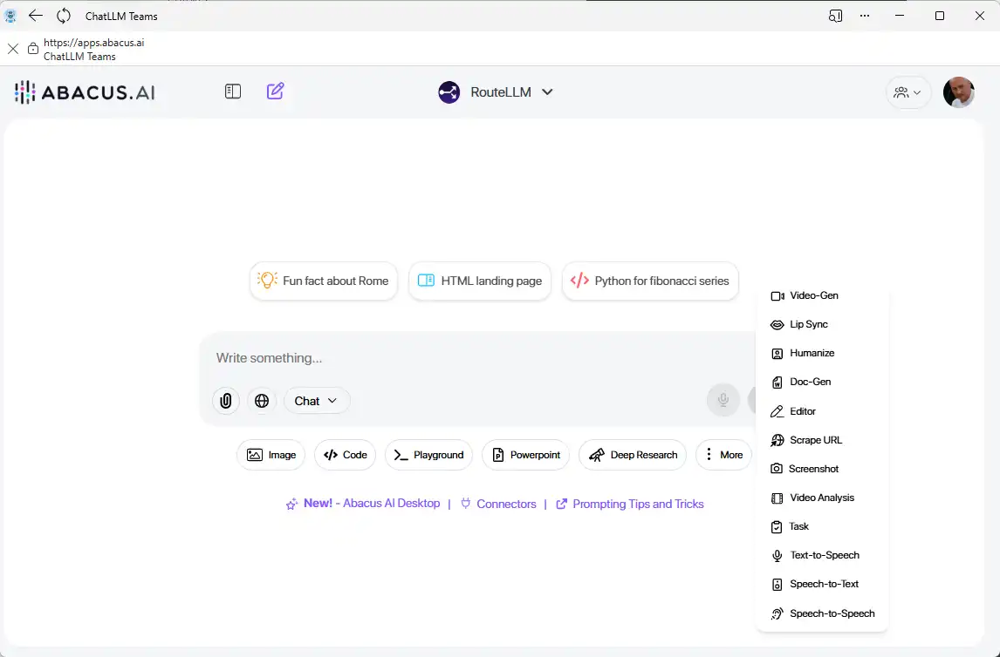
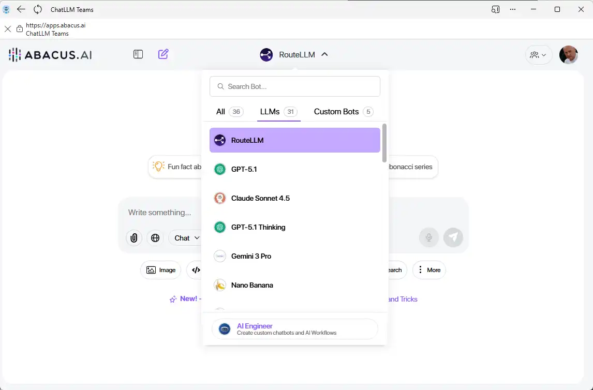
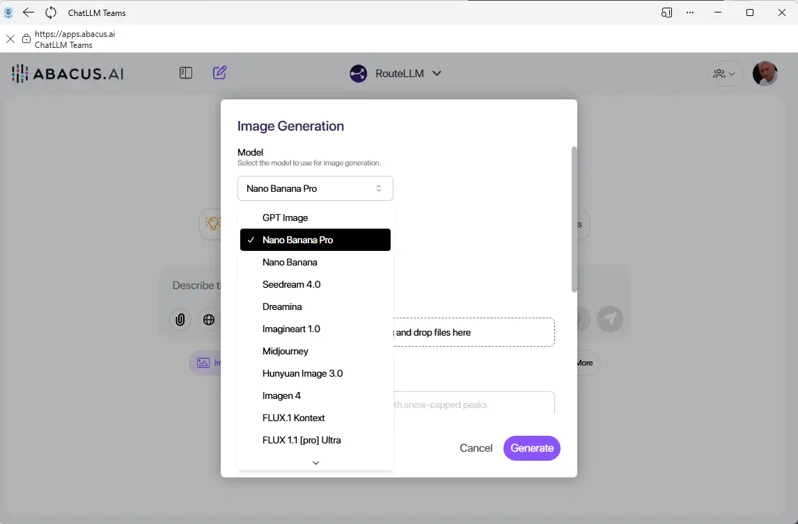
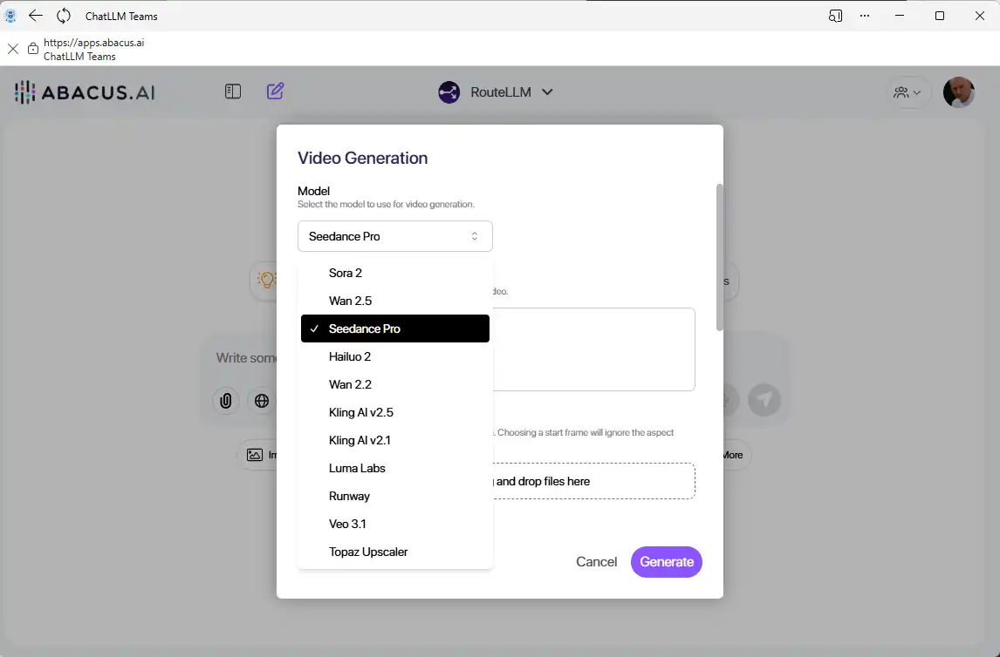
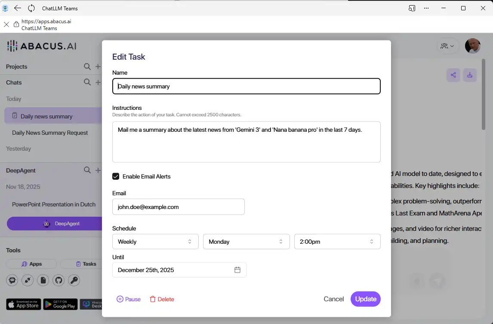
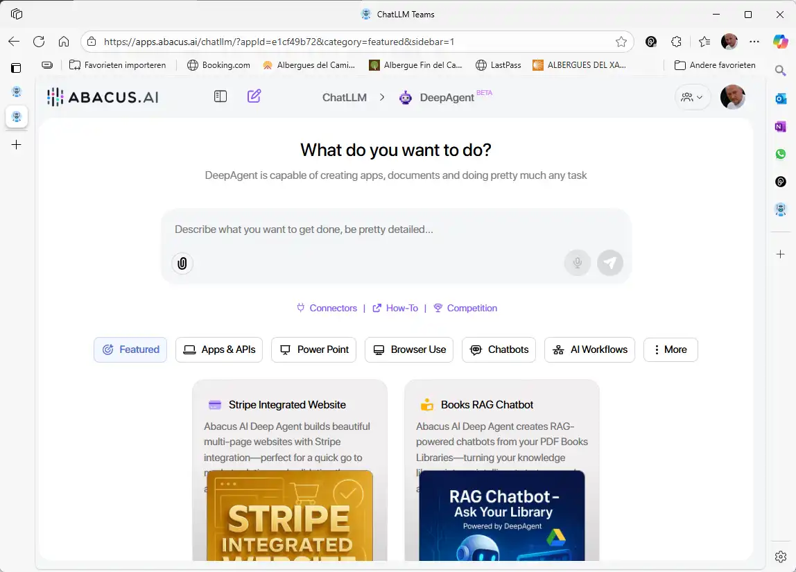
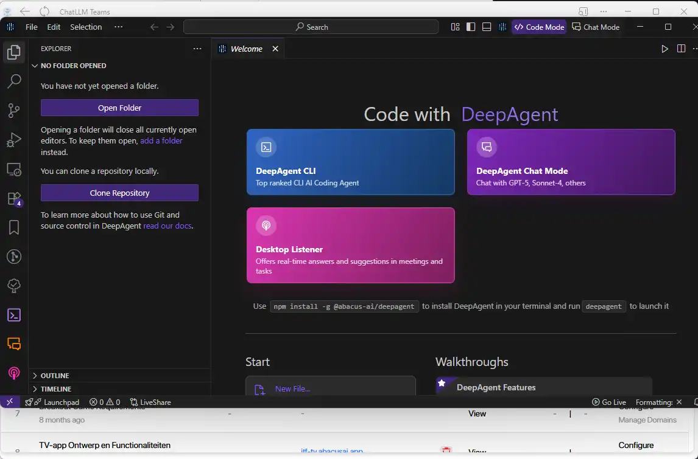

### Abacus.AI (ChatLLM)

**Developer**: Abacus.AI

**Description**: Abacus.AI (via its ChatLLM platform) acts as a "Unified Intelligence Hub." Instead of choosing just one
AI provider, Abacus gives you access to all the top-tier models in a single dashboard. It is designed for users who want
the flexibility to switch between the best minds in AI without managing multiple accounts.

**Key Features**:

- **Multi-Model Access**: Use OpenAI's GPT-4o, Anthropic's Claude 3.5, Google's Gemini, and Meta's Llama all from one
  screen.
- **Comparison Mode**: Run the exact same prompt on two different AI models side-by-side to see which one gives the
  better answer.
- **Unified Subscription**: A single monthly fee covers access to all underlying models, often costing less than a
  single subscription elsewhere.
- **Deep Research Agents**: Specialized AI agents that can browse the web and perform complex research tasks.
- **Team Dashboards**: Allows teams to share prompts, chat histories, and files securely.

**Best For**: Power users who want every model, teams looking to consolidate costs, and users who need to compare AI
outputs.

🔗 [Visit Abacus.AI](https://abacus.ai/)  
🔗 [Create an account](https://chatllm.abacus.ai/WrZczXnKpV) (Referrer link)

#### Abacus Subscription vs. Others

One of the main draws of Abacus.AI is the "bundled" approach. Here is how it compares to buying subscriptions
individually:

| Feature              | Abacus.AI (ChatLLM)               | Standard (ChatGPT + Claude + Gemini)              |
|:---------------------|:----------------------------------|:--------------------------------------------------|
| **Model Access**     | **All Major Models** in one place | **Single Family** (Only OpenAI OR Only Anthropic) |
| **Estimated Cost**   | $10 or $20 / month total          | ~$20 / month **per service**                      |
| **Login Experience** | One password, one interface       | Three different apps and passwords                |
| **Flexibility**      | Switch models mid-conversation    | Must copy-paste text between different websites   |

## What's Included

Abacus.AI goes beyond simple text chatting. It functions as a complete generative AI workspace, replacing the need for
multiple separate subscriptions. Here is a breakdown of the powerful tools included in your account.

### Specialized Tools Dashboard

Instead of trying to do everything inside a chat window, Abacus provides dedicated interfaces for specific workflows.
Whether you need to generate code, analyze a PDF, or humanize AI-written emails to sound more natural, there is a
specific tool designed to do that job efficiently.

### extensive Chat Models

The platform integrates over 30 **frontier models**, including the latest versions of Google Gemini, Anthropic Claude,
and OpenAI GPT.

* **Why this matters**: Different models are good at different things. You might use Claude for writing a report, but
  switch to GPT-5 for math or logic within the same conversation. You are never locked into just one "brain."

### Image Generation Studio

Access a library of 15+ top-tier image generation models, including **Flux** and **NanoBanana**.

* **Context**: You don't need a separate Midjourney or DALL-E subscription. You can generate photorealistic images,
  logos, or artistic illustrations directly here, switching between models to see which artistic style you prefer.

### Video Generation Suite

Create video content using 10+ leading video models like **Sora**, **Luma**, **Kling**, and **Seedance**.

* **Context**: This allows you to turn text prompts or static images into short video clips. It is ideal for creating
  social media content, marketing assets, or visualizing concepts without needing a camera crew.

### Custom Background Agents

You can create custom "Agents" that work for you even when you are asleep.

* **How it works**: You can set these agents to run periodically (e.g., every morning at 8 AM). For example, you could
  create an agent that searches the web for news about your industry and emails you a summary every day.

### Deep Agent (Autonomous AI)

The Deep Agent is a general-purpose assistant capable of multi-step reasoning.

* **Context**: Unlike a standard chatbot that just gives advice, the Deep Agent can perform actions. It can browse the
  web, analyze data, and execute complex instructions to solve problems that require research and planning.

### Abacus AI Desktop App

This downloadable application extends the power of AI to your computer desktop.

1. **For Everyone**: It includes a **Listener tool** that can join your video calls (Zoom, Teams, etc.), transcribe the
   audio, and generate perfect meeting notes automatically.
2. **For Developers**: It functions as an **IDE (Integrated Development Environment)**, helping programmers write,
   debug, and fix code faster.

