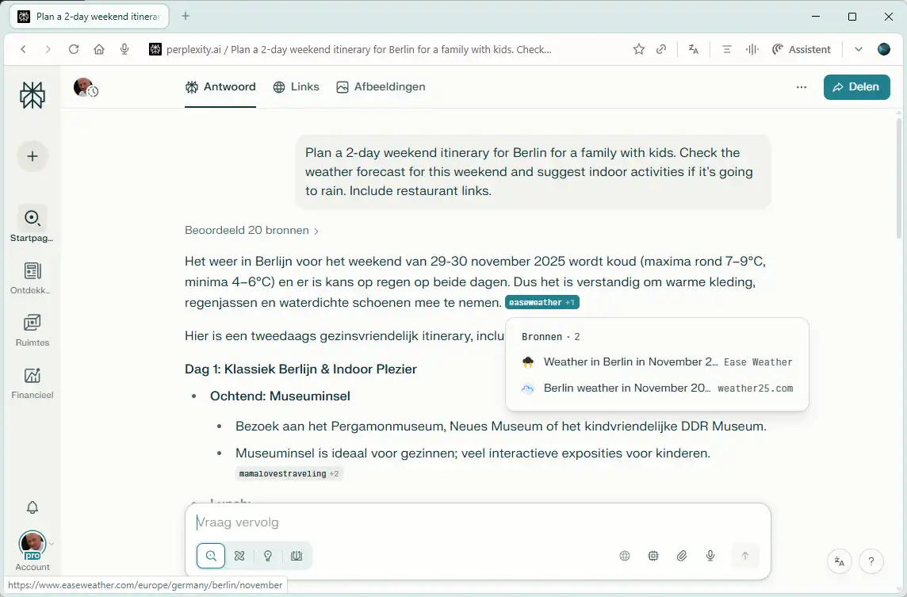
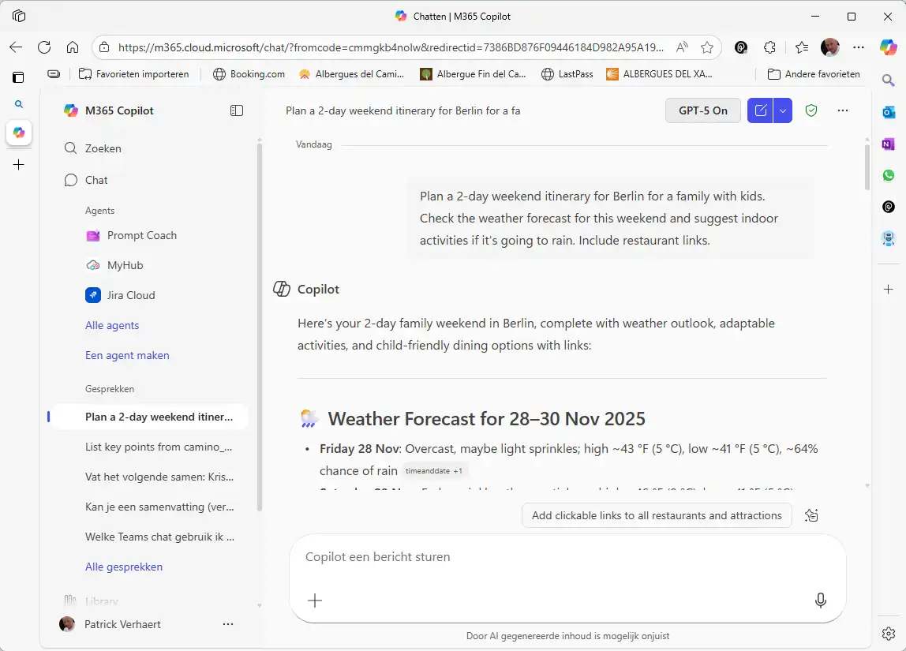
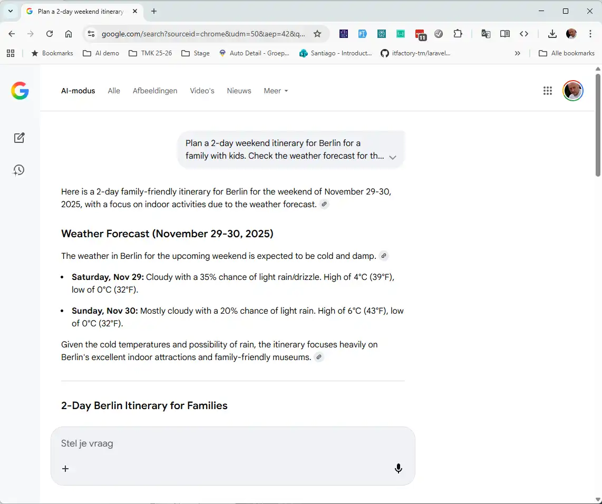

# Popular AI Browsers

Explore the leading AI-powered web browsers that are transforming how we navigate the internet. Each browser offers unique ways to search, summarize, and interact with the web.

The browser landscape is shifting from simple viewing tools to intelligent assistants. This guide covers the most innovative and user-friendly AI browsers available today.

## Choosing the Right Browser

Consider these factors when selecting an AI browser:

1.  **Primary Use Case**: Do you browse for research, entertainment, or work productivity?
2.  **Summarization Needs**: Do you frequently need long articles or videos summarized?
3.  **Privacy**: How is your browsing data used to train the AI?
4.  **Ecosystem**: Does it sync with your phone, email, or existing office apps?
5.  **Ad Blocking**: Built-in capabilities to remove distractions.
6.  **Interface**: Do you prefer a traditional look or a completely new way of organizing tabs?

## Leading AI Browsers

### ChatGPT Atlas (OpenAI)

**Developer**: OpenAI

**Description**: ChatGPT Atlas represents OpenAI's direct integration of intelligence into web browsing. Unlike traditional search engines that give you a list of links, Atlas browses the web for you, reading multiple sources to construct a single, comprehensive answer with direct citations.

**Key Features**:

- **Live Web Analysis**: Reads current websites in real-time to answer time-sensitive questions.
- **Direct Answers**: Bypasses the "ten blue links" search results to give you the answer immediately.
- **Visual Context**: Integrates images, maps, and charts directly into browsing results.
- **Source Transparency**: Clearly cites where information came from, allowing for easy fact-checking.
- **Ad-Free Experience**: Delivers information without the clutter of sponsored search results.

**Best For**: Quick answers, planning trips, market research without clicking through ads

🔗 [Visit ChatGPT Atlas](https://openai.com/index/introducing-chatgpt-atlas/) (macOS only)

### Perplexity Comet

**Developer**: Perplexity

**Description**: Perplexity Comet is a research-first browsing experience. It functions as an "Answer Engine," combining the depth of a library with the speed of a search engine. It is designed for users who value accuracy, citations, and deep dives into complex topics.

**Key Features**:

- **Pro Search**: Multi-step reasoning to answer complex questions by visiting multiple pages.
- **Focus Modes**: Narrow your search to academic papers, Reddit, YouTube, or the open web.
- **Page Summarization**: Instantly summarize the specific webpage you are currently viewing.
- **File Analysis**: Upload PDFs or images directly into the browser for analysis.
- **Curated Discover**: A news feed tailored to your interests, summarized by AI.

**Best For**: Academic research, fact-checking, deep dives, students and professionals

🔗 [Visit Perplexity Comet](https://www.perplexity.ai)  
🔗 [Free Por Version for Education](https://www.perplexity.ai/referrals/VL896BLE) (referral link)

### Microsoft Edge (Copilot)

**Developer**: Microsoft

**Description**: Microsoft Edge integrates Copilot directly into the sidebar, making it one of the most productive browsers for enterprise users. It seamlessly connects with Microsoft 365, allowing you to draft emails, summarize PDFs, and generate images without leaving your current tab.

**Key Features**:

- **Copilot Sidebar**: Chat with AI alongside any webpage to ask questions about the content.
- **Video Summarization**: Generates highlights and timestamps for YouTube videos.
- **Document Interaction**: Opens and summarizes PDFs directly within the browser window.
- **Compose Mode**: Helps draft emails, blog posts, or comments in various tones.
- **Enterprise Security**: Protects corporate data while using AI features.

**Best For**: Corporate environments, Office 365 users, heavy productivity workflows

🔗 [Visit Edge](https://www.microsoft.com/edge)

---

### Chrome (Google)

**Developer**: Google

**Description**: The world's most popular browser now integrates the Gemini model to enhance everyday browsing. Chrome focuses on subtle, helpful AI features that run smoothly in the background to assist with writing, organizing, and searching.

**Key Features**:

- **Help Me Write**: Right-click any text box on the web to have AI draft or refine your text.
- **Smart Tab Organizer**: Automatically groups similar tabs together based on content.
- **Gemini Nano**: Runs efficient AI models directly on your device for speed and privacy.
- **Lens Integration**: Circle anything on your screen to search for it immediately.
- **History Search**: Search your browsing history using natural language questions (e.g., "What was that shoe store I looked at last week?").

**Best For**: General users, Google ecosystem integration, seamless day-to-day assistance

🔗 [Visit Chrome](https://www.google.com/chrome)

## Comparison Table

| Browser              | Developer           | Key AI Feature      | Summary Style | Best For                             |
| -------------------- | ------------------- | ------------------- | ------------- | ------------------------------------ |
| **ChatGPT Atlas**    | OpenAI              | Live Web Analysis   | Direct Answer | Quick answers, ad-free browsing      |
| **Perplexity Comet** | Perplexity          | Citation-Based      | Academic/Deep | Research, verification, deep dives   |
| **Microsoft Edge**   | Microsoft           | Copilot Sidebar     | Sidebar Chat  | Enterprise work, Office 365 users    |
| **Chrome**           | Google              | "Help Me Write"     | Context Menu  | General browsing, Google suite users |

## Try It Yourself: Practical Exercises

Ready to see these browsers in action? Try these simple exercises to experience the difference between standard searching and AI browsing.

### 1. The "Trip Planner"
**Goal**: See how AI pulls live data to create a plan without you clicking ten different links.

::: tip Prompt
Plan a 2-day weekend itinerary for [Your City] for a family with kids. Check the weather forecast for this weekend and suggest indoor activities if it's going to rain. Include restaurant links.
:::

### 2. The "Fact Checker"
**Goal**: Experience a search that proves its work with citations.
::: tip Prompt
What are the scientifically proven benefits of standing desks versus sitting? Please cite recent medical studies.
:::

### 3. The "Instant Expert"
**Goal**: Use the "Browse for Me" feature to create a custom webpage.

::: tip Prompt
How to propagate a succulent plant
:::

### 4. The "Video Summarizer"
**Goal**: Save time watching long videos.
::: tip Prompt
Generate a bullet-point summary of this video and list the key takeaways.
:::

### 5. The "Polite Refusal"
**Goal**: Use AI to handle awkward social writing.
::: tip Prompt
Write a polite decline to a wedding invitation because I will be out of the country for work.
:::