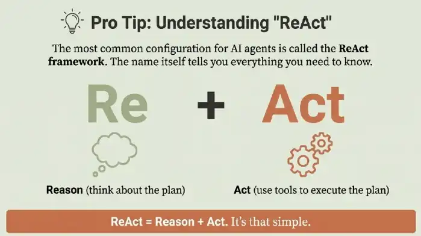

# From GenAI to AI Agents

| Feature         | Generative AI     | AI Workflow           | AI Agent              |
|:----------------|:------------------|:----------------------|:----------------------|
| **Human Input** | A specific prompt | A pre-defined process | A high-level goal     |
| **Role of AI**  | Responds to input | Follows fixed steps   | Makes decisions       |
| **Key Ability** | Generate & edit   | Execute a sequence    | Reason, act & iterate |

::: tip
All of these materials below were generated with [NotebookLM](https://notebooklm.google.com),
based on the YouTube video [“AI Agents, Clearly Explained”](https://www.youtube.com/watch?v=FwOTs4UxQS4).
:::

## Video Overview

  <iframe 
    style="position: absolute; top: 0; left: 0; width: 100%; height: 100%;" 
    src="https://www.youtube.com/embed/qLSbu0gFBRc" 
    title="YouTube video player" 
    frameborder="0" 
    allow="accelerometer; autoplay; clipboard-write; encrypted-media; gyroscope; picture-in-picture; web-share" 
    allowfullscreen>
  </iframe>

## Infographic

## Podcast

<Mp3 url="genai_aiagents.mp3" />

## Slide Presentation

