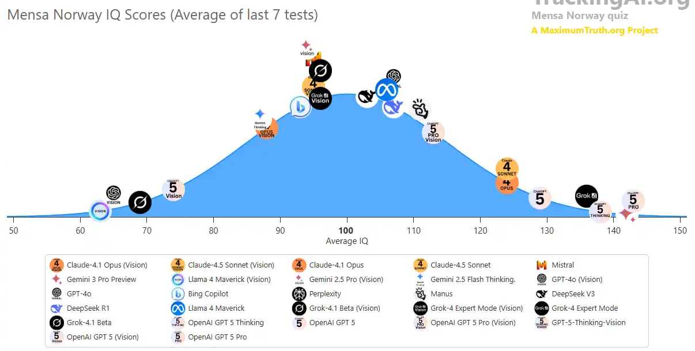
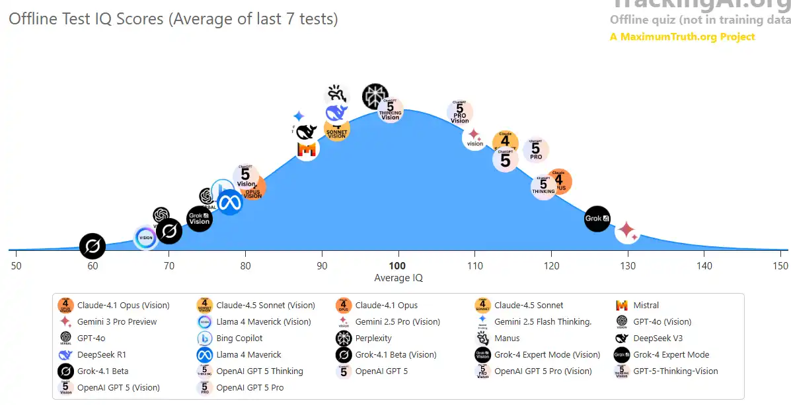

# 🧠 AI IQ Test: Are They Smarter Than Us?

When we ask "is AI smarter than a human?", the website **[TrackingAI.org](https://www.trackingai.org/home)** attempts to
answer this using standard IQ methodologies.

However, if you look at the charts, you will see two very different scores for the same AI. Understanding the difference
between the **Mensa Norway** score and the **Offline Test** score is critical to understanding how AI actually learns.

## The Two Tests: Public vs. Private

To verify if an AI is actually smart or just has a good memory, TrackingAI administers two different types of tests:

### 1. The "Mensa Norway" Score (Public)

* **What it is:** This is a famous, publicly available online IQ test used by humans.
* **The Results:** Top AI models (like GPT-4o, o1, and Claude 3.5) often score **extremely high** (120-140+ IQ), which
  is in the "Gifted" or "Genius" range.
* **The Catch:** Because this test is public and on the internet, the answers are likely included in the AI's **Training
  Data**.
* **Analogy:** Imagine taking a history test, but you were allowed to read the answer key the night before. You would
  get an A+, but it doesn't prove you are a historian; it proves you have a good memory.

### 2. The "Offline Test" Score (Private)

* **What it is:** This is a proprietary set of IQ puzzles created specifically for TrackingAI. These questions have *
  *never been published on the public internet**.
* **The Results:** On this test, the same AI models usually score **lower** (often 100-115 IQ), placing them in the "
  Average" to "High Average" human range.
* **Why it matters:** Since the AI has never seen these specific puzzles before, it cannot rely on memory. It must use *
  *actual reasoning** to solve them. This score is considered the "True IQ" of the model.

## The "Memorization Gap"

The difference between these two scores reveals how much the AI is "hallucinating intelligence" versus actually
thinking.

| AI Model (Example) | Mensa Norway Score | Offline Test Score | Diagnosis                                                                                        |
|:-------------------|:-------------------|:-------------------|:-------------------------------------------------------------------------------------------------|
| **Model A**        | 142 (Genius)       | 118 (High Average) | **High Memorization.** The AI has likely seen the test answers online.                           |
| **Model B**        | 120 (Superior)     | 118 (High Average) | **High Reasoning.** The scores are consistent, meaning the AI is genuinely solving the problems. |

::: tip The Takeaway:
If you want to know how smart an AI really is, **always look at the "Offline" score.**
:::

## Visual vs. Verbal IQ

Another interesting quirk you will see on TrackingAI is the difference between **Vision** and **Verbal** scores.

* **Verbal Mode:** The AI is given a text description of the puzzle (e.g., *"A grid where the square moves
  clockwise..."*).
* **Vision Mode:** The AI is shown the actual image of the puzzle.

Currently, AIs are much smarter when they **read** about the puzzle than when they **look** at it.

* **Text-only models** (like OpenAI's o1) have scored as high as **120+ IQ** on the Offline test when the puzzle is
  described in text.
* **Vision models** often struggle to "see" the pattern correctly, sometimes dropping their score significantly.
