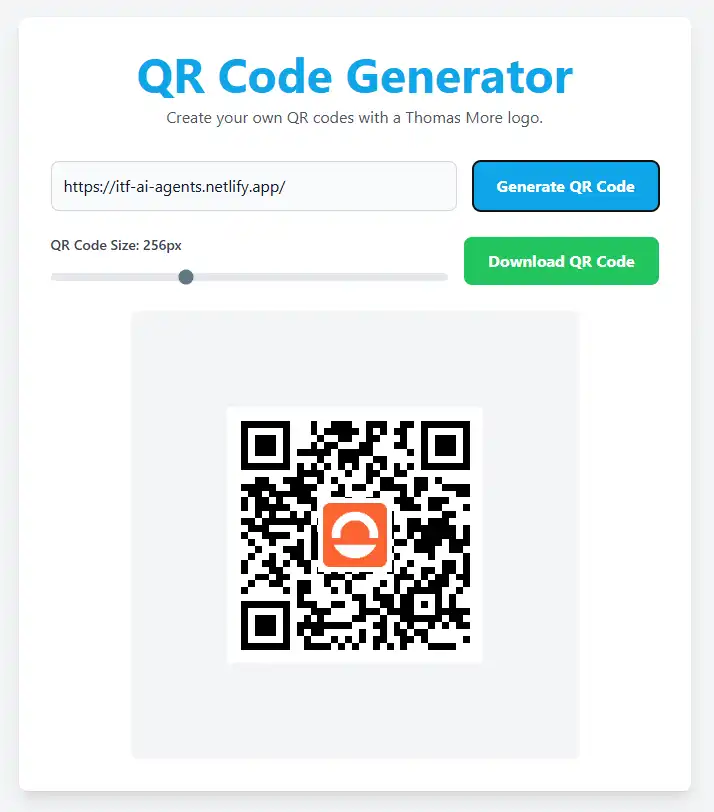
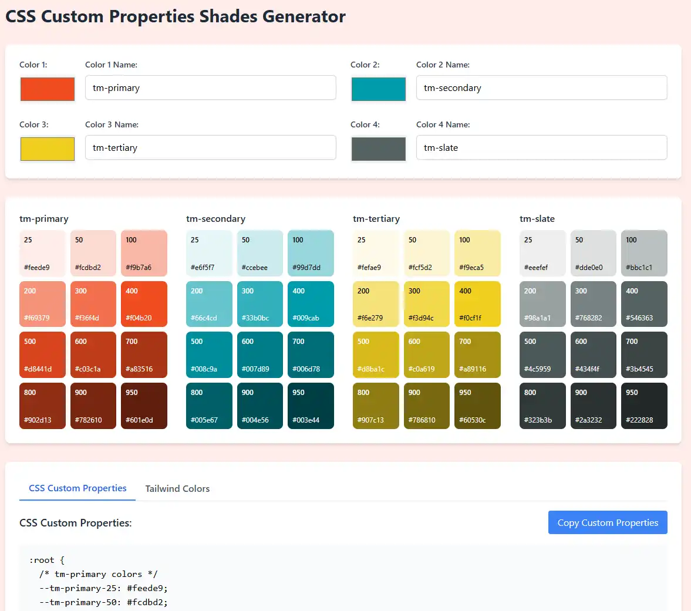
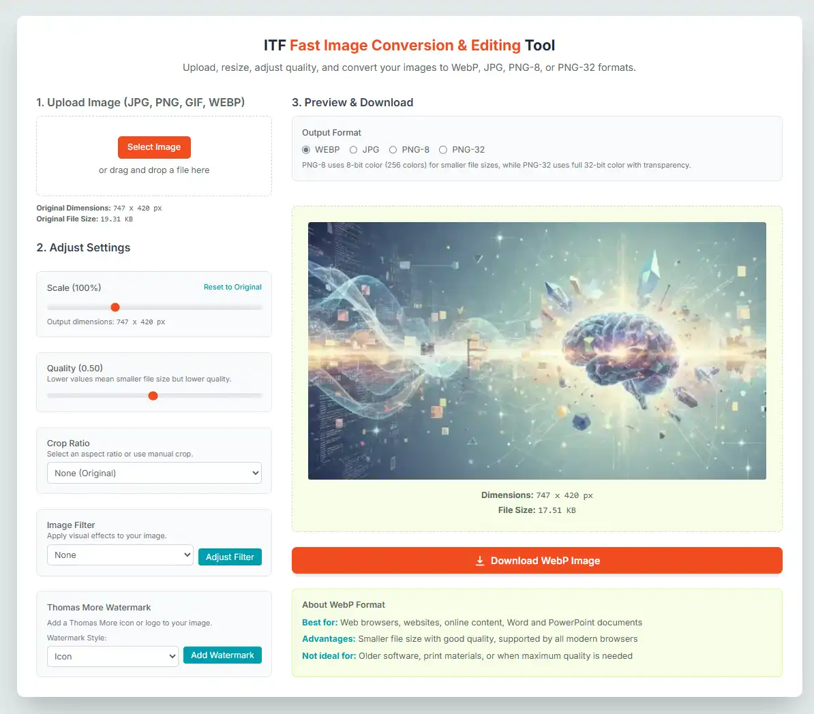
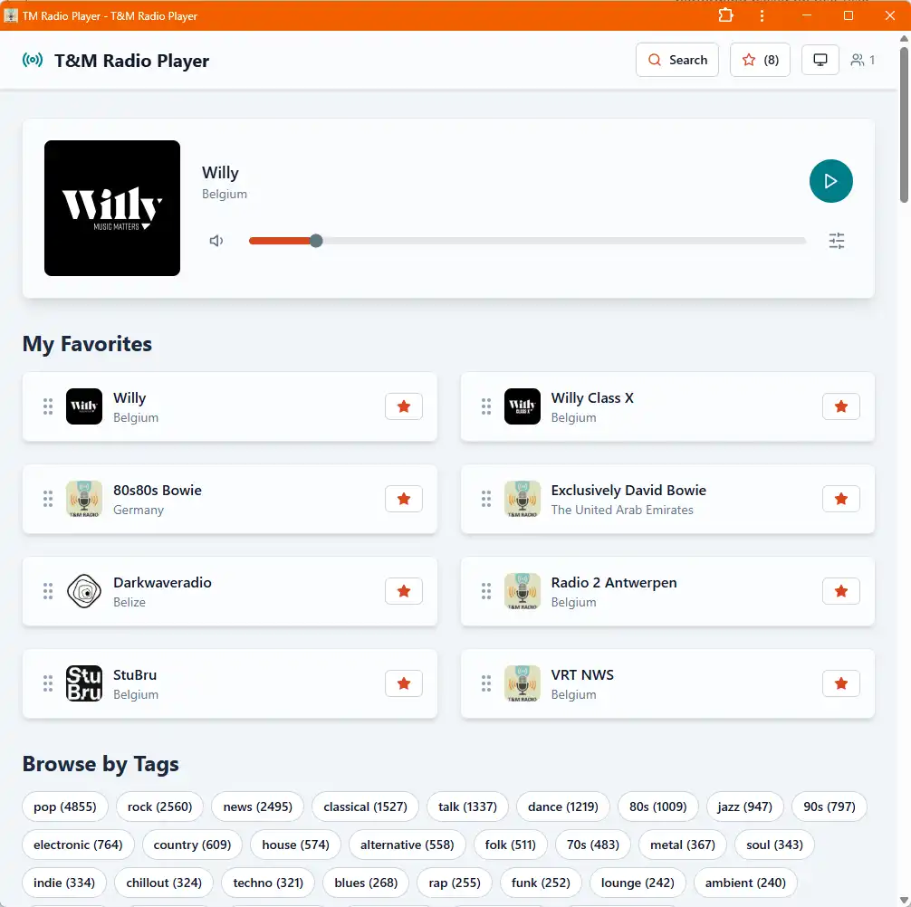
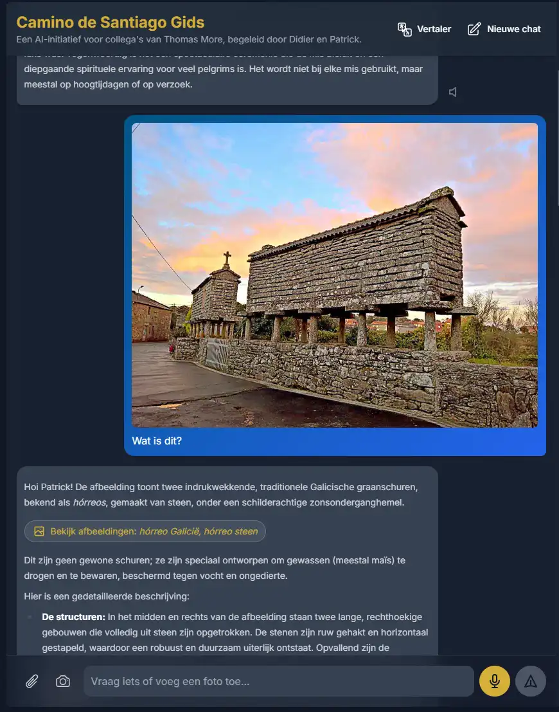

# Google AI Studio

If Gemini is the "iPhone" (simple, polished), AI Studio is the "Workshop." It is a playground designed for developers
and power users who want to access the raw brain of Google's models without the "personality" or restrictions of the
standard chat app.

## The Power User's Sandbox

**Developer**: Google DeepMind

**Description**: Google AI Studio is a web-based prototyping environment. It gives you free access to Google's most
powerful models (like Gemini 1.5 Pro) with a massive context window. It allows you to give "System Instructions" to
control exactly how the AI behaves, making it perfect for processing huge amounts of data or testing complex prompts.

**Key Features**:

- **Massive Context Window**: Process up to **2 million tokens** at once (equivalent to hours of video or thousands of
  pages of text).
- **System Instructions**: Define a permanent role for the AI (e.g., "You are a strict code reviewer" or "You are a
  Spanish translator").
- **Multimodal Inputs**: Drag and drop entire video files or large PDFs for analysis.
- **Free Access**: Generous free tier for testing and personal use.

**Best For**: Processing very large documents, analyzing video files, testing prompts, and users who want "raw" AI
output.

🔗 [Visit AI Studio](https://aistudio.google.com)

## Advanced Features

### 1. Gemini Live (Realtime Streaming)

AI Studio includes a "Sci-Fi" mode called **Gemini Live**. This allows you to connect your microphone and camera to the
model for a continuous, real-time conversation.

* **How it works**: Unlike a standard chat where you type and wait, this is an open channel. You can interrupt the AI,
  show it objects on your camera, and have a fluid voice conversation with almost zero delay.
* **Use Case**: Test how an AI performs as a live translator or a visual assistant for the blind.
* 🔗 [Try Gemini Live](https://aistudio.google.com/live)

### 2. The App Builder

AI Studio is not just for chatting; it is for **building**. Once you figure out the perfect instructions to make the AI
do what you want (e.g., "A bot that writes polite rejection emails"), you can save that setup as an **App**.

* **Save & Share**: You can save your prompts as reusable "Apps" in your library.
* **Get the Code**: With one click, AI Studio will write the programming code (JavaScript) needed to put
  your specific AI bot onto your own website or software.
* 🔗 [View Your Apps](https://aistudio.google.com/apps)

## What You Can Do (Use Cases)

### 1. The "Video Analyst"

**Scenario**: You have a 1-hour recording of a Zoom meeting or a lecture.

* **Action**: Upload the entire video file directly to AI Studio.
* **Prompt**: "Extract all the deadlines mentioned in this video and list who is responsible for each task."
* **Result**: The AI "watches" the video in seconds and produces a perfect textual summary.

### 2. The "Book Critic"

**Scenario**: You want to analyze a 500-page PDF document or an entire codebase.

* **Action**: Upload the massive file (which would be too big for ChatGPT).
* **Prompt**: "Summarize chapter 4 and explain how it contradicts chapter 10."
* **Result**: Thanks to the 2-million token window, it holds the entire book in its memory at once.

### 3. The "Bot Builder"

**Scenario**: You want to create a bot that *only* speaks in JSON format for a programming project.

* **Action**: Set the **System Instruction** to: "You are a data formatter. Output only valid JSON. Do not speak to the
  user."
* **Result**: The AI obeys strictly, removing all "Here is your answer" filler text. You can then click **"Get Code"**
  to use this in your app.

## Build with AI Studio

Some of my apps I build with AI Studio:

### QR Code Generator

Create QR codes with a Thomas More Logo on it.

🔗 [Visit website](https://tm-qrcode.netlify.app/)

### CSS Custom Properties Shades Generator

Generate CSS properties for my webdesign courses.

🔗 [Visit website](https://css-shades.netlify.app/)

### Fast Image Conversion &amp; Editing Tool

Generate CSS properties for my webdesign courses.

🔗 [Visit website](https://itf-webp.netlify.app/)

### Internet Radio

A radio app build around online radio stations.

🔗 [Visit website](https://tm-radio.netlify.app/)

### Camino App

An AI-driven app for our Camino trip with our colleges. Includes: a specialised chatbot, text-to-speech, speech-to-text, 
web-search and geolocation tools.

