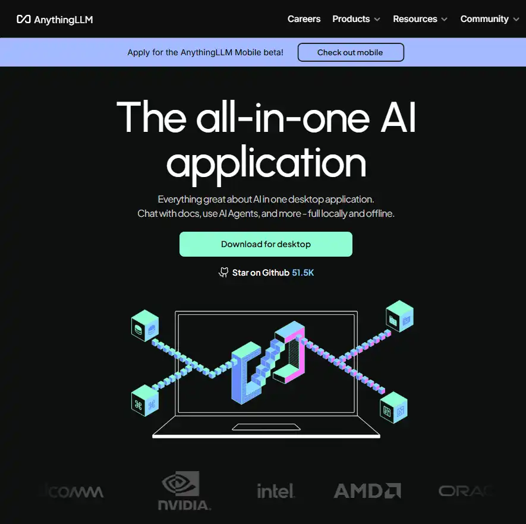
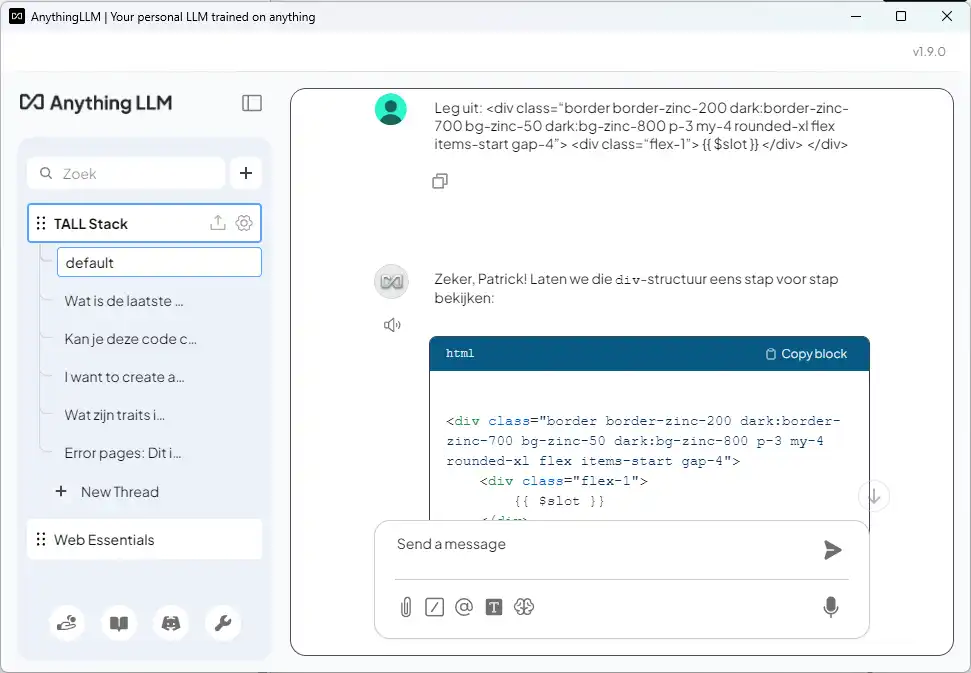

# Local & Private AI: AnythingLLM

While tools like ChatGPT are powerful, they run in the cloud and don't "know" your private data. **AnythingLLM** is a
desktop application that bridges this gap. It allows you to run a powerful AI completely offline (or connected to the
cloud) and "train" it on your specific documents, websites, or course materials.

## The "All-in-One" Workspace

**Developer**: Mintplex Labs Inc.

**Description**: AnythingLLM is not just a model; it is a **full-stack application** that turns your computer into a
private AI server. It combines an attractive chat interface, a database to store your documents, and connections to
various AI models (like local Llama models or OpenAI) into one easy-to-install package.

**Key Features**:

- **Chat with Your Data (RAG)**: Upload PDFs, Word docs, or scrape websites, and the AI will answer questions based
  *only* on that info.
- **Privacy First**: Can run 100% offline using built-in local models. Your data never leaves your device.
- **Model Agnostic**: You choose the brain. Connect it to GPT-4o for power, or use a free local model (via Ollama) for
  privacy.
- **Custom Workspaces**: Create separate chat rooms for different topics (e.g., "Biology Course," "Personal Taxes," "
  Coding Project").
- **Built-in Web Scraper**: Point it at a website URL, and it will learn the content of that site instantly.

**Best For**: Privacy-conscious users, companies with sensitive data, and building custom "Knowledge Bases" without
coding.

🔗 [Visit AnythingLLM](https://anythingllm.com)

## The AI Workflow: RAG (Retrieval-Augmented Generation)

AnythingLLM is the perfect example of an **[AI Workflow](https://itf-ai-agents.netlify.app/introduction/)**.

In a standard workflow, you ask a question, and the AI relies on its general training (which might be outdated). In the
AnythingLLM workflow, the process changes:

1. **Ingestion**: You give the tool a "Knowledge Base" (e.g., a documentation website).
2. **Retrieval**: When you ask a question, the system searches your specific data first.
3. **Generation**: It sends your data + your question to the AI to generate an accurate answer.

### Real-World Example: The Laravel Course Bot

To see this workflow in action, look at the 
**[Laravel 12 Course Chat](https://itf-laravel-12.netlify.app/config/chat)**.

In this scenario, a standard AI might not know the specific configurations for the latest version of Laravel. By using a
tool like AnythingLLM, the instructor created a workflow where:

1. The AI scraped the specific course pages.
2. The student asks: *"Explain this code snippet for me: ..."*
3. The AI answers using **only** the context from the course files, ensuring the student doesn't get generic or
   incorrect advice from the open internet.

## Try It Yourself: Build Your Own Expert

You don't need to be a developer to build your own version of the Laravel Chatbot. Follow these steps to turn
AnythingLLM into an expert on a topic of your choice.

### 1. The "Personal Librarian" Setup

**Goal**: Create a chatbot that knows the contents of a website (e.g., a documentation site or a blog) better than you
do.

* **Action**: Download and install [AnythingLLM Desktop](https://anythingllm.com/desktop).
* **Setup**:
    * Open the app and create a new Workspace named **"Course Helper"**.
    * In the settings, choose the built-in **Llama 3** (or similar) model so it runs locally on your machine.

### 2. The Training Phase

* **Action**: Click the "Upload" or "Data" button.
* **Input**: Instead of uploading a file, click the **Link** icon. Paste the URL of a documentation page (e.g.,
  `https://itf-laravel-12.netlify.app` or any Wikipedia article).
* **Process**: Click "Fetch" and then "Move to Workspace." AnythingLLM is now reading and "vectorizing" that website (
  converting text into math that the AI understands).

### 3. The Test

* **Prompt**: Ask a specific question found on that website.
    * *Example:* "What are the prerequisites listed on this site?"
* **What to watch for**:
    * **Citations**: The AI should answer and provide a citation/link back to the exact part of the website it read.
    * **Accuracy**: Unlike ChatGPT, which might guess, this bot is "grounded" in the data you gave it. If the info isn't
      on the site, it will tell you it doesn't know.