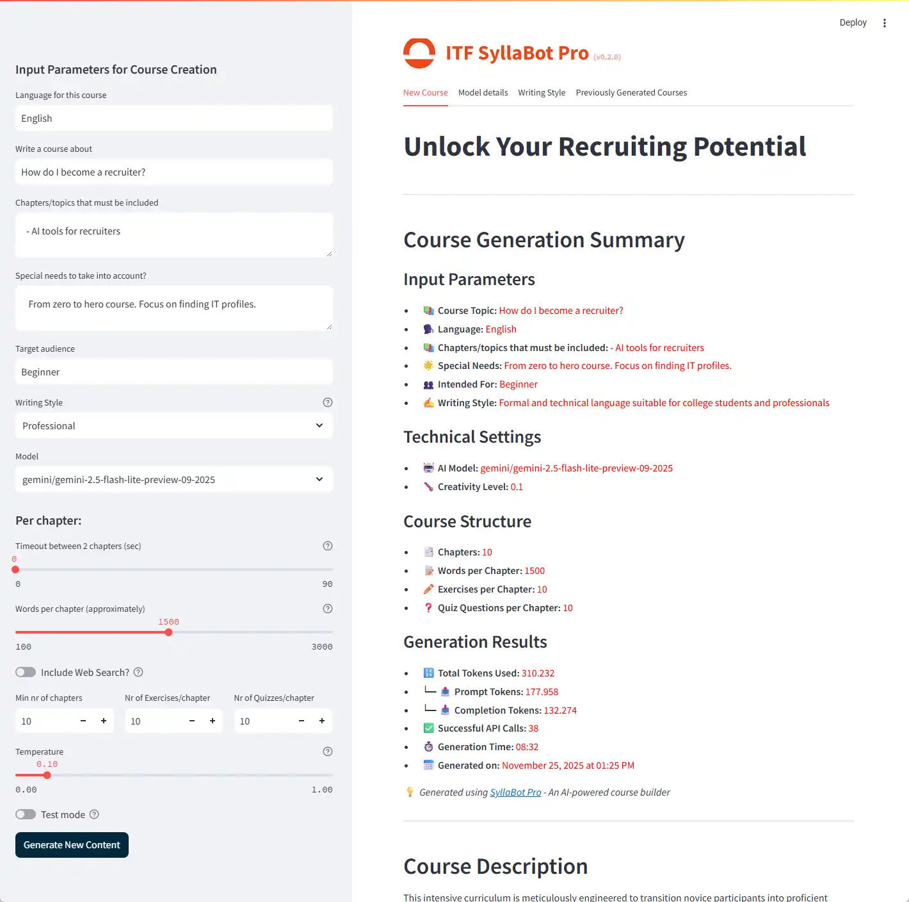

# Custom AI Agents (CrewAI)

Most people use AI by typing one prompt at a time into ChatGPT. But what if you could hire a whole team of experts—a
Researcher, a Writer, and a Reviewer—and have them work together automatically?

This is the power of **CrewAI**, the engine behind **SyllaBot Pro**. Instead of one general AI trying to do everything,
we define specialized "Agents" with specific personalities and jobs.

🔗 [View the Project on GitHub](https://github.com/pverhaert/syllabot-pro)

## The Anatomy of an Agent

In the `syllabot-pro` project, agents are not defined by complex code, but by simple configuration files. To create a
custom agent, you just need to give it a **Brain** (Agent) and a **Job** (Task).

### 1. The Brain (`agents.yaml`)

This file defines *who* the AI is. By giving it a specific name, role, and backstory, we stop it from sounding like a
generic robot and force it to act like a human expert.

Here is the actual configuration for the **Content Creator** agent used in SyllaBot:

```yaml
content_creator:
  role: >
    Educational Content Strategist
  goal: >
    Create engaging and comprehensive educational content for the chapter: "{chapter_title}"
    on a course about: {course}.
  backstory: >
    Meet Dr. Sarah Chen, a seasoned educational content strategist with 12 years of experience.
    With a Ph.D. in Educational Technology and specialized expertise in "{course}", she
    has a talent for breaking down complex concepts into digestible, engaging content.
    Her approach combines storytelling with data-driven insights.
```

**Why this works:**

* **Role**: Tells the LLM it is not an "Assistant" but a "Strategist."
* **Backstory**: By naming her "Dr. Sarah Chen," the AI adopts a more professional, academic, yet accessible tone.
* **Variables**: The `{course}` tags allow this single agent to switch from being a "Python expert" to a 
"History expert" instantly.

### 2. The Job Description (`tasks.yaml`)

Once we have an agent, we need to tell them exactly *what* to do. This is the **Task**. It is not just a simple prompt;
it is a detailed set of instructions, rules, and formatting requirements.

Here is how the **Content Task** is defined:

```yaml
content_task:
  description: >
    - Develop a comprehensive and detailed chapter for a course about "{course}".
    - Limit the chapter to: {chapter_title} : {chapter_topics}
    - Choose the best method (code, formulas, mermaid version 10.8 diagrams) appropriate to the topic.
    - When using Mermaid diagrams, follow these strict rules:
      * ALWAYS wrap Mermaid code in a proper markdown code block
      * Each statement MUST be on a new line
  expected_output: >
    "main_title": "The main title for this chapter",
    "topics": {
        "sub_title": "The subtitle",
        "content": "A full, detailed explanation..."
    }
  agent: content_creator
```

**Key Elements:**

* **Strict Rules**: Notice the specific instructions about "Mermaid version 10.8" and "new lines." This prevents common
  AI errors before they happen.
* **Expected Output**: We force the AI to reply in a structured format (JSON/YAML) so the software can easily assemble
  the final book.
* **Assignment**: The line `agent: content_creator` connects this job to "Dr. Sarah Chen."

## How SyllaBot Orchestrates Crews

In the `syllabot-pro/crews` folder, you will see multiple subfolders. This is because the project is split into
different "Crews" (teams), each focusing on one part of the pipeline:

1. **Outline Crew**: Reads the topic and plans the table of contents.
2. **Chapter Crew**: (Dr. Sarah Chen) Writes the actual text for each chapter.
3. **Quiz Crew**: reads the chapter and creates valid multiple-choice questions.
4. **Exercises Crew**: Generates exercises based on the content.

The main application (`main.py`) acts as the manager. It passes the output from the Outline Crew to the Chapter Crew,
ensuring the writer follows the plan exactly.

## Examples

Below are examples of full courses generated by these agents.

### How do I become a recruiter?



- Read the full course in [Markdown format](./custom/recruiter.md)
- Download the course in [Word format](/become_a_recruiter.docx) or [PDF](/become_a_recruiter.pdf)

### Maaltafels oefenen (Dutch)

- Read the full course in [Markdown format](./custom/maaltafels.md)
- Download the course in [Word format](/maaltafels.docx) or [PDF](/maaltafels.pdf)