# Unlock Your Recruiting Potential
___
## Course Generation Summary

### Input Parameters
- 📚 **Course Topic:** <span style='color: red'>How do I become a recruiter?</span>
- 🗣️ **Language:** <span style='color: red'>English</span>
- 📚️ **Chapters/topics that must be included:** <span style='color: red'>- AI tools for recruiters</span>
- 🌟 **Special Needs:** <span style='color: red'> From zero to hero course. Focus on finding IT profiles.</span>
- 👥 **Intended For:** <span style='color: red'>Beginner</span>
- ✍️ **Writing Style:** <span style='color: red'>Formal and technical language suitable for college students and professionals</span>

### Technical Settings
- 🤖 **AI Model:** <span style='color: red'>gemini/gemini-2.5-flash-lite-preview-09-2025</span>
- 🌡️ **Creativity Level:** <span style='color: red'>0.1</span>

### Course Structure
- 📑 **Chapters:** <span style='color: red'>10</span>
- 📝 **Words per Chapter:** <span style='color: red'>1500</span>
- ✏️ **Exercises per Chapter:** <span style='color: red'>10</span>
- ❓ **Quiz Questions per Chapter:** <span style='color: red'>10</span>

### Generation Results
- 🔢 **Total Tokens Used:** <span style='color: red'>310.232</span>
- └─ 📤 **Prompt Tokens:** <span style='color: red'>177.958</span>
- └─ 📥 **Completion Tokens:** <span style='color: red'>132.274</span>
- ✅ **Successful API Calls:** <span style='color: red'>38</span>
- ⏱️ **Generation Time:** <span style='color: red'>08:32</span>
- 📅 **Generated on:** <span style='color: red'>November 25, 2025 at 01:25 PM</span>

💡 *Generated using [SyllaBot Pro](https://github.com/pverhaert/syllabot-pro) - An AI-powered course builder*

___

## Course Description

This intensive curriculum is meticulously engineered to transition novice participants into proficient technical recruiters, specializing in the acquisition of Information Technology talent. It establishes a robust theoretical foundation in human capital acquisition methodologies before progressing systematically into advanced sourcing techniques, technological integration, and strategic talent pipeline management.

Learners will navigate the complexities of the modern recruitment ecosystem, emphasizing ethical practices, data-driven decision-making, and the effective utilization of contemporary recruitment technologies, including artificial intelligence platforms. The structure is designed to foster comprehensive skill development, ensuring graduates possess the requisite competencies to excel in high-demand IT recruitment roles.

## Outline

### Chapter 1: Foundations of Talent Acquisition and the Recruiter Role

- Defining the Strategic Role of Recruitment in Organizational Success
- Distinction Between Internal, Agency, and Freelance Recruitment Models
- Core Competencies Required for Entry-Level Recruitment Professionals
- Understanding the Talent Acquisition Lifecycle from Requisition to Onboarding

### Chapter 2: Navigating the Information Technology Talent Ecosystem

- Deconstructing Common IT Job Families (e.g., Software Development, DevOps, Cybersecurity)
- Glossary of Essential Technical Terminology for Non-Technical Recruiters
- Mapping Skill Sets to Specific Technology Stacks (e.g., Java vs. Python ecosystems)
- Analyzing Current Market Demand and Supply Dynamics for Niche IT Roles

### Chapter 3: Advanced Sourcing Methodologies and Boolean Logic Mastery

- Principles of Proactive Candidate Identification versus Reactive Posting
- Constructing Complex Boolean Search Strings for Precision Targeting
- Leveraging Professional Networking Platforms for Passive Candidate Engagement
- Strategies for Effective Cold Outreach and Initial Contact Cadence Development

### Chapter 4: Applicant Tracking Systems (ATS) and Candidate Relationship Management (CRM)

- Functional Overview and Selection Criteria for Enterprise-Grade ATS Platforms
- Data Integrity and Compliance within Applicant Tracking Databases
- Implementing CRM Strategies for Long-Term Talent Pipelining
- Workflow Automation within Recruitment Software Interfaces

### Chapter 5: Structured Interviewing and Technical Screening Protocols

- Designing Competency-Based Interview Guides Aligned with Job Descriptions
- Techniques for Assessing Soft Skills and Cultural Alignment in Technical Hires
- Introduction to Behavioral Interviewing Frameworks (e.g., STAR Method)
- Establishing Effective Feedback Loops Between Recruiters and Hiring Managers

### Chapter 6: Legal Compliance, Diversity, Equity, and Inclusion (DEI) in Hiring

- Overview of Global and Regional Employment Law Pertinent to Candidate Screening
- Mitigating Unconscious Bias in Job Descriptions and Candidate Evaluation
- Implementing Inclusive Sourcing Strategies to Broaden Candidate Pools
- Data Privacy Regulations (e.g., GDPR) in Candidate Data Handling

### Chapter 7: Compensation Benchmarking, Negotiation, and Offer Management

- Methodologies for Validating Market Rate Compensation for IT Professionals
- Structuring Competitive Total Rewards Packages Beyond Base Salary
- Tactical Approaches to Salary Negotiation and Counter-Offer Management
- Formalizing the Offer Extension Process and Managing Candidate Expectations

### Chapter 8: AI Tools and Automation for Modern Recruiters

- Categorization of Recruitment Technology: Sourcing, Screening, and Scheduling Automation
- Evaluating AI-Powered Resume Parsing and Candidate Matching Algorithms
- Ethical Considerations and Limitations of Machine Learning in Talent Selection
- Utilizing Chatbots for Candidate Engagement and FAQ Resolution

### Chapter 9: Personal Branding and Professional Network Cultivation

- Developing a Credible Professional Persona Across Digital Platforms
- Strategies for Building and Maintaining a Robust Professional Network
- Effective Utilization of Social Media for Employer Branding Initiatives
- Transitioning from Transactional Recruiting to Consultative Partnership

### Chapter 10: Recruitment Analytics and Performance Optimization

- Key Performance Indicators (KPIs) in Recruitment: Time-to-Fill and Quality-of-Hire
- Analyzing Funnel Conversion Rates to Identify Bottlenecks
- Data Visualization Techniques for Reporting Recruitment Efficacy to Stakeholders
- Implementing Continuous Process Improvement Cycles Based on Performance Metrics

## Additional Resources

- [SHRM Talent Acquisition Body of Competency and Knowledge](https://www.shrm.org/topics-and-tools/talent-acquisition/tools-and-templates/pages/default.aspx):
  Official resource detailing the core competencies required for strategic talent management professionals.
- [Boolean Search Guide for Recruiters](https://booleansearchguide.com/):
  A technical reference for constructing advanced search strings across various platforms.
- [HackerRank Technical Skills Assessment Documentation](https://www.hackerrank.com/resources/technical-skills-assessment-guide):
  Documentation providing insight into how technical skills are objectively evaluated in IT roles.

## Learning Outcomes

Upon successful completion of this curriculum, participants will possess the foundational and intermediate proficiencies necessary to operate effectively as an entry-level technical recruiter. They will be capable of dissecting complex IT job specifications and translating them into actionable sourcing strategies utilizing advanced Boolean logic.

Furthermore, learners will demonstrate competence in navigating and managing data within contemporary Applicant Tracking Systems and Candidate Relationship Management platforms, ensuring regulatory adherence. The course culminates in the ability to conduct structured, bias-mitigated interviews, negotiate competitive compensation packages for specialized IT roles, and leverage emerging AI technologies to enhance recruitment efficiency and data-driven decision-making.

## Course Content

### Chapter 1: Foundations of Talent Acquisition and the Recruiter Role


#### Defining the Strategic Role of Recruitment in Organizational Success

##### The Evolution from Personnel Administration to Strategic Talent Acquisition

For the aspiring recruitment professional, it is paramount to understand that the contemporary function of hiring has transcended its historical roots in administrative personnel management. Today, recruitment is formally recognized as **Talent Acquisition (TA)**, a strategic imperative directly linked to achieving organizational objectives. In the context of high-stakes, specialized fields, such as Information Technology (IT), the recruiter acts as a crucial business partner, not merely an order-taker.

##### Talent Acquisition as a Competitive Differentiator

In today's hyper-competitive global marketplace, an organization's primary sustainable advantage often resides in its human capital. The ability to consistently attract, assess, and secure top-tier talent—particularly in domains characterized by acute skill shortages, such as Cybersecurity Analysts or Senior Cloud Architects—determines market leadership. Therefore, TA is fundamentally about **workforce planning** and **risk mitigation**.

**Strategic Alignment:** A strategic recruiter must possess the acumen to translate the organization's long-term business strategy into actionable talent requirements. For instance, if a technology firm announces a pivot toward developing proprietary Artificial Intelligence (AI) solutions, the TA function must proactively build pipelines for Machine Learning Engineers and Data Scientists well before the immediate need materializes. This proactive approach contrasts sharply with reactive hiring, which often results in delays and compromises in quality.

**Impact on Organizational Performance Metrics:** The efficacy of the TA function directly influences several key performance indicators (KPIs):

1.  **Quality of Hire (QoH):** This metric assesses the long-term value new hires bring to the organization. A strategic TA function ensures that candidates not only possess the requisite technical proficiencies but also demonstrate alignment with the organizational culture and future growth trajectory.
2.  **Time-to-Productivity:** For technical roles, the time elapsed before a new engineer contributes meaningfully to projects is critical. Effective sourcing and rigorous technical screening, managed by the recruiter, minimize this lag.
3.  **Employee Retention:** Poor hiring decisions are a leading cause of attrition. By employing robust assessment methodologies, recruiters safeguard the investment made in onboarding and training.

##### The Recruiter as a Business Consultant

Entry-level professionals must adopt a consultative mindset. This involves understanding the financial implications of hiring delays and the cost associated with underqualified personnel. When engaging with a Hiring Manager (HM) requesting a new role, the strategic recruiter challenges the requirements, ensuring the job description accurately reflects market realities and genuine organizational needs. For example, if an HM demands a candidate with ten years of experience in a technology that has only existed for seven years, the recruiter must diplomatically guide the HM toward a realistic, market-validated specification, thereby preventing the creation of an unfillable requisition.

In essence, the strategic role of recruitment is to ensure the organization possesses the right human capabilities, in the right roles, at the right time, to execute its mission successfully.


#### Distinction Between Internal, Agency, and Freelance Recruitment Models

##### Categorization of Talent Acquisition Channels

Organizations utilize various models to fulfill their staffing needs. Understanding the structural differences, cost implications, and operational mandates of these models is fundamental for any aspiring recruiter. These primary models are categorized as Internal (In-house), Agency (External Contingent or Retained), and Freelance (Independent Contractors).

##### 1. Internal Recruitment Model (In-house TA Team)

This model involves a dedicated team of recruiters employed directly by the organization. These individuals are salaried employees whose sole focus is sourcing talent for their specific employer.

*   **Advantages:** Deep institutional knowledge, strong alignment with employer brand and culture, lower cost-per-hire over the long term, and better control over the candidate experience.
*   **Disadvantages:** Limited scalability during rapid growth phases, potential for 'siloing' (lack of exposure to broader market trends), and reliance on internal networks.

##### 2. Agency Recruitment Model

Agency recruiters operate independently of the hiring organization. They are typically compensated on a contingency basis (paid only upon a successful hire) or via a retained fee structure (paid upfront for exclusive search mandates, common for executive or highly niche IT roles).

*   **Contingent Agencies:** Compete with other agencies to fill a role. They are highly motivated by speed and placement success.
*   **Retained Agencies:** Engaged for specialized, often confidential, searches. They act as an extension of the organization's executive team.

*   **Advantages:** Access to specialized sourcing expertise (especially for hard-to-fill IT roles), immediate scalability, and market intelligence gathered across multiple clients.
*   **Disadvantages:** Higher cost-per-hire (often 15% to 30% of the first-year salary), potential misalignment with company culture if the agency prioritizes speed over fit, and candidates may perceive the process as less personal.

##### 3. Freelance Recruitment Model

This model involves engaging independent recruitment consultants on a project basis or for specific sourcing tasks. This is often utilized by small to medium-sized enterprises (SMEs) or large corporations needing temporary surge capacity for specific hiring drives (e.g., launching a new development center).

*   **Advantages:** Extreme flexibility, specialized expertise on demand, and often a lower overall cost than a full-service agency.
*   **Disadvantages:** Requires strong internal management and clear Statement of Work (SOW) documentation, and the freelancer may lack the deep commitment to the long-term employer brand.

##### Illustrating the Relationship Structure

The relationship between the organization and the sourcing channel can be visualized to clarify accountability and flow:

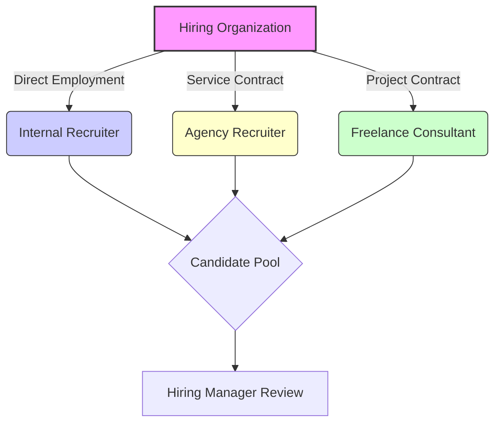

As an entry-level professional, you will likely begin within the Internal TA model, learning the organization's specific needs before potentially managing relationships with external agencies.


#### Core Competencies Required for Entry-Level Recruitment Professionals

##### Foundational Skill Matrix for Talent Acquisition Entry

Transitioning into recruitment requires developing a diverse set of competencies that blend interpersonal skills with analytical rigor. For those aspiring to specialize in IT recruitment, a baseline understanding of technology concepts is an essential accelerator. These core competencies can be segmented into three primary domains: Business Acumen, Process Management, and Interpersonal/Communication Skills.

##### 1. Business Acumen and Technical Literacy

This domain moves beyond simply reading a job description; it requires understanding *why* the role exists and its impact on the bottom line.

*   **Market Intelligence:** The ability to articulate current salary benchmarks, competitor hiring activities, and supply/demand dynamics for specific roles (e.g., knowing that the market rate for a mid-level Python Developer in a specific metropolitan area has increased by 12% year-over-year).
*   **Technical Fluency (IT Focus):** While you are not expected to code, you must speak the language of the hiring manager. This involves understanding the difference between front-end and back-end development, the function of an API, or the necessity of containerization (e.g., Docker/Kubernetes). Without this, credibility with technical hiring managers is severely compromised.
*   **Stakeholder Management:** Recognizing that the Hiring Manager is your primary client. This involves managing their expectations regarding candidate quality, timeline feasibility, and compensation parameters.

##### 2. Process Management and Data Integrity

Recruitment is a process-driven discipline. Efficiency and compliance rely heavily on structured execution.

*   **Organizational Skills:** Managing a high volume of candidates simultaneously across multiple requisitions requires meticulous organization. This includes tracking communication history, interview feedback, and compliance documentation.
*   **ATS Proficiency:** Mastery of the Applicant Tracking System (ATS) is non-negotiable. The ATS serves as the system of record for all candidate data, compliance reporting, and workflow management. Entry-level recruiters must demonstrate proficiency in data entry accuracy and workflow adherence.
*   **Compliance Awareness:** Understanding basic employment law principles related to non-discrimination and data privacy (which will be covered in depth later) is crucial even at the entry level to mitigate organizational risk.

##### 3. Interpersonal and Communication Skills

Recruiters are the organization's primary brand ambassadors.

*   **Active Listening:** The capacity to truly hear the needs of the HM and the motivations of the candidate. Misunderstanding a candidate's career aspirations leads directly to poor retention.
*   **Persuasion and Influence:** Recruiting passive candidates—those not actively looking for a job—requires sophisticated influencing skills. You must articulate the value proposition of your opportunity compellingly.
*   **Written Communication:** Crafting professional, error-free outreach emails, interview confirmations, and internal status reports. In IT recruiting, clarity in technical summaries is vital.

**Example of Technical Literacy Application:** A hiring manager requests a 'Java Developer.' A novice recruiter might only search for 'Java.' A competent recruiter, leveraging technical literacy, searches for candidates proficient in the Java Virtual Machine (JVM), Spring Boot framework, and experience with microservices architecture, significantly narrowing the search to higher-quality, relevant profiles.


#### Understanding the Talent Acquisition Lifecycle from Requisition to Onboarding

##### The End-to-End Talent Acquisition Funnel

The Talent Acquisition Lifecycle is a structured, multi-stage process that governs how an organization identifies a workforce need and successfully integrates a new employee. For beginners, visualizing this as a sequential flow helps in understanding where specific recruiter activities occur and how they impact subsequent stages. This lifecycle begins with a recognized business need and concludes only after the new hire is successfully integrated into the organizational structure.

##### Stages of the Talent Acquisition Lifecycle

The process is typically broken down into six critical phases:

1.  **Requisition Initiation and Approval:** The process starts when a Hiring Manager identifies a gap (a new role or replacement). This requires formal documentation, budget approval, and the creation of a detailed Job Description (JD), often requiring recruiter consultation to ensure market viability.
2.  **Sourcing and Attraction:** This is the proactive phase where the recruiter identifies potential candidates. For IT roles, this heavily involves database mining, professional network engagement, and targeted outreach to passive talent pools.
3.  **Screening and Assessment:** Candidates identified in the sourcing phase are vetted. This includes initial recruiter screens (behavioral/motivational fit) and technical assessments (e.g., coding challenges, technical interviews with subject matter experts).
4.  **Selection and Offer Management:** The final candidates are chosen. The recruiter manages the internal consensus building, conducts compensation benchmarking, extends the formal offer, and navigates any negotiation phases.
5.  **Pre-Boarding and Compliance:** Once the offer is accepted, the focus shifts to administrative readiness. This includes background checks, verifying employment eligibility (e.g., I-9 verification in the US), and ensuring all necessary paperwork is completed before the start date.
6.  **Onboarding and Integration:** While often managed by HR or the departmental team, the recruiter maintains a crucial touchpoint during the initial weeks to ensure a smooth transition and gather early feedback on the hiring process itself.

##### Visualizing the Lifecycle Flow

This process is cyclical; feedback from the Onboarding stage informs future Requisition Initiations, creating a continuous improvement loop. The following diagram illustrates this flow, highlighting the recruiter's primary areas of intervention:

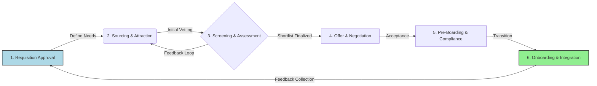

##### Critical Junctures for IT Recruitment

Within this lifecycle, two stages are particularly sensitive when recruiting technical talent:

*   **Sourcing (Stage 2):** Passive IT professionals are often difficult to reach via standard job boards. Success here depends on advanced Boolean searching and leveraging specialized platforms (like GitHub or Stack Overflow profiles).
*   **Screening (Stage 3):** The recruiter must ensure that the technical screening process is rigorous yet respectful of the candidate's time. A poorly structured technical interview can lead to high-quality candidates withdrawing immediately, demonstrating the direct link between process quality and talent retention.


---

### Chapter 2: Navigating the Information Technology Talent Ecosystem


#### Deconstructing Common IT Job Families (e.g., Software Development, DevOps, Cybersecurity)

##### Understanding Core IT Disciplines

As an aspiring IT recruiter, your foundational task is to accurately categorize and comprehend the roles you are sourcing for. The Information Technology landscape is vast, but several core job families form the backbone of most technology organizations. Understanding the primary mandate of each family allows you to translate vague job descriptions into actionable sourcing strategies.

**Software Development (Engineering):**
This family is fundamentally concerned with creating, building, and maintaining software applications. Developers translate business requirements into functional code. They are often segmented by the application layer they focus on:
*   **Front-End Developers:** Focus on the user interface (UI) and user experience (UX)—what the end-user directly interacts with (e.g., web browsers, mobile apps). Key skills involve HTML, CSS, and JavaScript frameworks (like React or Angular).
*   **Back-End Developers:** Focus on the server-side logic, databases, and application architecture that powers the application behind the scenes. Key skills involve server languages (Java, Python, Node.js) and database management.
*   **Full-Stack Developers:** Possess proficiency across both the front-end and back-end layers, capable of handling an entire feature lifecycle.

**DevOps (Development and Operations):**
DevOps is not strictly a job title but a cultural and professional movement that emphasizes collaboration between software development (Dev) and IT operations (Ops). The goal is to automate and streamline the software delivery pipeline.
*   **Core Function:** To ensure rapid, reliable, and frequent software releases.
*   **Key Responsibilities:** Implementing Continuous Integration/Continuous Delivery (CI/CD) pipelines, infrastructure as code (IaC), configuration management, and monitoring.
*   **Essential Tools:** Proficiency in tools like Jenkins, Docker, Kubernetes, and cloud platforms (AWS, Azure, GCP) is paramount for DevOps Engineers.

**Cybersecurity:**
This discipline focuses on protecting systems, networks, and data from digital threats, ensuring confidentiality, integrity, and availability (the CIA Triad). Cybersecurity roles are highly specialized and critical given the increasing threat landscape.
*   **Security Analysts:** Monitor systems for breaches, analyze security alerts, and respond to incidents.
*   **Security Architects:** Design secure infrastructure and applications from the ground up, establishing security policies and standards.
*   **Penetration Testers (Pen Testers):** Legally attempt to breach systems to identify vulnerabilities before malicious actors exploit them.

**Data Science and Analytics:**
These professionals extract knowledge and insights from structured and unstructured data. They build predictive models and statistical analyses to inform business strategy. Roles often include Data Scientists, Data Analysts, and Machine Learning Engineers.

##### Example Differentiation:
If a job description emphasizes "building scalable microservices using Terraform and ensuring 99.99% uptime," you are likely sourcing for a **DevOps Engineer**. If the description focuses on "developing responsive user interfaces using React hooks and state management," you are targeting a **Front-End Developer**. If the focus is on "implementing encryption standards and managing SIEM tools," you are seeking a **Cybersecurity Specialist**.


#### Glossary of Essential Technical Terminology for Non-Technical Recruiters

##### Bridging the Communication Gap

To effectively screen candidates and communicate with hiring managers, you must possess a working vocabulary of technical terms. This glossary provides essential starting points, categorized for easier assimilation.

| Term | Category | Definition for Recruiters |
| :--- | :--- | :--- |
| **API (Application Programming Interface)** | Development | A set of rules that allows different software applications to communicate with each other. *Recruiter Check: Does the candidate have experience building or consuming APIs?* |
| **Cloud Computing** | Infrastructure | Delivery of computing services—including servers, storage, databases, networking, software, analytics, and intelligence—over the Internet ("the cloud"). Major providers are AWS, Azure, GCP. |
| **Containerization (e.g., Docker)** | DevOps | A method of packaging an application and its dependencies so it runs reliably when moved from one computing environment to another. |
| **Kubernetes (K8s)** | DevOps | An open-source system for automating deployment, scaling, and management of containerized applications. |
| **Agile/Scrum** | Methodology | A set of principles for software development under which requirements and solutions evolve through the collaborative effort of self-organizing cross-functional teams. Scrum is a specific framework within Agile. |
| **Database (SQL/NoSQL)** | Data | A structured set of data held in a computer. SQL (Relational, structured data like MySQL) and NoSQL (Non-relational, flexible data like MongoDB) are the primary types. |
| **Latency** | Performance | The delay before a transfer of data begins following an instruction for its transfer. Lower latency is generally better. |
| **Version Control (e.g., Git)** | Development | A system that records changes to a file or set of files over time so that you can recall specific versions later. Git is the industry standard. |
| **Authentication vs. Authorization** | Security | **Authentication** verifies *who* you are (e.g., password). **Authorization** verifies *what* you are allowed to do once authenticated (e.g., access rights). |
| **CI/CD** | DevOps | Continuous Integration/Continuous Delivery. The practice of automating the software release process. |

##### Application in Screening:
When reviewing a resume for a Senior Backend Engineer, seeing "Experience with RESTful APIs and MongoDB" immediately signals proficiency in modern data interaction and NoSQL database management, which are critical components of scalable architecture.


#### Mapping Skill Sets to Specific Technology Stacks (e.g., Java vs. Python ecosystems)

##### The Concept of Technology Stacks

A "technology stack" (or "tech stack") refers to the combination of programming languages, frameworks, databases, servers, and tools used to build and run a specific application or system. Recruiters must understand that proficiency in one language often necessitates proficiency in its associated ecosystem components. A developer rarely uses just a language in isolation.

##### Comparative Analysis: Java Ecosystem vs. Python Ecosystem

Java and Python are both dominant languages, but they thrive in different environments and require different supporting technologies.

**The Java Ecosystem (Often Enterprise-Focused):**
Java is renowned for its stability, performance, and suitability for large-scale, mission-critical enterprise applications.
*   **Core Language:** Java (often using the JVM—Java Virtual Machine).
*   **Primary Framework:** Spring Boot (for building robust microservices and web applications).
*   **Database Preference:** Often relies on robust relational databases like Oracle, PostgreSQL, or SQL Server.
*   **Deployment:** Frequently deployed on traditional enterprise servers or managed Kubernetes clusters.
*   **Associated Skills:** Understanding of Object-Oriented Programming (OOP) principles, multithreading, and enterprise design patterns.

**The Python Ecosystem (Often Data Science/Scripting Focused):**
Python is valued for its readability, rapid development capabilities, and extensive libraries, making it dominant in data science, machine learning, and scripting.
*   **Core Language:** Python.
*   **Primary Frameworks:** Django or Flask (for web development).
*   **Data Science Libraries:** Pandas, NumPy, Scikit-learn, TensorFlow (essential for Data Scientist roles).
*   **Database Preference:** Highly flexible, often using PostgreSQL or NoSQL databases like MongoDB or Cassandra.
*   **Associated Skills:** Statistical analysis, data visualization, and familiarity with Jupyter Notebooks.

##### Visualizing Stack Dependencies

The relationship between the core language and its required ancillary technologies can be mapped effectively. This visualization helps you understand why a candidate listing Python but no data libraries might not fit a Data Scientist role, even if they are a strong programmer.

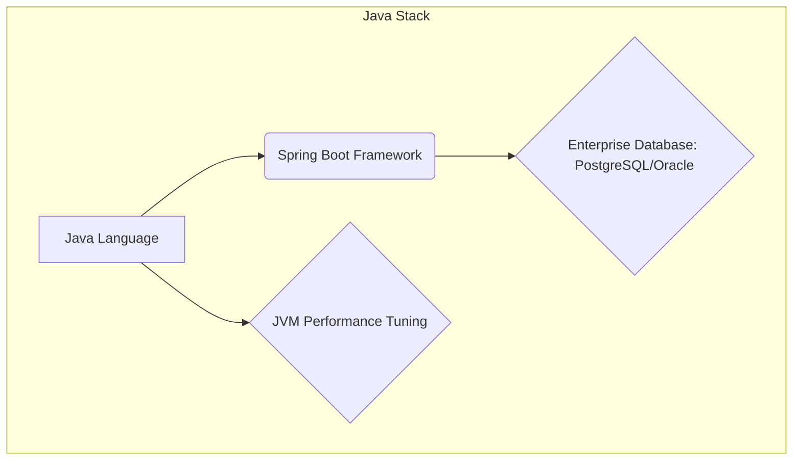
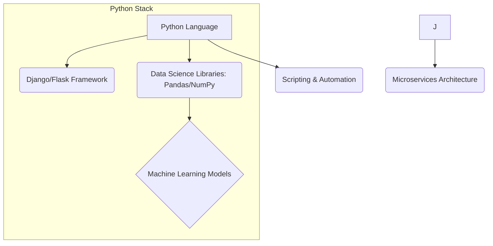

When sourcing, if the requirement is for a "Python Developer specializing in predictive modeling," you must prioritize candidates listing P2 and P3 skills alongside Python. If the requirement is for a "Senior Java Engineer," J1 and J2 are non-negotiable indicators of relevant experience.


#### Analyzing Current Market Demand and Supply Dynamics for Niche IT Roles

##### Supply, Demand, and Scarcity Premium

Recruitment is fundamentally an exercise in supply and demand economics applied to human capital. For common roles (e.g., Junior Web Developer), the supply of candidates often meets or exceeds demand, leading to competitive salary negotiations favoring the employer. However, for niche IT roles, the dynamics shift dramatically.

**Niche IT Roles:** These are highly specialized positions requiring a rare combination of skills, often involving emerging technologies or deep expertise in legacy, yet critical, systems. Examples include:
1.  **Quantum Computing Engineers:** Extremely low supply globally, extremely high demand from research institutions and tech giants.
2.  **SAP Basis Administrators (Specific Versions):** High demand in large enterprises still running legacy ERP systems, but the talent pool is aging.
3.  **Cloud Security Architects (Multi-Cloud Certified):** Requires deep expertise across AWS, Azure, *and* GCP, a rare combination.

##### Interpreting Market Signals

As a recruiter, your value lies in interpreting these dynamics to advise hiring managers on realistic timelines and compensation expectations.

**1. Scarcity Premium:** When demand significantly outstrips supply for a niche skill, candidates command a premium salary. If a standard Senior Developer salary is $150k, a niche Cloud Security Architect with rare certifications might command $200k+. Ignoring this premium leads to extended time-to-fill metrics.

**2. The "T-Shaped" Professional:** The market increasingly values T-shaped individuals. The vertical bar of the 'T' represents deep expertise in one area (e.g., Kubernetes administration), while the horizontal bar represents a broad understanding of related disciplines (e.g., basic scripting, cloud fundamentals, security awareness). Niche roles often require deep vertical expertise.

**3. Geographic Constraints:** For highly specialized roles, the talent pool might be geographically constrained. A company seeking an expert in mainframe modernization might find 90% of the required supply located within a 50-mile radius of a few major metropolitan areas. This necessitates remote work strategies or relocation packages.

##### Demand Analysis Example: The Rise of Observability

Consider the shift from simple monitoring to "Observability" (the ability to ask arbitrary questions about system state without pre-planning).

*   **Old Demand (Monitoring):** High supply of candidates familiar with basic log aggregation tools.
*   **Current Demand (Observability):** High demand for engineers proficient in the "Three Pillars" (Metrics, Logs, Traces) using tools like Prometheus, Grafana, and Jaeger. The supply for this specific combination is currently lower than the demand, creating a temporary market advantage for the candidate.

Your role is to constantly monitor industry reports (e.g., Stack Overflow Developer Survey, specialized tech recruitment firm reports) to anticipate these shifts. If you see a technology gaining traction (e.g., Rust language adoption), you must proactively begin building talent pipelines *before* the demand explodes and supply dries up. This proactive pipeline management is crucial for transforming from a reactive order-taker to a strategic talent partner.


---

### Chapter 3: Advanced Sourcing Methodologies and Boolean Logic Mastery


#### Principles of Proactive Candidate Identification versus Reactive Posting

##### The Paradigm Shift: From Reactive to Proactive Sourcing

As an aspiring recruiter transitioning into a strategic talent acquisition professional, understanding the fundamental difference between reactive posting and proactive candidate identification is paramount. This distinction forms the bedrock of advanced sourcing methodologies, particularly within competitive sectors like Information Technology (IT).

**Reactive Posting (The Traditional Model)**

Reactive sourcing is characterized by the submission of a job requisition, followed by the publication of the job description across various job boards (e.g., Indeed, company career pages). The recruiter then waits for candidates who are actively seeking new employment opportunities—the *active job seekers*—to apply. While necessary for volume hiring or roles with high market supply, this approach suffers from several critical limitations:

1.  **Limited Reach:** It only captures candidates who are currently dissatisfied or actively monitoring the job market.
2.  **Quality Control:** The applicant pool quality can be highly variable, requiring extensive screening to filter out unqualified submissions.
3.  **Time Lag:** The time-to-fill metric often extends because the process relies on external candidate motivation.

**Proactive Candidate Identification (Strategic Sourcing)**

Proactive sourcing, conversely, is a deliberate, market-driven strategy focused on identifying, engaging, and cultivating relationships with *passive candidates*. Passive candidates are currently employed, performing well in their roles, and are generally not looking for a new position unless presented with a truly compelling opportunity. For niche IT roles—such as a Senior Kubernetes Engineer or a specialized Data Scientist—the vast majority of qualified talent resides in this passive pool.

**Key Components of Proactive IT Sourcing:**

1.  **Talent Mapping:** This involves systematically researching the talent landscape for a specific role or technology stack. For instance, if you are hiring for a team migrating to AWS, talent mapping involves identifying all relevant professionals working at competitor firms or organizations known for utilizing AWS extensively. This creates a living database of potential future hires, irrespective of immediate openings.
2.  **Market Penetration:** Proactive sourcing requires deep dives into specialized platforms, open-source communities (like GitHub), technical forums, and industry-specific conferences where IT professionals congregate. The goal is not just to find a resume, but to understand the ecosystem where top technical talent resides.
3.  **Relationship Cultivation:** Unlike reactive hiring, which is transactional, proactive sourcing is relational. Recruiters build rapport over time, positioning themselves as career advisors rather than mere job vendors. This long-term approach ensures a warm pipeline when a critical role opens.

**Illustrative Example: Sourcing a Niche DevOps Engineer**

*   **Reactive Approach:** Post the job description for a 'DevOps Engineer specializing in Terraform and Ansible' on LinkedIn Jobs. Wait 10 days. Receive 50 applications, 3 of whom meet the core requirements.
*   **Proactive Approach:** Identify the top 10 companies known for advanced CI/CD pipelines. Use advanced search techniques (detailed in the next section) to locate engineers listing 'Terraform,' 'Ansible,' and 'Docker' on their profiles. Analyze their contributions on GitHub or Stack Overflow to validate expertise. Begin personalized outreach, referencing a specific project or technology they have publicly demonstrated mastery in. This yields a smaller, highly qualified, and engaged pool much faster.

In essence, mastering proactive sourcing transforms the recruiter from an order-taker into a strategic business partner who anticipates talent needs and shapes the organization's future workforce capabilities.


#### Constructing Complex Boolean Search Strings for Precision Targeting

##### The Syntax of Precision: Mastering Boolean Logic

Boolean logic is the mathematical foundation underpinning all advanced database and search engine queries. For recruiters, mastering Boolean syntax is the single most effective technical skill for moving beyond basic keyword searches to achieve high-precision candidate identification, especially when targeting specific IT skill sets.

**Core Boolean Operators**

Boolean searches utilize three primary operators to define relationships between search terms:

1.  **AND:** Narrows the search. Requires *all* specified terms to be present in the result set. Example: `Java AND Spring` will only return profiles mentioning both technologies.
2.  **OR:** Broadens the search. Requires *at least one* of the specified terms to be present. This is crucial for capturing synonyms or alternative technologies. Example: `(Python OR Jython OR IronPython)` ensures you capture all variations of Python developers.
3.  **NOT:** Excludes specific terms. Used to refine results by eliminating irrelevant profiles or technologies. Example: `JavaScript NOT Node.js` might be used if you are specifically seeking front-end React developers who do not specialize in back-end Node.js.

**Advanced Construction Techniques**

Effective Boolean strings rely on structure, achieved through parentheses and proximity operators.

1.  **Parentheses (Nesting):** Parentheses dictate the order of operations, similar to mathematical equations. Complex requirements must be grouped logically. For example, you need a developer proficient in either Java or C#, AND they must have cloud experience.
    *   *Incorrect:* `Java OR C# AND AWS` (This might return Java profiles without AWS, or C# profiles with AWS).
    *   *Correct:* `(Java OR C#) AND AWS`

2.  **Quotation Marks (" "):** Used to search for exact phrases. Essential for capturing specific certifications or titles. Example: `\"Certified Information Systems Security Professional\"`.

3.  **Wildcards (\*):** The asterisk acts as a placeholder for zero or more characters. Useful for capturing variations in spelling or suffixes. Example: `manag*` captures manager, managing, management.

4.  **Proximity Operators (NEAR/ADJ):** While not universally supported across all platforms (e.g., LinkedIn often uses its own internal proximity logic), understanding the concept is vital. Proximity operators search for terms within a specified distance of each other, indicating a stronger contextual relationship than a simple AND. For example, `Cloud NEAR/3 Architect` searches for 'Cloud' within three words of 'Architect'.

**Boolean String Example for an IT Role (Focus: Cloud Security Engineer)**

We require a candidate with expertise in at least one major cloud provider (AWS or Azure), mandatory experience with a security tool (e.g., Splunk or Sentinel), and must *not* be a generalist administrator.

```
(AWS OR Azure OR GCP) AND (Splunk OR Sentinel OR Qualys) NOT (System Administrator OR Desktop Support)
```

**Visualizing Boolean Structure**

The structure of a complex Boolean string can be visualized using a decision tree or flow diagram to ensure logical integrity before execution.

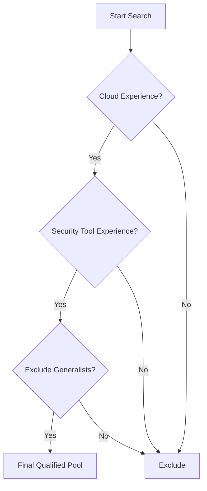

By systematically applying these operators and nesting requirements, recruiters can drastically reduce noise in search results, transforming thousands of potential profiles into a highly curated list of technically validated candidates.


#### Leveraging Professional Networking Platforms for Passive Candidate Engagement

##### Beyond the Job Board: Strategic Use of Professional Networks

Professional networking platforms, most notably LinkedIn, serve as the primary digital repository for the global professional workforce. For the modern recruiter, these platforms are not merely databases; they are dynamic environments requiring nuanced engagement strategies to attract passive IT talent.

**Platform Selection and Profile Optimization**

While platforms like GitHub (for developers) and specialized forums are valuable, LinkedIn remains the central hub. Success here hinges on two factors: the recruiter's ability to search effectively and the quality of their own professional profile.

1.  **Recruiter Profile Credibility:** Passive candidates scrutinize the profile of the person contacting them. Your profile must reflect expertise in the domain you are sourcing for. If you are recruiting for Machine Learning Engineers, your profile summary should articulate an understanding of ML concepts, not just recruitment metrics. This establishes immediate credibility.
2.  **Advanced Search Functionality:** Utilizing the platform's native search filters (often supplementing or replacing manual Boolean strings) is critical. For IT roles, focus on filtering by:
    *   **Skills Endorsements:** Validating proficiency in specific technologies (e.g., React.js, Kubernetes).
    *   **Group Membership:** Identifying candidates belonging to niche technical groups (e.g., 'Cloud Native Computing Foundation' members).
    *   **Past Company Affiliations:** Targeting employees from organizations known for high technical standards.

**Engaging the Passive IT Professional**

Passive candidates are inundated with generic outreach. Engagement must be personalized, relevant, and respectful of their current employment status. The goal is to initiate a *conversation*, not deliver a sales pitch.

1.  **Contextual Relevance:** The initial message must demonstrate that you have thoroughly reviewed their profile and understand their technical contributions. Reference a specific project, a published article, or a skill listed that aligns with the opportunity. For a Java developer, mentioning experience with the Spring Boot framework they list is far more effective than a generic 'We are hiring developers.'
2.  **Value Proposition Beyond Salary:** Passive candidates are often motivated by technical challenge, career trajectory, and organizational impact, not just compensation. Frame the opportunity around:
    *   The complexity of the technical problem they would solve.
    *   The opportunity to work with cutting-edge technology stacks (e.g., migrating from monolithic architecture to microservices).
    *   The mentorship or leadership potential.

**Strategies for Passive Engagement (The 'Soft Approach')**

*   **Content Sharing:** Engage with the candidate’s content (likes, thoughtful comments) before sending a direct message. This creates familiarity.
*   **Informational Interviews:** For highly sought-after profiles, propose a brief, non-committal 'market intelligence' call. Frame it as seeking their expert opinion on industry trends, subtly introducing the role as a potential future fit.
*   **Alumni and Connection Leverage:** If you share a common university or previous employer, leverage that connection point immediately in your outreach to build rapport quickly.

By treating professional networking platforms as sophisticated market intelligence tools rather than simple resume databases, recruiters can systematically map and engage the most valuable, yet hardest-to-reach, technical talent.


#### Strategies for Effective Cold Outreach and Initial Contact Cadence Development

##### The Art of the First Contact: Cadence and Customization

Once a target candidate is identified through advanced sourcing, the effectiveness of the initial outreach determines whether the engagement progresses or terminates immediately. Cold outreach, particularly in the IT sector where professionals are highly solicited, demands strategic planning encapsulated in a contact cadence.

**Principles of Effective Cold Outreach Messaging**

Cold outreach messages (whether via LinkedIn InMail, email, or text) must adhere to principles of brevity, personalization, and clarity of purpose. The recipient must immediately grasp *who* you are, *why* you are contacting *them specifically*, and *what* the next step entails.

1.  **Hyper-Personalization (The Hook):** The first sentence is the most critical. It must reference something specific about the candidate’s professional history that validates your research. Avoid templates that begin with, "I came across your profile..."
    *   *Example Hook for a Cybersecurity Analyst:* "I was impressed by your recent presentation on zero-trust architecture at the RSA conference; our current initiative involves implementing similar segmentation strategies."

2.  **The Role Context (The Bridge):** Briefly connect their demonstrated expertise to the specific challenge your organization is solving. Do not list 20 requirements; focus on the 1-2 core technical challenges that align with their known strengths.

3.  **Low-Friction Call to Action (The Ask):** The initial ask should require minimal commitment. Asking for a 30-minute interview immediately is often too high a barrier. Instead, request a brief, 10-minute exploratory chat or simply ask if they are open to learning more about the technical scope.

**Developing a Multi-Touch Contact Cadence**

A cadence is a structured sequence of communications deployed over a defined period, designed to maximize response rates without becoming intrusive. For passive IT candidates, a typical cadence spans 10 to 14 business days and incorporates multiple channels.

**Example IT Sourcing Cadence (12-Day Framework)**

| Touch Point | Day | Channel | Objective | Content Focus |
| :--- | :--- | :--- | :--- | :--- |
| **1 (Initial)** | Day 1 | InMail/Email | Establish Relevance & Hook | Hyper-personalized reference to their work; low-commitment ask. |
| **2 (Follow-up)** | Day 3 | LinkedIn Connection Request (with personalized note) | Increase Visibility | Reference Touch 1; focus on the impact of the role. |
| **3 (Value Add)** | Day 6 | Email (if email provided) | Provide Context | Share a link to a relevant company blog post or technical whitepaper related to the role's domain. |
| **4 (Re-engagement)** | Day 9 | InMail/Email | Gentle Nudge | Acknowledge potential busyness; reiterate the unique technical challenge. |
| **5 (Break-up)** | Day 12 | Email | Final Check-in | Professional closure; state you will cease outreach but keep them in mind for future roles. |

**Cadence Strategy Considerations:**

*   **Channel Switching:** Varying the communication channel (email, InMail, connection request) prevents message fatigue and increases the probability of contact across different communication preferences.
*   **Tone Management:** Maintain a professional, consultative, and respectful tone throughout. Aggressive follow-up alienates high-value passive talent.
*   **Tracking and Documentation:** Every touchpoint must be logged in the Candidate Relationship Management (CRM) system (discussed in Chapter 4) to ensure adherence to the cadence and to prevent accidental over-contacting.

By employing structured, personalized, and multi-channel outreach cadences, recruiters significantly enhance their ability to convert identified passive prospects into engaged candidates, thereby mastering the transition from basic job posting to advanced talent acquisition.


---

### Chapter 4: Applicant Tracking Systems (ATS) and Candidate Relationship Management (CRM)


#### Functional Overview and Selection Criteria for Enterprise-Grade ATS Platforms

##### The Central Nervous System of Talent Acquisition: Understanding the ATS

As aspiring recruitment professionals, particularly those focusing on the highly competitive Information Technology sector, understanding the Applicant Tracking System (ATS) is foundational. The ATS serves as the centralized repository and management tool for all candidate-related data throughout the entire recruitment lifecycle. It transitions the recruitment process from disparate spreadsheets and email chains into a structured, auditable workflow.

###### Core Functional Components of an Enterprise ATS

An enterprise-grade ATS is characterized by robust functionality designed to handle high volumes of applications and complex compliance requirements. Key functions include:

1.  **Job Requisition Management:** The system facilitates the creation, approval routing, and publishing of job descriptions across multiple channels (career site, job boards, social media). For IT roles, this includes standardized templates ensuring necessary technical keywords are present for optimal searchability.
2.  **Candidate Sourcing and Ingestion:** This involves the automated capture of applicant data. A critical feature here is **Resume Parsing**, where the ATS uses Natural Language Processing (NLP) algorithms to extract structured data (skills, experience, education) from unstructured resumes. In IT recruitment, the accuracy of parsing complex technical terms (e.g., distinguishing between 'Node.js' experience and general JavaScript knowledge) is a primary determinant of system utility.
3.  **Candidate Tracking and Workflow Progression:** The ATS maintains a chronological record of every interaction and status change for an applicant. Candidates move through defined stages, such as 'Application Received,' 'Screening,' 'Hiring Manager Review,' 'Interview Scheduled,' and ultimately, 'Offer Extended' or 'Rejected.'
4.  **Compliance and Reporting:** The system must generate standardized reports necessary for regulatory adherence (e.g., EEO/Affirmative Action reporting in the United States) and internal performance metrics.

###### Selection Criteria for Enterprise-Grade ATS Platforms

Selecting an appropriate ATS is a strategic decision that impacts operational efficiency for years. When evaluating platforms, especially for specialized hiring like IT profiles, several criteria must be rigorously assessed:

*   **Integration Capabilities (API Ecosystem):** The ATS must seamlessly integrate with existing Human Resources Information Systems (HRIS), background check providers, assessment platforms, and, crucially, external sourcing tools (like LinkedIn Recruiter or specialized IT sourcing databases). Robust Application Programming Interface (API) availability is non-negotiable for modern, interconnected talent acquisition stacks.
*   **Scalability and Performance:** The platform must reliably handle peak application loads without latency. A sudden influx of applicants for a high-demand role (e.g., a critical Cloud Security Engineer position) should not degrade system performance.
*   **Customization and Configurability:** The ability to tailor workflows, custom fields (e.g., specific certifications like AWS Certified Solutions Architect), and user permissions to match organizational structure and specific hiring needs is vital. A rigid system will force the recruitment team to adapt inefficiently.
*   **User Experience (UX) for Recruiters and Hiring Managers:** If the interface is cumbersome, adoption rates will suffer, leading to data silos and process circumvention. The system must offer intuitive dashboards for both the recruiter managing the pipeline and the hiring manager reviewing candidates.
*   **Mobile Accessibility:** Given the dynamic nature of modern business, the ATS must offer full functionality via mobile devices for approvals and candidate communication on the go.

In essence, the ATS is the operational backbone. Its selection dictates the efficiency, compliance posture, and ultimately, the speed at which an organization can secure top technical talent.


#### Data Integrity and Compliance within Applicant Tracking Databases

##### The Imperative of Data Quality in Talent Management

Data integrity refers to the accuracy, consistency, and reliability of the data stored within the ATS database. For recruiters focused on IT talent acquisition, poor data integrity translates directly into flawed decision-making, missed opportunities, and potential legal exposure. If a candidate's primary programming language or years of experience are incorrectly logged due to poor parsing or manual entry errors, that candidate may be erroneously excluded from future searches or pipeline nurturing efforts.

###### Pillars of Data Integrity

1.  **Accuracy and Completeness:** Ensuring that all required fields are populated correctly. For IT roles, this often means standardizing skill entries. For instance, ensuring that 'C++' is not entered inconsistently as 'C plus plus' or 'Cpp' across different records, which would fragment search results.
2.  **Consistency:** Maintaining uniform data formats across the system. This is often enforced through mandatory picklists or validation rules built into the ATS interface.
3.  **Timeliness:** Data must be updated in real-time or near real-time. If a candidate accepts an offer, their status must immediately reflect this across all integrated systems to prevent unnecessary follow-up communication or accidental scheduling of subsequent interviews.

###### Regulatory Compliance and Data Governance

Recruitment databases house Personally Identifiable Information (PII) and sensitive employment history. Compliance is not optional; it is a fundamental responsibility of the talent acquisition function. Failure to adhere to data protection regulations can result in substantial financial penalties and reputational damage.

*   **Data Privacy Regulations (e.g., GDPR, CCPA):** Regulations like the General Data Protection Regulation (GDPR) in Europe mandate strict rules regarding consent, data processing, and the 'Right to be Forgotten.' Recruiters must ensure that candidates provide explicit consent for their data to be stored, especially if they are being placed into a long-term talent pool. Furthermore, the ATS must facilitate the timely and verifiable deletion of candidate records upon request or after the legally mandated retention period expires.
*   **Data Retention Policies:** Organizations must define how long candidate data is kept post-hiring or post-rejection. For example, an organization might retain data for unsuccessful applicants for 12 months for EEO reporting purposes, after which the system should automatically flag or purge the data, depending on jurisdiction.
*   **Audit Trails:** A high-quality ATS maintains an immutable audit trail, logging every user action—who viewed the record, who changed the status, and when. This transparency is crucial for defending hiring decisions during internal or external audits.

**Example Scenario: Data Integrity in IT Screening**

Consider a recruiter sourcing candidates for a Senior Backend Developer role requiring expertise in microservices architecture using Go (Golang). If the ATS parsing engine incorrectly categorizes a candidate's 'Go' experience as 'General Programming' or misses the skill entirely, the data integrity is compromised. The system fails its primary function, and a highly qualified candidate is overlooked, demonstrating the direct link between data quality and hiring success.


#### Implementing CRM Strategies for Long-Term Talent Pipelining

##### Transitioning from Tracking to Relationship Cultivation

While the ATS manages the *active* hiring process, the Candidate Relationship Management (CRM) functionality within modern recruitment software focuses on nurturing *passive* or *future* talent. For specialized IT roles where the supply of qualified professionals is significantly lower than demand (e.g., Machine Learning Engineers), building and maintaining a talent pipeline is a strategic necessity, not an administrative task.

###### The Role of Recruitment CRM

Recruitment CRM extends the lifecycle of candidate engagement beyond the immediate job opening. It allows recruiters to segment, score, and communicate with individuals who were excellent prospects but perhaps not the right fit for a specific role, or those who were simply not ready to move at the time of contact. This proactive approach minimizes reliance on expensive, last-minute sourcing efforts.

###### Strategies for Long-Term IT Talent Pipelining

1.  **Segmentation and Tagging:** Candidates must be meticulously tagged based on technical stack, seniority, location, and career aspirations. For instance, a recruiter might create segments like: `[Cloud/AWS]`, `[Seniority: Principal]`, `[Interest: Remote Work]`. This allows for highly targeted communication.
2.  **Nurturing Campaigns:** Utilizing automated or semi-automated email sequences to keep the talent pool engaged. These campaigns should provide value, not just solicit applications. Examples include:
    *   Sharing company blog posts detailing new technology adoption (e.g., 'How Our Team Migrated to Serverless Architecture').
    *   Inviting pipeline members to exclusive webinars featuring current engineering leaders.
    *   Sending personalized check-ins based on tenure in the pipeline (e.g., 'It's been six months since we last connected; are you still interested in opportunities in Cybersecurity?').
3.  **Silver Medalist Programs:** Candidates who performed exceptionally well in interviews but were narrowly beaten by another candidate (the 'silver medalist') represent extremely low-hanging fruit for future openings. The CRM ensures these individuals are flagged for immediate contact when a similar role opens.

###### Visualizing the Talent Pipeline Flow

The CRM facilitates a continuous flow, contrasting with the linear, transactional nature of the ATS funnel. The following diagram illustrates how candidates move through relationship stages rather than just application stages:

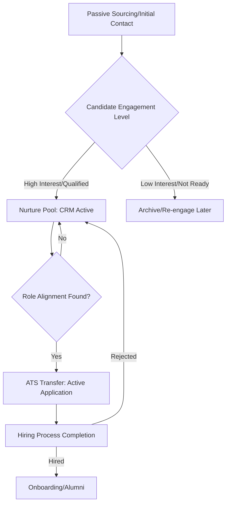

By implementing robust CRM strategies, recruiters transform from reactive order-takers into strategic talent advisors, ensuring a warm pipeline of pre-vetted IT professionals ready to engage when a critical requisition is opened.


#### Workflow Automation within Recruitment Software Interfaces

##### Maximizing Recruiter Efficiency Through Process Streamlining

Workflow automation refers to the configuration of recruitment software to execute predefined, repetitive tasks automatically based on specific triggers or conditions. For the entry-level recruiter, mastering automation is the fastest path to increasing capacity and reducing administrative overhead, allowing more time for high-value activities like candidate consultation and relationship building.

###### Key Areas for Automation in Recruitment Software

Automation is most effective when applied to high-volume, low-complexity tasks. In the context of IT recruitment, this often involves managing the initial screening and scheduling phases.

1.  **Automated Candidate Acknowledgement and Screening Questions:** Upon application submission, the system can instantly send a personalized confirmation email. Furthermore, if the ATS is integrated with a screening module, it can automatically present mandatory qualifying questions (e.g., 'Do you possess active security clearance?' or 'Are you authorized to work in the US?'). Candidates who fail to meet these non-negotiable criteria can be automatically moved to a 'Disqualified' status, saving the recruiter manual review time.
2.  **Interview Scheduling:** This is perhaps the most significant time-saver. Using integrated calendar tools (like Outlook or Google Calendar), the system can cross-reference the availability of the candidate and multiple interviewers (e.g., the Engineering Lead and the Product Manager). The system then proposes available slots and sends out calendar invitations automatically upon candidate confirmation.
3.  **Feedback Collection:** Post-interview, the system can automatically dispatch standardized feedback forms to the interview panel, setting automated reminders if the feedback is not submitted within a defined Service Level Agreement (SLA) period (e.g., 24 hours).
4.  **Status Updates and Communication Cadence:** Automation ensures candidates are never left in the dark. If a candidate moves from 'Interview Scheduled' to 'Hiring Manager Review,' the system can trigger an email update to the candidate, managing expectations proactively.

###### Illustrating the Automated Scheduling Workflow

The following diagram outlines a typical automated workflow triggered when a candidate passes the initial recruiter screen and is ready for a technical interview with the hiring team:

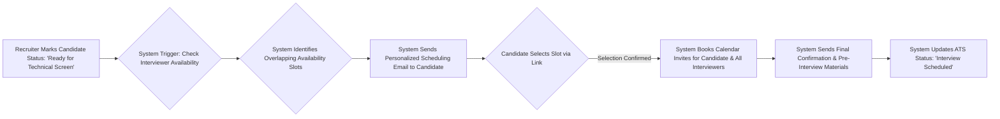

By leveraging these automation features, the recruiter shifts their focus from administrative coordination to strategic engagement—ensuring the candidate experience remains positive, which is paramount when competing for scarce IT talent. Understanding how to configure and monitor these workflows is a core competency for the modern, efficient recruiter.


---

### Chapter 5: Structured Interviewing and Technical Screening Protocols


#### Designing Competency-Based Interview Guides Aligned with Job Descriptions

The foundation of effective interviewing lies in the **Competency-Based Interview Guide (CBIG)**. A competency is a measurable characteristic that predicts superior performance in a specific role. For IT recruitment, these competencies typically span technical proficiency, problem-solving aptitude, and professional behaviors.

The process begins with a meticulous deconstruction of the Job Description (JD). The JD is not merely a list of required technologies; it outlines the *outcomes* the role must deliver. Your task as the recruiter is to translate these required outcomes into observable, measurable competencies.

##### Step 1: Competency Identification and Weighting
Review the JD and categorize requirements into core competency clusters. For a **DevOps Engineer** role, these might include:
1.  **Technical Depth (Weight 40%):** Expertise in CI/CD pipelines (e.g., Jenkins, GitLab CI), Infrastructure as Code (IaC) tools (e.g., Terraform, Ansible).
2.  **Problem Solving & Debugging (Weight 30%):** Ability to diagnose latency issues across distributed systems.
3.  **Collaboration & Communication (Weight 20%):** Effectiveness in bridging development and operations teams.
4.  **Adaptability & Learning Agility (Weight 10%):** Willingness to adopt new cloud platforms (e.g., migrating from AWS to Azure).

##### Step 2: Defining Behavioral Indicators
For each competency, define what successful demonstration looks like. These indicators serve as the rubric for evaluation.

| Competency | Behavioral Indicator (What success looks like) |
| :--- | :--- |
| Technical Depth (IaC) | Candidate consistently designs idempotent and reusable Terraform modules without significant post-deployment modification. |
| Problem Solving | Candidate systematically isolates root causes in complex, multi-service environments under pressure. |

##### Step 3: Developing Structured Questions
The CBIG mandates that every interviewer asks the *same* set of core questions tied to these competencies, ensuring fairness and comparability across candidates. These questions should prompt candidates to provide specific examples of past performance, which are far more predictive than hypothetical answers.

**Example CBIG Snippet for a Mid-Level Backend Developer:**

| Competency Area | Interview Question (Structured Prompt) | Evaluation Scale (1-5) |
| :--- | :--- | :--- |
| **Technical Depth (Scalability)** | "Describe a recent project where you had to significantly scale an application component (e.g., database reads or API throughput). What specific architectural decisions did you make to handle the increased load, and what metrics confirmed success?" | 1=Vague/Theoretical; 5=Specific metrics, clear architectural trade-offs discussed. |
| **Collaboration** | "Tell me about a time you fundamentally disagreed with a senior engineer or architect on a technical approach. How did you present your alternative viewpoint, and what was the final resolution?" | 1=Avoided conflict/Complied immediately; 5=Data-driven advocacy leading to a mutually agreed-upon path. |

By aligning the interview guide directly with the JD's required outcomes and defining clear, observable indicators, you transform the interview from a subjective conversation into an objective assessment tool. This structure is crucial for mitigating bias and ensuring that every candidate is evaluated against the same performance standard.


#### Techniques for Assessing Soft Skills and Cultural Alignment in Technical Hires

While technical acumen is non-negotiable for IT roles, the modern engineering environment demands high levels of collaboration, resilience, and alignment with organizational values. Recruiters must employ specific techniques to probe these often-intangible attributes during screening and initial interviews.

##### Assessing Soft Skills (e.g., Communication, Conflict Resolution)
Technical candidates often excel at explaining complex systems to peers but struggle to articulate technical risks to non-technical stakeholders (e.g., Product Managers or Executives).

1.  **The "Translate for the CEO" Technique:** Present a simplified technical scenario relevant to the role (e.g., "Our primary database is experiencing intermittent connection timeouts due to unexpected traffic spikes"). Ask the candidate: "How would you explain the severity of this issue and the proposed fix timeline to our CEO, who has no technical background?" This assesses clarity, prioritization, and audience awareness.
2.  **Conflict Simulation:** Use behavioral questions focused on disagreement. For instance, asking a candidate how they handled technical debt accumulation when pressured by deadlines reveals their prioritization skills and willingness to advocate for long-term system health over short-term expediency.

##### Assessing Cultural Alignment (Organizational Fit)
Cultural alignment is often misinterpreted as "hiring people just like us." In reality, it means assessing alignment with the *company's operating principles* (e.g., speed of iteration, emphasis on documentation, tolerance for ambiguity).

For IT profiles, focus on alignment with engineering culture:

*   **Autonomy vs. Structure:** Does the role require high autonomy (common in startups) or adherence to strict compliance frameworks (common in finance/healthcare IT)? Ask: "Describe a time you had to deliver a feature with minimal oversight. What guardrails did you put in place for yourself?"
*   **Learning Mindset:** Technology evolves rapidly. Assess the candidate's approach to continuous learning. Ask: "When was the last time you had to learn a completely new framework or language for a project? Walk me through your self-directed learning process."

**Inclusivity Note:** When assessing cultural fit, focus strictly on *work style* and *values alignment* (e.g., integrity, commitment to quality), rather than personality traits or hobbies. A structured approach ensures you are measuring alignment with *how* the team works, not *who* the team members are socially.


#### Introduction to Behavioral Interviewing Frameworks (e.g., STAR Method)

Behavioral interviewing is predicated on the principle that past performance is the best predictor of future behavior. Instead of asking, "Are you a good problem-solver?" (which elicits a simple "Yes"), you ask for evidence of past problem-solving actions. The **STAR Method** provides the necessary structure for both the interviewer to probe effectively and the candidate to deliver comprehensive answers.

##### The STAR Components
The STAR framework guides candidates to structure their responses logically, ensuring all necessary components of an experience are covered.

1.  **S - Situation:** Set the scene. What was the context? (e.g., "We were launching a new microservice for user authentication.")
2.  **T - Task:** What was the candidate's specific responsibility or goal within that situation? (e.g., "My task was to ensure the service could handle 10,000 requests per second reliably.")
3.  **A - Action:** What specific steps did the candidate take to address the task? This is the most crucial part; it must focus on *their* individual contribution. (e.g., "I implemented connection pooling using HikariCP and configured auto-scaling policies in Kubernetes.")
4.  **R - Result:** What was the outcome of those actions? Quantify the result whenever possible. (e.g., "We successfully passed load testing at 12,000 requests/second, and latency dropped by 30% compared to the legacy system.")

##### Example Application for an IT Recruiter
**Hiring Manager Request:** Assess the candidate's ability to handle production incidents under pressure.

**Recruiter Prompt (STAR-based):** "Can you describe a significant production outage or critical bug you were responsible for resolving? Please detail the **Situation**, your **Task**, the specific **Actions** you took to diagnose and fix it, and the final **Result**."

If a candidate only provides the Situation and Result, the recruiter must follow up:
*   *Probing for Task:* "What exactly was *your* specific responsibility in that scenario?"
*   *Probing for Action:* "That sounds complex. Can you walk me through the exact diagnostic steps you took before implementing the fix?"

The structured nature of STAR allows you to compare the *Actions* taken by Candidate A versus Candidate B against the same competency requirement.

The following diagram illustrates the flow of a successful STAR response:
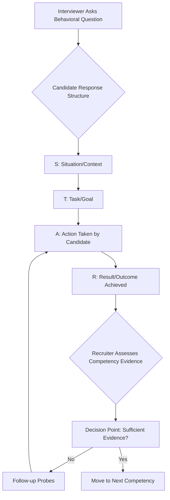


#### Establishing Effective Feedback Loops Between Recruiters and Hiring Managers

The relationship between the recruiter and the hiring manager (HM) is a consultative partnership, not a transactional order-taking process. Effective talent acquisition hinges on rapid, structured, and data-informed feedback loops. This ensures the screening criteria remain relevant and that the hiring process remains agile.

##### Standardizing Evaluation Criteria (The Scorecard)
Before interviews commence, the recruiter and HM must co-create a standardized interview scorecard based on the competencies defined previously. This scorecard must include numerical ratings (e.g., 1 to 5) for each core competency, rather than subjective comments alone.

##### Structured Debrief Cadence
Feedback should not be ad-hoc. Schedule mandatory, brief debrief sessions immediately following the completion of the first round of interviews for any given role.

*   **Frequency:** Daily for high-priority, urgent roles; Bi-weekly for standard roles.
*   **Duration:** 15-30 minutes maximum.

##### Data-Driven Discussion Points
The recruiter must lead the debrief by presenting data, not just anecdotes:

*   **Funnel Conversion Rates:** "We sourced 50 candidates, 10 were screened by me, and 3 were presented to you. The conversion rate from screen to HM interview is 30%—is this acceptable?"
*   **Competency Score Aggregation:** Present the average scores for each competency across all interviewed candidates. If the average score for "System Design" is consistently 2.5 across three candidates, it signals one of two issues:
    *   **Issue A (Sourcing/Screening):** The recruiter is presenting candidates who lack the required depth.
    *   **Issue B (Interviewing):** The HM/Interview Panel is applying standards inconsistently, or the initial competency definition was flawed.
*   **Candidate Drop-Off Analysis:** If candidates are rejecting offers or withdrawing after the technical screen, the feedback loop must immediately address the cause (e.g., compensation misalignment, poor candidate experience, or overly aggressive technical challenges).

**Example Feedback Loop Implementation:**

Consider a search for a **Cloud Security Architect**.

*   **Recruiter Action:** After the first three HM interviews, the recruiter compiles the scores.
*   **Data Point:** All three candidates scored highly (4.5/5) on "Knowledge of AWS Security Services" but poorly (2.0/5) on "Experience with Compliance Frameworks (e.g., SOC 2, ISO 27001)."
*   **Feedback Session Outcome:** The recruiter presents this data. The HM confirms that SOC 2 experience is *critical* for the next quarter's projects, not just a 'nice to have.'
*   **Process Adjustment:** The recruiter immediately updates the sourcing strategy to prioritize Boolean strings that include "SOC 2" or "ISO 27001," and the interview guide is updated to ask more pointed STAR questions regarding compliance implementation.

This iterative, data-driven approach ensures that the recruitment process continuously self-corrects, maximizing the probability of securing a high-caliber technical professional who meets both the technical and behavioral requirements of the organization. Mastering structured interviewing and feedback mechanisms is the definitive step in transitioning from an entry-level recruiter to a strategic talent advisor.


---

### Chapter 6: Legal Compliance, Diversity, Equity, and Inclusion (DEI) in Hiring


#### Overview of Global and Regional Employment Law Pertinent to Candidate Screening

##### Foundational Principles of Employment Legislation

As an aspiring recruiter, particularly one focusing on the highly competitive Information Technology sector, understanding the legal landscape governing candidate screening is non-negotiable. Employment law dictates the parameters within which you can solicit, process, and utilize candidate information. While specific statutes vary significantly by geography, the underlying philosophy often centers on preventing discrimination based on protected characteristics. These characteristics typically include, but are not limited to, race, color, religion, sex (including pregnancy, sexual orientation, and gender identity), national origin, age, disability, and genetic information.

##### Regional Variations in Compliance

Recruitment is increasingly globalized, meaning you must be cognizant of jurisdictional differences. For instance, in the United States, federal laws like Title VII of the Civil Rights Act of 1964 prohibit employment discrimination. State and local laws often add further protections. When recruiting for remote IT roles spanning multiple states, compliance with the strictest applicable law often becomes the operational standard.

In contrast, the European Union operates under comprehensive directives, most notably the General Data Protection Regulation (GDPR), which heavily influences data handling (discussed further in Topic 4). Furthermore, many EU nations have stringent laws regarding the use of criminal background checks or pre-employment medical inquiries, often restricting them solely to roles where such information is demonstrably essential (e.g., roles requiring high-level security clearance for handling sensitive infrastructure code).

##### Screening Specifics for IT Roles

When screening candidates for technical positions, recruiters must exercise extreme caution regarding inquiries that could lead to disparate impact. For example:

1.  **Background Checks and Credit History:** In many jurisdictions, using credit history as a screening criterion for non-financial IT roles (like a standard Software Developer) is prohibited or heavily restricted, as it can disproportionately affect certain demographic groups.
2.  **Inquiries about Legal Work Authorization:** While verifying the legal right to work is mandatory, the timing and manner of this inquiry are regulated. In the U.S., for example, this verification (Form I-9) must occur *after* an offer of employment has been accepted, not during the initial screening or interview stages.
3.  **Technical Assessments and Accommodation:** If you utilize standardized technical aptitude tests (e.g., coding challenges), you must have a clear, documented process for providing reasonable accommodations for candidates with disabilities, as mandated by legislation such as the Americans with Disabilities Act (ADA) in the U.S. Failure to provide accommodation upon request, if feasible, constitutes a violation.

As a beginner recruiter, your primary directive is to ensure that all screening criteria—whether related to technical skills, experience, or background—are demonstrably job-related and consistent with business necessity. Any criterion that screens out a protected class must be rigorously defensible.


#### Mitigating Unconscious Bias in Job Descriptions and Candidate Evaluation

##### The Pervasiveness of Unconscious Bias

Unconscious biases are mental shortcuts based on social norms and personal experiences that influence our decisions without our conscious awareness. In recruitment, these biases can severely undermine meritocracy, leading to homogenous teams and missed talent, especially critical when seeking specialized IT expertise where talent scarcity is high. Bias manifests early in the process, often starting with the language used in job advertisements.

##### De-biasing Job Descriptions

Job descriptions (JDs) are powerful communication tools, but they can inadvertently signal exclusion. Research indicates that gender-coded language can deter qualified applicants. Words perceived as traditionally masculine (e.g., 'ninja,' 'dominate,' 'rockstar,' 'aggressive') or feminine (e.g., 'support,' 'collaborative,' 'nurture') can skew applicant demographics. For an IT role, using terms like 'brilliant coder' or 'expert hacker' might appeal more strongly to one gender over another, even if the underlying requirements are neutral.

**Mitigation Strategy:** Utilize text analysis tools or manual review to ensure language is neutral. Focus on required competencies and outcomes rather than personality traits.

##### Structured Candidate Evaluation Protocols

Bias is perhaps most damaging during the evaluation phase, where subjective impressions can override objective qualifications. Common biases include:

*   **Affinity Bias:** Favoring candidates who remind the interviewer of themselves (e.g., attended the same university or share a hobby).
*   **Confirmation Bias:** Seeking information that confirms an initial positive or negative impression formed early in the interview.
*   **Halo/Horns Effect:** Allowing one strong positive (Halo) or negative (Horns) trait to overshadow all other qualifications.

To counteract this, implementing structured interviewing is paramount. Structured interviewing requires that all candidates for the same role are asked the exact same set of pre-determined, job-relevant questions, and their responses are scored against a standardized rubric.

##### The Structured Evaluation Framework

The transition from unstructured (risky) to structured (compliant and effective) evaluation can be visualized as follows:

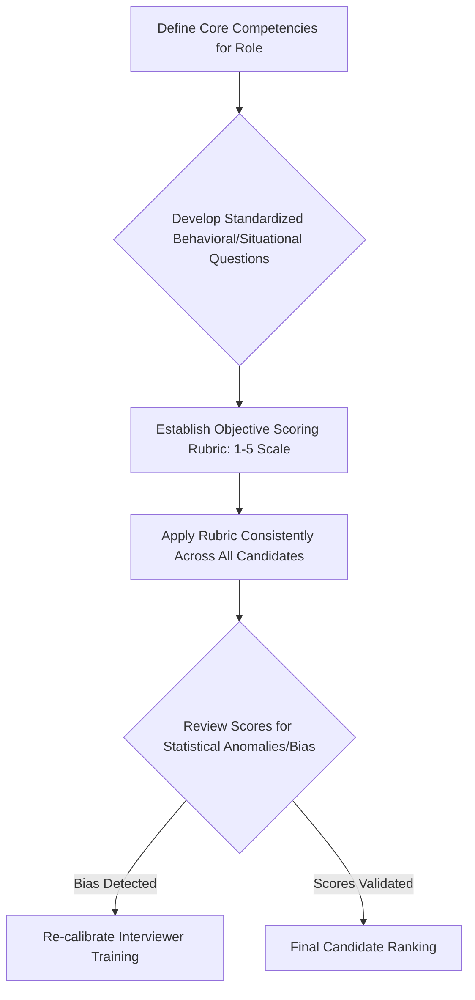

By adhering to this framework, the focus shifts from 'gut feeling' to measurable performance against predefined criteria, significantly enhancing fairness and the quality of technical hires.


#### Implementing Inclusive Sourcing Strategies to Broaden Candidate Pools

##### Moving Beyond Traditional Sourcing Channels

Effective recruitment for niche IT profiles—such as Senior DevOps Engineers or specialized Cybersecurity Analysts—requires proactive sourcing. However, relying solely on the same established channels (e.g., LinkedIn Recruiter searches targeting candidates from the same top-tier universities or established tech giants) perpetuates homogeneity. Inclusive sourcing is the deliberate strategy of expanding outreach to attract qualified individuals from underrepresented groups (URGs) within the technology sector.

##### Strategic Channel Diversification

To broaden the candidate pool, recruiters must diversify where they look for talent. This involves identifying platforms and communities where diverse IT professionals congregate:

1.  **Targeted Professional Organizations:** Engage with organizations dedicated to supporting underrepresented groups in technology, such as the National Society of Black Engineers (NSBE), Women in Technology International (WITI), or specific groups focused on LGBTQ+ professionals in STEM. Sponsoring their events or posting directly to their job boards signals genuine commitment.
2.  **Niche Communities and Forums:** For highly specialized roles, look beyond mainstream platforms. Engage ethically in relevant open-source communities, specialized Slack channels, or technical forums where candidates demonstrate practical skills, irrespective of their formal educational background.
3.  **Returnship Programs:** For experienced IT professionals (e.g., former software architects) who have taken career breaks, actively promote 'returnship' programs designed to reintegrate them into the workforce. This taps into a highly skilled, often overlooked talent segment.

##### Inclusive Language in Outreach

Even in direct outreach (cold messaging), the language used must be inclusive. Avoid overly aggressive or exclusionary jargon. Instead of demanding immediate availability, frame the initial contact as an invitation to explore a mutually beneficial career trajectory. For example, instead of: "Are you immediately available for a high-stakes, high-pressure role?", consider: "We are building a high-impact team focused on scalable cloud infrastructure, and your background in Kubernetes is highly relevant. Would you be open to a confidential discussion about our long-term vision?"

##### Measuring Sourcing Inclusivity

To ensure these strategies are effective, you must track diversity metrics at the top of the funnel. A key metric is the **Source Diversity Ratio (SDR)**, which compares the demographic representation of candidates sourced from inclusive channels versus traditional channels. If 90% of your pipeline originates from traditional sources, your inclusive sourcing efforts are not yet impactful. The goal is to establish multiple, reliable pipelines that yield a diverse slate of qualified candidates for every requisition, ensuring that the final selection pool is broad and equitable.


#### Data Privacy Regulations (e.g., GDPR) in Candidate Data Handling

##### The Imperative of Data Governance in Recruitment

In the digital age, recruiters handle vast quantities of Personal Identifiable Information (PII)—resumes, contact details, interview notes, salary expectations, and sometimes sensitive background check results. Mishandling this data exposes the organization to significant legal penalties and reputational damage. The General Data Protection Regulation (GDPR), effective across the European Economic Area (EEA), serves as the global benchmark for data privacy and profoundly impacts how recruiters manage candidate data, even if the recruiter or candidate is outside the EU, provided the data relates to EU residents.

##### Core Tenets of GDPR for Recruiters

As a recruiter, you must adhere to several fundamental principles when processing candidate data:

1.  **Lawfulness, Fairness, and Transparency:** Data processing must have a clear legal basis (usually consent or legitimate interest). Candidates must be explicitly informed about *what* data is collected, *why* it is collected, *how long* it will be stored, and *who* will access it. This is typically achieved via a comprehensive Privacy Notice.
2.  **Data Minimization:** You should only collect data strictly necessary for the recruitment process. For an entry-level IT role, collecting extensive personal financial history is likely excessive and non-compliant.
3.  **Accuracy and Storage Limitation:** Data must be kept accurate and up-to-date. Crucially, data cannot be stored indefinitely. You must establish and adhere to defined retention schedules. Once a candidate is hired, their data moves to HR records; if they are rejected, their data must be securely deleted or anonymized after a defined period (often 6–12 months, depending on local law and business justification).

##### Consent Management and IT Profiles

Obtaining explicit, affirmative consent is vital, especially when using candidate data for future pipeline building. If you screen a promising Python Developer who is not a fit for the current role, you cannot automatically add them to your CRM for future openings without their specific consent to retain their profile for that purpose.

**Example of Consent Requirement:**

*   **Scenario:** A recruiter in Berlin screens a candidate for a Cloud Architect position.
*   **Action Required:** The recruiter must obtain explicit consent to process the candidate's CV and interview notes for the current role. If the recruiter wishes to keep the profile for potential future roles (e.g., in 18 months), they must ask a separate, specific question: "Do you consent to us retaining your profile data for up to 18 months for consideration in future, similar roles?"

##### Data Security and Breach Protocol

Recruiters are responsible for the security of the data they hold, whether in the Applicant Tracking System (ATS) or local files. This means using secure, encrypted systems. Should a data breach occur (e.g., an unsecured laptop containing candidate resumes is lost), GDPR mandates reporting the breach to the relevant Supervisory Authority within 72 hours, and notifying the affected individuals without undue delay. Mastery of these data governance protocols is essential for maintaining ethical and legal recruiting practices in the global IT talent market.


---

### Chapter 7: Compensation Benchmarking, Negotiation, and Offer Management


#### Methodologies for Validating Market Rate Compensation for IT Professionals

##### Methodologies for Validating Market Rate Compensation for IT Professionals

As a recruiter specializing in the Information Technology sector, understanding compensation validation is paramount. Market rate compensation is not a static figure; it is a dynamic range determined by supply, demand, geographic location, organizational size, and the specific technological stack required for a role. For beginners, mastering this validation process transforms you from a mere administrator into a strategic talent advisor.

**Data Sources for Compensation Benchmarking**

Validating the appropriate salary range for an IT professional—such as a Cloud Architect or a specialized Data Scientist—requires triangulating data from multiple authoritative sources. Relying on a single data point introduces significant risk of over- or under-offering.

1.  **Proprietary Internal Data:** This involves analyzing historical compensation data for similar roles within your own organization. While useful for internal equity checks, it must be cross-referenced with external benchmarks, as internal data may lag behind current market shifts, especially in fast-moving fields like Artificial Intelligence or Cybersecurity.

2.  **Third-Party Compensation Surveys:** These are formalized reports published by specialized HR consulting firms (e.g., Radford, Mercer, Willis Towers Watson). These surveys aggregate salary data across numerous participating organizations, often segmented by industry, company revenue, and geographic metro area. When utilizing these surveys, it is crucial to understand the **percentile** being targeted (e.g., offering at the 50th percentile, or median, versus the 75th percentile to attract top-tier talent).

3.  **Publicly Available Aggregators:** Websites like Glassdoor, Salary.com, and specialized IT salary guides offer broad data points. While accessible, these sources often suffer from lower data integrity due to self-reporting and lack of verification regarding job scope or tenure. They serve best as initial indicators rather than definitive benchmarks.

**Geographic Differentials and Cost of Labor Adjustments**

Compensation for IT roles is heavily influenced by geography. A Software Engineer with expertise in GoLang commanding \$180,000 in San Francisco, California, might command \$135,000 in Austin, Texas, or \$110,000 in a lower cost-of-labor region. Recruiters must apply established **Geographic Differential Indices (GDI)** to normalize benchmark data from national surveys to the specific hiring location. This ensures internal equity across distributed teams.

**Establishing the Compensation Band**

Effective benchmarking results in a defined compensation band, typically structured around three key points: Minimum (the lowest acceptable offer), Midpoint (the target market rate, often the 50th percentile), and Maximum (the top of the range, reserved for exceptional candidates or highly specialized skills).

Consider a benchmark for a Mid-Level Python Developer:

*   **Market Survey Data (National Median):** \$130,000
*   **Geographic Adjustment (Local Market Index):** +10%
*   **Target Midpoint:** \$143,000
*   **Resulting Band:** \$120,000 (Min) to \$165,000 (Max)

This structured approach ensures that every offer is defensible, equitable, and competitive.

**Visualizing the Validation Process**

The following diagram illustrates the iterative process of validating the market rate for a specific IT requisition:

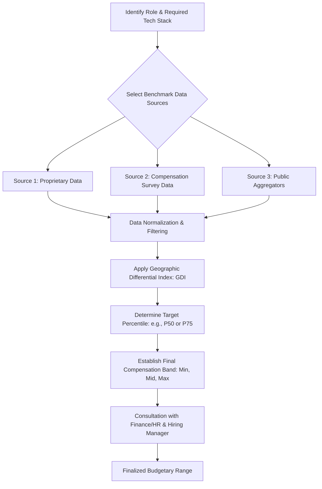

Mastering these methodologies ensures that you present offers grounded in empirical evidence, which is crucial when dealing with highly sought-after IT talent who often conduct their own market research.


#### Structuring Competitive Total Rewards Packages Beyond Base Salary

##### Structuring Competitive Total Rewards Packages Beyond Base Salary

In the competitive landscape for IT professionals, particularly those possessing niche skills (e.g., Kubernetes administration, advanced machine learning), the base salary alone is often insufficient to secure acceptance. The **Total Rewards Package (TRP)** encompasses all tangible and intangible benefits an employee receives in exchange for their labor. For the modern recruiter, articulating the value of the TRP is as critical as negotiating the base compensation.

**Components of the Total Rewards Package**

The TRP can be systematically broken down into several key categories, each carrying significant weight for IT candidates:

1.  **Fixed Compensation (Base Salary):** The guaranteed periodic payment.

2.  **Variable Compensation:** This includes performance-based incentives. For technical roles, this often manifests as:
    *   **Annual Performance Bonuses:** Tied to individual or organizational metrics.
    *   **Spot Bonuses:** Immediate recognition for exceptional project completion.

3.  **Long-Term Incentives (LTI) and Equity:** This is particularly attractive in high-growth technology companies. LTI components include:
    *   **Stock Options (ISOs/NSOs):** The right to purchase company stock at a predetermined price.
    *   **Restricted Stock Units (RSUs):** Actual shares granted upon vesting, often contingent on tenure or performance milestones. Understanding vesting schedules (e.g., 4-year cliff vesting) is essential for explaining the long-term financial commitment.

4.  **Benefits:** The foundational elements of security and well-being.
    *   **Health & Wellness:** Medical, dental, vision coverage, often subsidized by the employer.
    *   **Retirement Plans:** Employer matching contributions to 401(k) or equivalent plans. A strong match significantly boosts the perceived value of the package.

5.  **Perks and Work-Life Integration:** These intangible elements address quality of life and flexibility, which are highly valued by IT professionals.
    *   **Flexible Work Arrangements:** Remote work policies or hybrid schedules.
    *   **Professional Development Stipends:** Dedicated budgets for certifications (e.g., AWS Certified Solutions Architect), conferences, and continuous learning—a non-negotiable for many technical experts.
    *   **Technology Allowances:** Provision of high-end hardware or stipends for home office setup.

**Quantifying the Value of Non-Salary Components**

To effectively present the TRP, recruiters must be able to translate non-cash elements into an equivalent annual dollar value. This process is known as **Monetization of Benefits**.

**Example: Monetizing Equity and Bonus Potential**

Consider a candidate being offered a \$150,000 base salary. The full TRP includes:

*   **Annual Bonus Target:** 15% of base salary = \$22,500
*   **RSU Grant Value (Year 1 Vesting):** \$30,000
*   **401(k) Match (Assuming 5% contribution):** \$7,500

**Total Quantified Value (Year 1 Estimate):** \$150,000 (Base) + \$22,500 (Bonus) + \$30,000 (Equity) + \$7,500 (Match) = **\$210,000**

By presenting the offer as a \$210,000 Total Rewards Package, the recruiter shifts the focus from a single base number to the comprehensive value proposition. This strategy is particularly effective when the base salary might be slightly below the absolute top market rate but is offset by superior equity or benefits.


#### Tactical Approaches to Salary Negotiation and Counter-Offer Management

##### Tactical Approaches to Salary Negotiation and Counter-Offer Management

Salary negotiation is an inevitable stage in the recruitment lifecycle, especially when sourcing high-demand IT talent. For the beginner recruiter, negotiation should be viewed not as a conflict, but as a structured dialogue aimed at achieving mutual alignment based on established market data and organizational constraints. Preparation is the cornerstone of successful negotiation.

**Pre-Negotiation Preparation: Anchoring and Data Recall**

Before any discussion commences, the recruiter must establish the candidate's expectations early in the process—a concept known as **Anchoring**. If the candidate reveals their expectation first, their number becomes the psychological anchor for the subsequent discussion.

*   **Recruiter Strategy:** Aim to provide the organization's established compensation band *before* the candidate provides their firm number, thereby anchoring the discussion to the employer’s data-backed range. If the candidate provides a high anchor, immediately pivot back to the validated market data you possess.

**Tactical Negotiation Framework**

When a candidate requests a figure exceeding the approved range, the recruiter must employ consultative techniques rather than outright rejection. The goal is to understand the *why* behind the request.

1.  **Active Listening and Inquiry:** Ask open-ended questions: "That figure is slightly above our established range for this level of responsibility. Could you elaborate on what specific market data or competing offer led you to that expectation?"
2.  **Data-Driven Justification:** Respond by referencing the validated market data (from Topic 1). For example: "Based on our benchmarking for Senior DevOps Engineers in this metro area, the 75th percentile aligns with \$160,000. We are prepared to offer \$155,000, which places us in the top quartile of the market."
3.  **Leveraging Non-Salary Levers:** If the base salary cannot move further, pivot to the Total Rewards Package. "While we cannot increase the base beyond \$155,000 due to internal equity constraints, we can enhance the package by increasing the RSU grant by 20% or offering an accelerated performance review timeline."

**Managing Counter-Offers**

Counter-offers from a candidate's current employer present a significant challenge. These are often emotionally charged and require a measured, professional response.

*   **Acknowledge and Validate:** Recognize the candidate's value to their current employer. Do not disparage the competitor.
*   **Reiterate the Value Proposition:** Gently remind the candidate why they engaged with you in the first place (e.g., career trajectory, technology stack, cultural fit). The counter-offer addresses compensation; your role is to re-emphasize the holistic career opportunity.
*   **Establish a Firm Decision Timeline:** Counter-offers create urgency. Provide a clear, short window (e.g., 24-48 hours) for the candidate to make a final decision, ensuring they understand the organizational commitment you have made.

**Negotiation Flowchart**

The following diagram outlines the typical decision path during a compensation discussion:

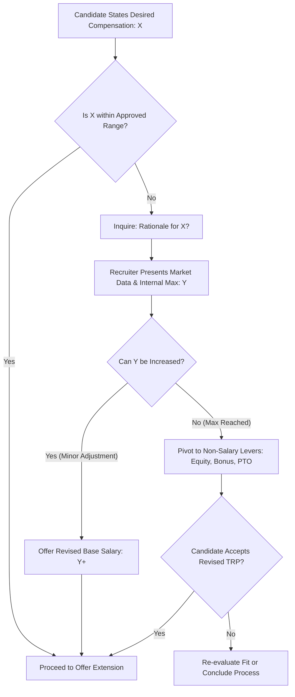

By adhering to this structured, data-informed approach, you maintain credibility while maximizing the organization's ability to secure top IT talent.


#### Formalizing the Offer Extension Process and Managing Candidate Expectations

##### Formalizing the Offer Extension Process and Managing Candidate Expectations

The culmination of the recruitment effort is the formal offer extension. This phase requires meticulous attention to detail, as any ambiguity can lead to offer decline or, worse, post-hire dissatisfaction. The process must transition seamlessly from verbal agreement to legally binding documentation while managing the candidate’s emotional state.

**The Verbal Offer: Setting the Stage**

The initial communication of the offer should always be conducted verbally, typically via a scheduled phone call or video conference. This allows the recruiter to gauge the candidate’s immediate reaction, address initial questions, and reinforce the positive aspects of the decision.

1.  **Confirmation of Key Terms:** Clearly state the final agreed-upon base salary, target bonus structure, equity grant details (including vesting schedule), and start date. Ensure these figures precisely match the internal approvals obtained.
2.  **Contingencies Disclosure:** Explicitly state all conditions precedent to employment. For IT roles, this almost universally includes successful completion of a background check, verification of employment eligibility (e.g., I-9 compliance), and potentially a technical assessment or reference checks.
3.  **Timeline Management:** Provide a clear deadline for acceptance. A standard timeframe is 48 to 72 hours. Explain that this timeline is necessary to manage internal resource allocation and other pipeline candidates.

**The Written Offer Letter: Precision and Compliance**

The written offer letter serves as the formal contract document. It must be error-free and comprehensive. It should be delivered immediately following the verbal confirmation.

Key elements that must be documented precisely:

*   **Job Title and Reporting Structure:** Must align perfectly with the job description used throughout the process.
*   **Compensation Details:** Itemized breakdown of base salary, bonus structure (stating if the bonus is guaranteed or discretionary), and equity details (number of units/options, grant price, vesting schedule).
*   **Benefits Summary:** A high-level overview of health coverage eligibility and retirement plan enrollment dates.
*   **At-Will Employment Statement (Jurisdiction Dependent):** A clear statement regarding the nature of the employment relationship.
*   **Signatures:** Spaces for authorized company representative and the candidate to sign and date.

**Managing Candidate Expectations Post-Offer**

Once the offer is extended, the recruiter shifts into a dedicated support role until the start date. Candidates often experience a period of anxiety, sometimes referred to as 'buyer's remorse,' even after accepting.

*   **Proactive Check-ins:** Schedule brief, non-intrusive check-ins (e.g., mid-day after the offer, and again 24 hours before the deadline). These check-ins are not to pressure acceptance but to offer clarification.
*   **Facilitating Pre-Boarding:** If the candidate has accepted, begin the transition to onboarding. Introduce them to their future manager or a team member for an informal chat. This reinforces their decision and builds early engagement.
*   **Handling Second Thoughts:** If a candidate expresses hesitation, return to the consultative approach. Revisit the core motivators that led them to apply. If the hesitation stems from a specific term (e.g., a delayed start date impacting a bonus), explore if minor, pre-approved flexibility can be granted without violating internal policy.

**Offer Acceptance Rate (OAR) Analysis**

As a professional recruiter, you must track the Offer Acceptance Rate (OAR) as a key metric for process health. A low OAR signals issues in benchmarking, negotiation strategy, or the overall candidate experience. Analyzing *why* offers are declined (e.g., compensation too low, competing offer superior, process too slow) provides actionable data for refining future recruitment cycles for IT profiles.


---

### Chapter 8: AI Tools and Automation for Modern Recruiters


#### Categorization of Recruitment Technology: Sourcing, Screening, and Scheduling Automation

##### Technological Segmentation in Talent Acquisition

The integration of Artificial Intelligence (AI) and automation is fundamentally reshaping the recruitment function, moving it from a purely administrative process to a strategic, data-informed discipline. For the modern recruiter, particularly one focused on the highly competitive IT sector, understanding the taxonomy of these tools is paramount. Recruitment technology can be broadly segmented based on the primary stage of the talent acquisition lifecycle it seeks to optimize: Sourcing, Screening, and Scheduling.

**Sourcing Automation:** This category encompasses tools designed to proactively identify and engage potential candidates, often passive ones. In the context of IT recruitment, sourcing automation leverages machine learning to scan vast datasets—professional networks, public code repositories (like GitHub), and specialized talent pools—to locate individuals possessing specific, in-demand technical proficiencies (e.g., expertise in Rust programming or cloud architecture certifications like AWS Certified Solutions Architect).

*Example:* An AI sourcing platform might analyze a candidate's GitHub contributions, inferring proficiency levels in specific programming languages far more accurately than a keyword search on a resume alone. The automation handles the initial identification and often the personalized outreach cadence.

**Screening Automation:** This is perhaps the most transformative area, focusing on the initial evaluation of applicants against predefined job requirements. This automation aims to reduce the volume of unqualified applications, allowing recruiters to focus on high-potential individuals. Key components include resume parsing, skills inference, and initial automated assessments.

*Example:* For a Senior DevOps Engineer role requiring Terraform and Ansible proficiency, an automated screening system can instantly score applicants based on the density and context of these keywords, cross-referencing them with years of experience inferred from the document structure. This drastically reduces the manual effort required to sift through hundreds of applications.

**Scheduling Automation:** This segment addresses the logistical friction inherent in coordinating interviews across multiple stakeholders (candidates, hiring managers, technical interview panels). Automation tools integrate with calendars (e.g., Outlook, Google Calendar) to find mutually available slots, send confirmations, and manage rescheduling requests without direct recruiter intervention.

*Example:* Once a candidate passes the initial screening, an automated scheduling bot can present the candidate with available time slots for a first-round technical interview with the Engineering Lead, instantly booking the slot and sending calendar invitations to all parties. This process, which previously consumed significant administrative time, becomes instantaneous.

These three pillars—Sourcing, Screening, and Scheduling—form the core operational framework where AI delivers measurable efficiency gains. Understanding where each tool fits allows the novice recruiter to strategically implement technology rather than simply adopting disparate software solutions.

##### Visualization of Recruitment Technology Categorization

To solidify this conceptual framework, consider the following process flow illustrating where automation intervenes within the typical recruitment funnel:

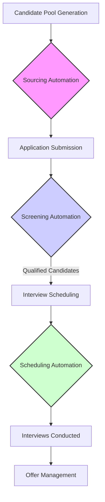

This categorization provides a foundational understanding necessary before delving into the specifics of advanced algorithms.


#### Evaluating AI-Powered Resume Parsing and Candidate Matching Algorithms

##### Deconstructing Algorithmic Evaluation in Talent Matching

As recruiters move beyond simple keyword searches, they encounter sophisticated AI tools designed to interpret unstructured data, primarily resumes and CVs. Resume parsing and candidate matching algorithms utilize Natural Language Processing (NLP) and Machine Learning (ML) models to extract, normalize, and compare candidate data against job requirements. Evaluating these systems requires a technical appreciation of their underlying mechanisms.

**Resume Parsing Mechanics:** Parsing involves transforming a document (PDF, DOCX) into structured, machine-readable data fields (e.g., Name, Experience Years, Skills List). For IT roles, the challenge lies in accurately identifying nuanced technical terms. For instance, the parser must differentiate between a candidate who merely *used* Python and one who has demonstrated expertise in *developing* complex applications using Python frameworks like Django or Flask.

*Technical Nuance:* Advanced parsers employ entity recognition to tag specific technical entities. A robust parser should correctly identify 'Kubernetes' as a container orchestration technology, not just a random string of characters, and assign it a confidence score based on contextual usage.

**Candidate Matching Algorithms:** Once data is parsed, matching algorithms compare the structured candidate profile against the ideal candidate profile derived from the job description (JD). These algorithms often employ vector space models or deep learning networks to calculate a similarity score.

1.  **Keyword Weighting:** Simple models assign higher weights to mandatory skills (e.g., 'Security Clearance Required') and lower weights to preferred skills (e.g., 'Familiarity with Agile methodologies').
2.  **Semantic Matching:** Superior models move beyond exact keyword matches. They understand synonyms and related concepts. For a JD requiring 'Cloud Infrastructure Management,' a semantic matcher recognizes 'AWS EC2 administration' or 'Azure Virtual Machine deployment' as highly relevant matches, even if the exact phrase isn't present.

##### Metrics for Algorithm Assessment

To ensure these tools are effective and not merely generating noise, recruiters must understand basic evaluation metrics derived from information retrieval science:

*   **Precision:** Of all the candidates the AI ranked highly (e.g., Top 10%), how many were genuinely qualified? High precision means fewer false positives (unqualified candidates presented to the hiring manager).
    $$\text{Precision} = \frac{\text{True Positives}}{\text{True Positives} + \text{False Positives}}$$
*   **Recall:** Of all the truly qualified candidates in the entire applicant pool, what percentage did the AI successfully identify and rank highly? High recall means fewer false negatives (qualified candidates missed by the system).
    $$\text{Recall} = \frac{\text{True Positives}}{\text{True Positives} + \text{False Negatives}}$$

When evaluating a system for sourcing niche IT talent (e.g., specialized penetration testers), a recruiter might prioritize **Recall** initially to ensure no potential expert is overlooked, even if it means slightly lower initial precision that the recruiter can refine manually. Conversely, if the volume is overwhelming, **Precision** becomes the priority to manage the immediate workload.

**Practical Application for IT Roles:** If an AI matching system consistently ranks candidates with general programming experience above those with specific experience in a required framework (e.g., ranking a general Java developer above a specialized Spring Boot developer for a microservices role), the underlying model requires recalibration or retraining using better-labeled data sets.


#### Ethical Considerations and Limitations of Machine Learning in Talent Selection

##### Navigating Algorithmic Bias and Fairness in Automated Screening

While AI promises objectivity, machine learning models are inherently susceptible to inheriting and amplifying biases present in the data upon which they are trained. This presents significant ethical and legal challenges for recruiters, especially when dealing with protected characteristics or ensuring diversity in technical fields historically lacking representation.

**The Problem of Historical Data Bias:** ML models learn patterns from historical hiring decisions. If, historically, a company predominantly hired male candidates for Senior Software Architect roles, the algorithm may inadvertently learn to associate male-coded language or specific educational institutions predominantly attended by that demographic with 'success.' When applied to new applicants, the system may unfairly penalize equally qualified female or minority candidates, creating a feedback loop of systemic bias.

*Example of Bias Amplification:* If a company historically hired graduates only from three specific universities for their cybersecurity team, an AI trained on this data might assign a lower match score to an equally skilled candidate from a lesser-known but highly reputable coding bootcamp, simply because the bootcamp is not represented in the 'successful hire' historical data.

**Limitations of Machine Learning in Contextual Assessment:** AI excels at pattern recognition but struggles profoundly with context, nuance, and potential. It cannot assess motivation, cultural contribution, or the ability to pivot quickly—qualities essential for high-performing IT professionals.

1.  **Inability to Assess Potential:** An algorithm might reject a candidate who self-taught advanced machine learning concepts outside formal education, viewing their lack of a traditional degree as a negative signal, thereby missing a high-potential future innovator.
2.  **Over-reliance on Keywords:** Over-reliance on exact keyword matching can lead to penalizing candidates who use alternative terminology or describe their experience differently (e.g., using 'CI/CD pipeline management' instead of the exact term 'DevOps automation').

##### Mitigating Ethical Risks: The Recruiter's Responsibility

To ensure responsible deployment of these technologies, recruiters must adopt a stance of critical oversight:

*   **Bias Auditing:** Regularly test the system's output by submitting intentionally diverse, yet equally qualified, synthetic profiles to see if the ranking order changes based on non-skill attributes (e.g., name, gender indicators, non-traditional educational background).
*   **Transparency and Explainability (XAI):** Demand that vendors provide insight into *why* a candidate received a specific score. If the system cannot articulate its decision-making process beyond a simple numerical score, its use in high-stakes screening should be limited.
*   **Human-in-the-Loop (HITL):** Automation should serve as a *filter*, not a *final decision-maker*. Recruiters must review the top-ranked candidates and, crucially, review a statistically significant sample of the candidates the AI rejected to ensure no qualified talent was erroneously discarded.

For the beginner recruiter focusing on IT, the ethical mandate is clear: technology must augment human judgment, not replace the nuanced assessment required to build a diverse and high-performing technical team.


#### Utilizing Chatbots for Candidate Engagement and FAQ Resolution

##### Conversational AI: Enhancing Candidate Experience (CX) Through Automation

Chatbots represent the front line of automated candidate interaction. These conversational agents, powered by AI and Natural Language Understanding (NLU), are deployed on career sites or within Applicant Tracking Systems (ATS) to provide immediate, scalable support to applicants. Their primary value proposition lies in improving Candidate Experience (CX) by offering 24/7 responsiveness, which is critical when sourcing candidates across multiple time zones.

**Functionality in IT Recruitment:** For technical roles, candidates often have highly specific, time-sensitive questions that cannot wait for a recruiter's working hours. Chatbots are programmed to handle these Frequently Asked Questions (FAQs) efficiently.

*   **Role-Specific Queries:** A candidate applying for a Backend Developer position might ask, 'Is this role remote?' or 'What is the primary database technology used in this project?' The chatbot retrieves the answer directly from the integrated knowledge base (often linked to the ATS job record).
*   **Process Queries:** Common questions regarding application status, next steps, or required documentation (e.g., 'Do I need to submit a portfolio?') are handled instantly, reducing recruiter email volume.
*   **Pre-screening Qualification:** Advanced chatbots can conduct rudimentary, structured pre-screening interviews. For example, they can ask, 'Do you possess active security clearance?' or 'Are you authorized to work in the United States?' If the candidate fails a mandatory gate question, the chatbot can politely conclude the interaction, saving the recruiter time.

##### Designing Effective Chatbot Interactions

Effective chatbot deployment requires careful design to maintain a professional and engaging tone, avoiding the perception of impersonal automation. The flow must be logical and clearly delineate when human intervention is necessary.

**Flow Diagram of a Standard Chatbot Interaction:**

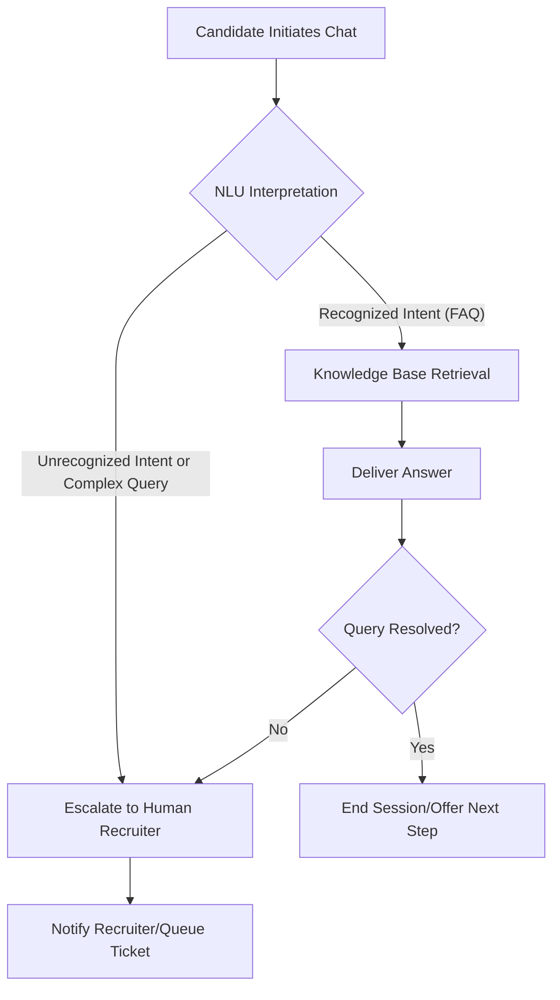

**The Hand-off Protocol:** The most crucial element for maintaining a positive CX is the seamless transition from bot to human. If the chatbot cannot resolve the query (as shown in the diagram path to F), it must immediately capture the context of the conversation and route it to the appropriate recruiter or talent acquisition specialist. This ensures the candidate does not have to repeat their query.

**Data Collection and Iteration:** Every interaction, whether resolved by the bot or escalated, provides valuable data. Recruiters should analyze transcripts regularly to identify common points of confusion or missing information in the knowledge base. This iterative refinement process ensures the chatbot becomes increasingly intelligent and helpful over time, directly supporting the goal of efficient IT talent acquisition by providing instant clarity on complex technical roles.


---

### Chapter 9: Personal Branding and Professional Network Cultivation


#### Developing a Credible Professional Persona Across Digital Platforms

Welcome to Chapter 9. As you transition from foundational knowledge to active recruitment practice, particularly within the competitive Information Technology sector, your personal brand becomes an indispensable asset. A credible professional persona is the curated digital representation of your expertise, values, and reliability. For a beginner recruiter aiming to attract high-caliber IT talent, establishing this persona is paramount.

##### The Architecture of Digital Credibility

Credibility in the digital sphere is built upon consistency, authenticity, and demonstrated knowledge. Your persona must signal to potential candidates—especially discerning software engineers or cybersecurity analysts—that you understand their domain and respect their career trajectory. This involves meticulous management of your primary professional platforms, most notably LinkedIn, but also potentially specialized forums or professional blogs.

**Consistency in Presentation:** Ensure uniformity across all professional profiles. This includes a high-resolution, professional headshot, a concise yet impactful headline that clearly states your specialization (e.g., "IT Talent Acquisition Specialist | Focusing on Cloud Engineering & DevOps"), and a summary section that articulates your value proposition. Avoid generic statements; instead, quantify your understanding of the IT landscape.

**Demonstrating Domain Fluency:** To resonate with IT professionals, you must move beyond superficial knowledge. Integrate relevant keywords related to the technology stacks you recruit for (e.g., Kubernetes, React, AWS Lambda) into your profile narrative. Furthermore, actively engage with industry content. Sharing insightful commentary on recent technology trends, regulatory changes affecting IT roles, or emerging skill demands validates your expertise. For instance, if you are sourcing for a Senior Data Scientist, commenting intelligently on a recent paper about explainable AI (XAI) demonstrates a level of engagement far superior to simply posting a job link.

**Authenticity and Transparency:** While branding involves curation, it must remain rooted in reality. Overstating your experience or the roles you handle will quickly erode trust. Be transparent about your recruitment philosophy and your commitment to ethical hiring practices. This is particularly crucial when dealing with passive candidates who are often skeptical of unsolicited outreach.

##### Platform-Specific Optimization for Recruiters

Different platforms require tailored approaches to maintain credibility:

1.  **LinkedIn:** This is your primary hub. Optimize your 'Experience' section not just for your recruiting history, but also for any relevant project work or certifications that showcase your understanding of the hiring process or technology itself. Utilize the 'Skills & Endorsements' section strategically, focusing on skills relevant to talent acquisition *and* the IT domains you cover.
2.  **Professional Portfolios/Blogs (Optional but Recommended):** For advanced credibility, consider maintaining a simple blog or Medium account. Topics could include 'Navigating the Technical Interview Process for Junior Developers' or 'Market Insights on Compensation for Full-Stack Engineers in Q3.' This positions you as a thought leader, not just a transactional intermediary.

**Example of Persona Development (IT Focus):**

*   **Weak Headline:** Recruiter at Tech Solutions Inc.
*   **Strong Credible Persona Headline:** Talent Acquisition Partner | Bridging the Gap Between Innovative Startups and Elite Backend Developers (Go/Rust Specialist) | Driving 90-Day Time-to-Hire Reduction.

Developing this persona is an ongoing process requiring regular content review and engagement, ensuring your digital footprint aligns perfectly with the professional standard you wish to project.


#### Strategies for Building and Maintaining a Robust Professional Network

A professional network is the lifeblood of a successful recruiter, especially when targeting niche IT profiles where passive candidates dominate the talent pool. Building this network transcends simply collecting contacts; it involves cultivating mutually beneficial, long-term relationships. For a beginner, this requires a structured, proactive approach.

##### Network Cultivation Framework

Effective networking operates on a continuous cycle: Identification, Engagement, Nurturing, and Reciprocation. We can model this relationship development using a simple process flow:

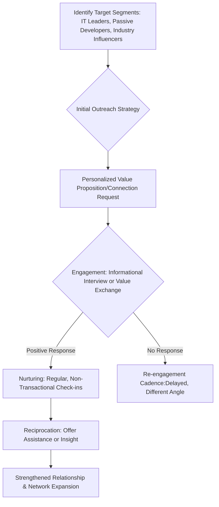

##### Targeting IT Professionals

When focusing on IT talent, your network must be technically relevant. Identify key nodes within the technology ecosystem:

1.  **Technical Peers:** Connect with other recruiters specializing in IT, but also with engineering managers, architects, and senior developers who serve as gatekeepers or influencers for hiring decisions.
2.  **Community Leaders:** Engage with organizers of local tech meetups (e.g., Python User Groups, Cloud Security Forums). These individuals possess deep connections within the talent pool.
3.  **Alumni and Former Colleagues:** Leverage existing professional ties, clearly communicating your new specialization in IT recruitment.

##### Maintenance and Nurturing

The critical differentiator between a contact list and a robust network is maintenance. A network decays rapidly without consistent, low-pressure interaction. This is where the transition from transactional recruiting (only reaching out when you have an immediate opening) to relationship-based recruiting occurs.

**The 90-Day Nurturing Cadence:** Implement a systematic approach to stay visible without being intrusive. This might involve:

*   **Monthly:** Share an article relevant to their specific technology stack or role (e.g., sending a DevOps article to a known Kubernetes expert).
*   **Quarterly:** Send a brief, personalized message acknowledging a professional milestone (e.g., a work anniversary or a new certification).
*   **Semi-Annually:** Offer a brief, non-committal check-in, perhaps asking for their perspective on a general market trend, positioning yourself as a resource rather than a solicitor.

**Reciprocation is Key:** A network thrives on give-and-take. Always look for opportunities to assist your contacts without expecting immediate returns. This could involve making an introduction to someone in your network, sharing market data, or providing feedback on a presentation they are preparing. This establishes you as a valuable connector, significantly enhancing your professional standing.


#### Effective Utilization of Social Media for Employer Branding Initiatives

While personal branding focuses on *you*, employer branding focuses on the organization you represent. As a recruiter, you are the primary conduit through which candidates experience the company culture and value proposition. Social media platforms are powerful amplifiers for these initiatives, especially when targeting tech talent who often research a company's reputation extensively before applying.

##### Social Media as a Branding Vehicle

Employer branding is the perception of what it is like to work for your organization. Effective utilization of social media transforms this perception from abstract marketing copy into tangible evidence.

**Platform Selection for IT Recruitment:** While LinkedIn remains central, platforms like Twitter (for real-time tech discussions) and even specialized communities (like GitHub or Stack Overflow, depending on company policy) can be leveraged. The focus should be on showcasing the *work* and the *people*.

**Content Pillars for IT Employer Branding:** Your social media content should revolve around three core pillars:

1.  **Technology & Innovation:** Highlight the cutting-edge projects, the tech stack utilized, and the engineering challenges the team is solving. *Example:* A post featuring a brief video interview with a Principal Engineer discussing their migration to microservices architecture.
2.  **Culture & People:** Showcase the human element. Feature employee spotlights, team events, or diversity and inclusion initiatives. Authenticity is crucial here; staged photos are often transparently rejected by sophisticated IT candidates.
3.  **Impact & Mission:** Connect the technical work to the broader organizational mission. How does the software being built by the team impact the end-user or the industry? Tech professionals are often motivated by purpose.

##### Measuring Branding Effectiveness

To ensure your efforts are not merely noise, you must track engagement metrics related to employer branding content. Key metrics include:

*   **Engagement Rate:** Likes, shares, and comments on employer-focused posts.
*   **Traffic Referral:** The volume of traffic directed to the careers page originating from social media channels.
*   **Candidate Sentiment:** Monitoring qualitative feedback received during initial screening regarding what attracted them to the role (often citing a specific social media post).

**The Recruiter's Role in Amplification:** You are not just a consumer of employer branding content; you are its most effective distributor. When the marketing team releases a new piece on the company's commitment to open-source contribution, your role is to share it with your network, adding your personal endorsement and context (e.g., "This aligns perfectly with the challenging work I see our new Python developers tackling daily"). This personal endorsement carries significantly more weight than a corporate post alone.

**Inclusivity Note:** Ensure that all visual content and testimonials reflect the diversity you aim to achieve within the technical teams. Inclusivity must be demonstrated, not just stated, to attract a broad spectrum of IT talent.


#### Transitioning from Transactional Recruiting to Consultative Partnership

The most significant leap a beginner recruiter makes is moving from a transactional mindset—filling seats quickly based on immediate requisitions—to adopting a consultative partnership approach with hiring managers and candidates. This transition is fundamental to long-term success, particularly in specialized fields like IT where talent scarcity is the norm.

##### Defining Transactional vs. Consultative Recruiting

**Transactional Recruiting** is reactive, focused on immediate fulfillment, and often characterized by order-taking. The recruiter acts as an administrative intermediary, prioritizing speed over fit or long-term strategy. Success is measured by 'time-to-fill.'

**Consultative Partnership** is proactive, strategic, and focused on long-term talent strategy and organizational impact. The recruiter acts as an internal consultant, advising stakeholders on market realities, talent availability, and best practices for attraction and retention. Success is measured by 'quality-of-hire' and retention rates.

##### Pillars of Consultative Partnership

To become a trusted advisor, you must master three areas:

1.  **Market Intelligence Authority:** You must possess superior knowledge of the IT talent market compared to the hiring manager. This includes compensation trends, competitor hiring activities, emerging skill gaps, and geographical talent saturation. When a hiring manager insists on an outdated technology stack, the consultant explains the market scarcity and proposes viable alternatives (e.g., suggesting a shift from legacy Java EE to modern Spring Boot expertise, backed by data).
2.  **Strategic Workforce Planning:** Engage in discussions *before* a requisition is opened. Consult on workforce planning, helping the business unit define future needs based on product roadmaps. This shifts your role from filling gaps to preventing them.
3.  **Process Ownership and Influence:** A consultant owns the entire hiring process outcome, not just the sourcing phase. This involves advising on interview structure (Chapter 5), ensuring candidate experience standards are met, and providing data-driven feedback on why candidates are declining offers (Chapter 7).

**Example Scenario: Consultative Intervention (IT Focus)**

*   **Transactional Approach:** Hiring Manager (HM) requests a 'Senior C++ Developer with 10 years of experience in embedded systems.' Recruiter sources candidates matching the exact criteria.
*   **Consultative Approach:** Recruiter analyzes the market and reports back: "Based on current market data, candidates meeting that exact profile command a 25% premium and have a 1% availability rate in our region. However, I have identified a strong cohort of mid-level engineers proficient in Rust, which aligns with your future roadmap goals. If we adjust the requirement to include Rust proficiency and offer mentorship, we can secure three highly viable candidates within 45 days at a 10% lower cost. Shall we adjust the Job Description to reflect this strategic pivot?"

This consultative dialogue establishes the recruiter as a strategic business partner whose insights directly influence organizational capability and efficiency. Mastering this transition is the hallmark of a mature, effective recruiter.


---

### Chapter 10: Recruitment Analytics and Performance Optimization


#### Key Performance Indicators (KPIs) in Recruitment: Time-to-Fill and Quality-of-Hire

Key Performance Indicators (KPIs) are quantifiable measures used to evaluate the success of an organization, or in our context, the efficiency and effectiveness of the recruitment function. For a recruiter aiming for excellence, mastering a core set of KPIs is non-negotiable. We will focus initially on two foundational metrics: Time-to-Fill (TTF) and Quality-of-Hire (QoH).

##### Time-to-Fill (TTF)

Time-to-Fill measures the duration, typically in calendar days, from the moment a job requisition is officially approved until a candidate accepts the formal offer. This metric is critical, especially in the fast-moving IT sector where a delay in hiring a Senior DevOps Engineer can halt a critical project timeline. A lower TTF generally indicates an efficient sourcing and screening process.

The standard calculation for Time-to-Fill is:

$$\\text{Time-to-Fill (Days)} = \\text{Offer Acceptance Date} - \\text{Requisition Approval Date}$$

**Example Application (IT Focus):**
Suppose a requisition for a Mid-Level Python Developer was approved on October 1st. The selected candidate accepted the offer on October 28th.
$$\\text{TTF} = 28 \\text{ days} - 1 \\text{ day} = 27 \\text{ days}$$

Recruiters must segment TTF by role complexity. For instance, a standard Help Desk Technician might have a target TTF of 20 days, whereas a highly specialized AI/Machine Learning Scientist might have an acceptable TTF of 60 days due to scarcity. Tracking these segmented TTFs allows for targeted process adjustments.

##### Quality-of-Hire (QoH)

While TTF measures speed, Quality-of-Hire (QoH) measures the *value* delivered by the hiring process. This is arguably the most important, yet most challenging, metric to quantify, as it requires post-hire data collection. For IT roles, high QoH means the new hire possesses the requisite technical competencies, integrates well with the team, and achieves performance milestones within a defined period (e.g., 6 or 12 months).

QoH is often calculated using a composite index derived from several factors, including:

1.  **Hiring Manager Satisfaction Score:** Surveying the hiring manager 90 days post-hire on the new employee's performance and fit.
2.  **New Hire Performance Ratings:** Objective performance review scores after the probationary period.
3.  **First-Year Retention Rate:** The percentage of hires still employed after one year.
4.  **Ramp-Up Time:** How quickly the new hire reached full productivity (e.g., successfully deploying their first feature).

A simplified formula for a composite QoH index might look like this (though actual implementation is often more complex):

$$\\text{QoH Index} = (0.4 \\times \\text{HM Satisfaction}) + (0.3 \\times \\text{Performance Score}) + (0.3 \\times \\text{Retention Indicator})$$

**Example Application (IT Focus):**
If a recruiter hires a Cybersecurity Analyst, and 180 days later, the manager rates them 4.5/5 on technical proficiency, and the analyst has already completed two critical security audits successfully, this indicates a high QoH, justifying the time and resources spent on sourcing that specific profile. If the TTF was high but the QoH is excellent, the process was effective, even if slow. Conversely, a fast hire (low TTF) who fails probation (low QoH) indicates a severe process failure.


#### Analyzing Funnel Conversion Rates to Identify Bottlenecks

The recruitment funnel, often visualized as a pipeline, illustrates the flow of candidates from initial awareness (application or sourcing contact) through to the final hiring decision. Analyzing conversion rates between each stage is fundamental to diagnosing where the process is failing or succeeding. This analysis moves recruitment from intuition to empirical diagnosis.

##### The Standard Recruitment Funnel Stages (IT Context)

A typical funnel for sourcing technical talent includes stages such as:

1.  **Sourced/Applied:** Total initial pool of candidates.
2.  **Screened:** Candidates who meet minimum qualifications and pass an initial recruiter screen.
3.  **Technical Interview:** Candidates who successfully pass the initial technical assessment or interview with the engineering team.
4.  **Hiring Manager Interview:** Candidates who progress to meet the final decision-makers.
5.  **Offer Extended:** Candidates who receive a formal offer.
6.  **Offer Accepted:** The final hire.

##### Calculating Conversion Rates

The conversion rate between any two stages is calculated as:

$$\\text{Conversion Rate} (\\text{Stage A to B}) = \\left( \\frac{\\text{Number of Candidates Entering Stage B}}{\\text{Number of Candidates Entering Stage A}} \\right) \\times 100$$

**Example Scenario:**
A recruiter is hiring for a specialized role, like a Cloud Architect. Over one month, they processed 100 candidates:

| Stage | Candidates Entering Stage |
| :--- | :--- |
| Sourced/Applied | 100 |
| Screened | 50 |
| Technical Interview | 20 |
| Offer Extended | 5 |
| Offer Accepted | 2 |

**Conversion Calculations:**
*   Sourced to Screened: $(50 / 100) \\times 100 = 50\%$
*   Screened to Technical Interview: $(20 / 50) \\times 100 = 40\%$
*   Technical Interview to Offer Extended: $(5 / 20) \\times 100 = 25\%$
*   Offer Extended to Accepted: $(2 / 5) \\times 100 = 40\%$

##### Identifying Bottlenecks

A bottleneck occurs where the conversion rate drops significantly below the expected benchmark or the average rate across other roles. In the example above, the drop from 40% (Screened to Technical Interview) to 25% (Technical Interview to Offer Extended) is substantial. This suggests a potential bottleneck at the **Technical Interview** stage. Possible causes could include:
1.  The technical assessment is poorly designed or too difficult, filtering out otherwise viable candidates.
2.  The engineering interviewers are unavailable, causing long delays (impacting TTF).
3.  The interviewers are not aligned on the required competencies, leading to inconsistent evaluation.

To visualize this flow and the associated drop-offs, we use a process flow diagram:

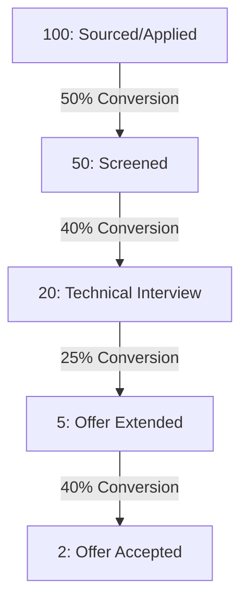
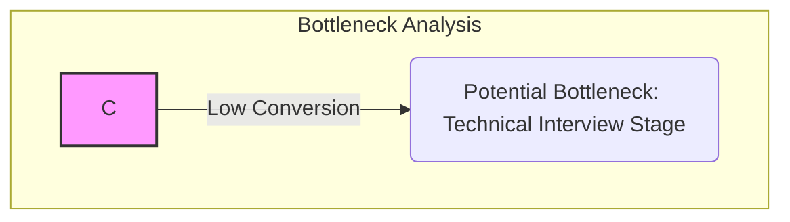

By systematically analyzing these conversion rates, the recruiter can focus improvement efforts precisely where they yield the highest return on investment (ROI) for process refinement.


#### Data Visualization Techniques for Reporting Recruitment Efficacy to Stakeholders

Data, no matter how accurately collected, is ineffective if it cannot be communicated clearly to decision-makers—Hiring Managers, HR Directors, and Executive Leadership. Stakeholders require concise, actionable insights, not raw spreadsheets. Data visualization transforms complex metrics into easily digestible narratives.

##### Principles of Effective Recruitment Reporting

When presenting recruitment analytics, the visualization must align with the audience's needs:

1.  **Executive Dashboards (High-Level):** Focus on strategic KPIs like overall QoH, total hiring volume, and average TTF across departments. These require simple, high-impact visuals.
2.  **Operational Reports (Recruiter/Manager Level):** Focus on funnel conversion rates, source effectiveness, and pipeline health. These require more granular detail.

##### Appropriate Visualization Types for Recruitment Data

For an IT recruitment context, specific chart types are superior for conveying different types of information:

1.  **Bar Charts for Source Effectiveness:** To demonstrate which sourcing channels yield the highest volume of *qualified* candidates for specific IT roles (e.g., comparing LinkedIn Recruiter vs. GitHub Sourcing vs. Employee Referrals for Java Developers).

    *Example Metric:* Number of Hires by Source Channel.

2.  **Line Charts for Trend Analysis:** Essential for tracking performance over time. For instance, tracking the average TTF for "Cloud Engineer" roles month-over-month to see if recent process changes have reduced hiring duration.

3.  **Pie Charts (Used Sparingly) for Composition:** Useful for showing the breakdown of the current active pipeline by seniority level or by technology stack (e.g., 60% Backend Engineers, 40% Frontend Engineers in the active pipeline).

4.  **Scatter Plots for Correlation:** Advanced visualization showing the relationship between two variables, such as plotting Time-to-Fill against Quality-of-Hire. If a cluster shows high TTF and high QoH, it confirms that investing more time in sourcing yields better results for that specific role type.

##### Example Visualization: Source Effectiveness for IT Roles

Imagine a recruiter needs to justify increased spending on a niche job board specializing in DevOps talent. A bar chart clearly illustrates the ROI:

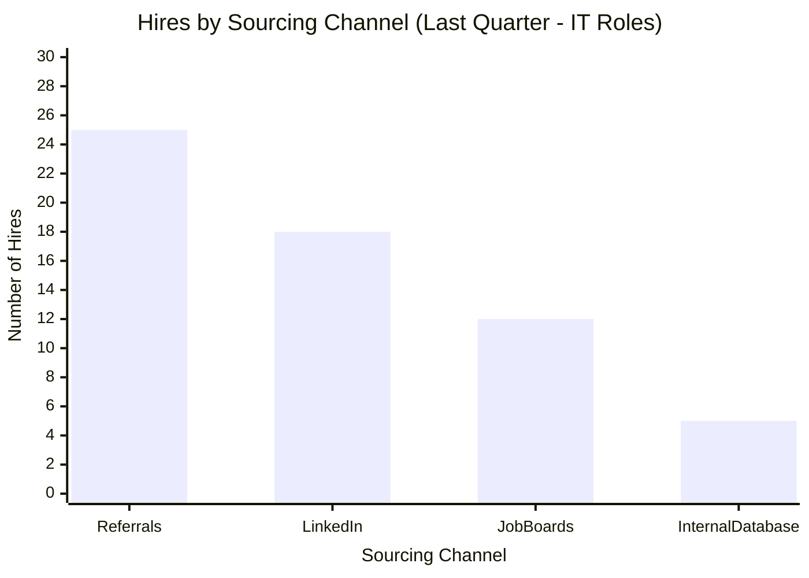

When presenting this to leadership, the narrative is clear: "Referrals remain our strongest source for quality hires, but the Job Board channel, despite lower volume, delivered 12 hires for critical roles, warranting continued investment." This data-driven approach establishes the recruiter as a strategic business partner rather than merely an administrative function.


#### Implementing Continuous Process Improvement Cycles Based on Performance Metrics

Recruitment is not a static function; it must evolve constantly to meet changing market demands, especially in technology where skill requirements shift rapidly (e.g., the sudden rise of Generative AI expertise). Continuous Process Improvement (CPI) provides a structured methodology for using the data gathered from KPIs and funnel analysis to iteratively enhance recruitment efficacy.

##### The Plan-Do-Check-Act (PDCA) Framework

The most widely adopted model for CPI is the Deming Cycle, or PDCA cycle. Applying this cycle systematically ensures that improvements are data-validated and sustainable.

**1. Plan (Identify the Problem and Set Goals):**
Based on the analytics review, identify a specific area for improvement.
*   *Example:* Analysis shows the conversion rate from Technical Interview to Offer Extended for Senior Software Engineers is only 15% (a bottleneck). The goal is to raise this to 25% within the next fiscal quarter.

**2. Do (Implement the Change):**
Execute the planned intervention on a small, controlled scale if possible.
*   *Example:* The recruiter collaborates with the Engineering Director to standardize the technical interview process. They introduce a mandatory, standardized take-home coding challenge scored against a predefined rubric, replacing unstructured whiteboard sessions.

**3. Check (Measure and Analyze Results):**
Collect data on the new process and compare the results against the baseline metrics established in the 'Plan' phase.
*   *Example:* After running 10 interviews under the new standardized process, the conversion rate to Offer Extended rises to 22%. The team reviews qualitative feedback from candidates and interviewers regarding the new challenge.

**4. Act (Standardize or Re-Plan):**
If the results meet or exceed the goal, standardize the change across all relevant hiring teams. If the results are insufficient, refine the intervention and restart the cycle.
*   *Example:* Since 22% is close to the 25% goal and represents a significant improvement over the baseline 15%, the standardized coding challenge and rubric are formally adopted as the mandatory screening protocol for all Senior Software Engineer requisitions. The next cycle might focus on improving the initial sourcing conversion rate.

##### Applying CPI to IT Talent Acquisition

For IT roles, CPI cycles are often focused on reducing sourcing friction or improving candidate experience to secure scarce talent.

*   **Scenario:** If data shows that candidates sourced from external agencies have a 50% higher QoH than those sourced internally, the 'Plan' phase might involve investigating the internal sourcing team's training or access to specialized tools. The 'Do' phase could involve intensive training on advanced Boolean searching for niche technologies (like Rust or Go developers). The 'Check' phase measures the QoH of internally sourced candidates in the subsequent quarter.

By embedding the PDCA cycle into the recruitment workflow, the aspiring recruiter ensures that their function is constantly optimizing for speed (TTF) and effectiveness (QoH), transforming the role into a data-driven strategic asset for the organization. This analytical rigor is what separates transactional hiring from strategic talent acquisition.


---

## Exercises

### Chapter 1: Foundations of Talent Acquisition and the Recruiter Role

#### Terminology Identification: Evolution of TA *

_**Question**_

Match the following historical function to its modern strategic equivalent as described in the text:

1. Administrative Personnel Management
2. Reactive Hiring
3. Order-Taker

To:
A. Strategic Talent Acquisition (TA)
B. Proactive Workforce Planning
C. Crucial Business Partner

State the correct sequence (e.g., 1-A, 2-B, 3-C).

_**Solution**_

1-A, 2-B, 3-C

_**Explanation**_

This exercise tests foundational understanding of the evolution described:
*   **Personnel Administration** has evolved into **Strategic Talent Acquisition (TA)**.
*   **Reactive Hiring** (waiting for needs) is contrasted with **Proactive Workforce Planning** (anticipating needs).
*   The modern recruiter is a **Crucial Business Partner**, moving beyond the transactional role of an **Order-Taker**.

#### KPI Impact Assessment *

_**Question**_

If an organization hires a Senior Cloud Architect who fails to integrate with the existing DevOps team structure within three months, which two primary Organizational Performance Metrics discussed in the text are most directly compromised? Select the best pair.

A. Time-to-Productivity and Employee Retention
B. Quality of Hire (QoH) and Time-to-Productivity
C. Employee Retention and Quality of Hire (QoH)
D. Market Intelligence and Stakeholder Management

_**Solution**_

C. Employee Retention and Quality of Hire (QoH)

_**Explanation**_

1.  **Quality of Hire (QoH):** The text defines this as assessing the *long-term value* and *cultural alignment*. Failure to integrate suggests poor cultural/team fit, impacting long-term value.
2.  **Employee Retention:** Poor hiring decisions (leading to early attrition or poor performance) are a leading cause of attrition, directly impacting retention metrics. While Time-to-Productivity might be affected, the failure to integrate points most strongly to the quality and retention aspects first.

#### Consultative Challenge Scenario **

_**Question**_

A Hiring Manager (HM) for a new Security Operations Center (SOC) insists on a requisition for a 'Cybersecurity Analyst with 12 years of experience in SIEM platform deployment.' You know the leading SIEM technology was commercially released only 8 years ago. As a strategic recruiter adopting a consultative mindset, what is the most appropriate immediate action, referencing the text's guidance on challenging requirements?

_**Solution**_

**Action:** The recruiter must diplomatically challenge the 12-year requirement by referencing market realities and the actual lifespan of the required technology (SIEM). The recruiter should guide the HM toward a realistic specification, such as 7-9 years of experience, focusing on proficiency in core security principles and relevant platform expertise, thereby preventing the creation of an unfillable requisition.

_**Explanation**_

This tests the 'Recruiter as a Business Consultant' competency. The strategic recruiter must prevent the creation of an **unfillable requisition**. Demanding experience exceeding the technology's existence (12 years for an 8-year-old platform) is an example of unrealistic specification. The recruiter's role is to use market knowledge (Business Acumen) to guide the HM to a viable requirement, ensuring the requisition accurately reflects market realities.

#### Model Relationship Mapping **

_**Question**_

Analyze the provided relationship structure diagram for TA channels. If an organization utilizes a **Retained Agency** to find a confidential Chief Technology Officer (CTO), which node (B, C, or D) represents this external sourcing channel, and what is the primary contractual relationship type (referencing the diagram's labels)?


_**Solution**_

Node **C (Agency Recruiter)** represents this channel. The primary contractual relationship type is the **Service Contract**.

_**Explanation**_

Retained search firms fall under the **Agency Recruitment Model**. In the provided diagram:
*   Node B is Internal (Direct Employment).
*   Node C is the Agency model, characterized by a **Service Contract**.
*   Node D is the Freelance model (Project Contract).

Retained searches are specialized agency mandates, fitting perfectly into the structure represented by Node C.

#### Model Selection Justification **

_**Question**_

A mid-sized software company needs to rapidly scale its development team by hiring 20 new entry-level Software Developers over the next quarter due to unexpected venture capital funding. They have a small internal TA team. Based on the advantages and disadvantages listed, which recruitment model (Internal, Agency, or Freelance) offers the best immediate **scalability** for this high-volume need, and what is the primary associated disadvantage they must manage?

_**Solution**_

**Best Model for Scalability:** Agency Recruitment Model.

**Primary Disadvantage:** Higher cost-per-hire (often 15% to 30% of the first-year salary).

_**Explanation**_

The Internal model suffers from **limited scalability** during rapid growth. The Freelance model offers flexibility but is less suited for high-volume, standardized hiring drives. The **Agency Model** provides **immediate scalability** by leveraging external resources quickly. However, this speed comes at the cost of a significantly **higher cost-per-hire** compared to the long-term, lower cost of the internal team.

#### Technical Fluency Check **

_**Question**_

To demonstrate **Technical Fluency** when sourcing a candidate for a role requiring expertise in modern application deployment, explain the functional difference between **Docker** and **Kubernetes** in the context of a technical Hiring Manager. (Assume the HM is looking for proficiency in containerization.)

_**Solution**_

**Docker** is a platform used to create, deploy, and run applications using **containers** (packaging the application and its dependencies).

**Kubernetes** is an orchestration system used to **manage and scale** those containers across a cluster of machines, ensuring high availability and automated deployment/healing.

_**Explanation**_

This tests the required **Technical Fluency** competency. A novice might confuse the two or only know the term 'containerization.' A competent recruiter understands that Docker builds the package, while Kubernetes manages the fleet of packages. This distinction allows the recruiter to ask more precise sourcing questions (e.g., 'What is your experience managing K8s clusters?') rather than just searching for 'Docker'.

#### Lifecycle Sequencing: IT Requisition **

_**Question**_

Place the following activities from the Talent Acquisition Lifecycle into the correct sequential order (1 being the first step). This scenario involves filling a critical gap for a new AI project.

(A) Conducting Boolean searches on professional networking sites for Machine Learning Engineers.
(B) Obtaining budget sign-off for the new Data Science team structure.
(C) Administering a take-home coding assessment to the final three candidates.
(D) Extending a formal compensation package to the selected candidate.

Sequence the steps using the letters provided.

_**Solution**_

1. B, 2. A, 3. C, 4. D

_**Explanation**_

This exercise maps activities to the six lifecycle stages:
1.  **(B) Budget Sign-off:** Corresponds to **Requisition Initiation and Approval** (Stage 1).
2.  **(A) Boolean Searches:** Corresponds to **Sourcing and Attraction** (Stage 2), which follows approval.
3.  **(C) Coding Assessment:** Corresponds to **Screening and Assessment** (Stage 3), which follows sourcing.
4.  **(D) Extending Offer:** Corresponds to **Selection and Offer Management** (Stage 4).

#### Strategic Risk Mitigation Case ***

_**Question**_

Your technology firm plans a major strategic pivot into proprietary AI solutions in 18 months. The current market intelligence indicates a severe, growing shortage of specialized Machine Learning Engineers (MLEs). If the TA function adopts a purely **reactive hiring** approach, what specific long-term organizational risk is most likely to materialize, and how does **proactive pipeline building** mitigate this risk, referencing the concept of **Workforce Planning**?

_**Solution**_

**Risk Materializing:** The primary risk is **failure to execute the strategic pivot** on time due to insufficient specialized human capital, leading to competitive disadvantage and potential financial loss.

**Mitigation via Proactive Planning:** Proactive pipeline building (part of **Workforce Planning**) involves identifying and nurturing relationships with MLEs *now*, long before the 18-month deadline. This mitigates the risk by ensuring a ready pool of qualified candidates when the strategic need becomes acute, preventing delays and compromises in quality associated with reactive hiring.

_**Explanation**_

This requires synthesizing Strategic Alignment, Risk Mitigation, and Proactivity. Reactive hiring means waiting until the pivot starts, by which time the talent shortage will have worsened. Strategic recruiters must use **Workforce Planning** to translate the business strategy (AI pivot) into talent requirements (MLEs) and begin sourcing early. This proactive approach safeguards the organization's investment and timeline.

#### Model Cost/Benefit Analysis ***

_**Question**_

A large corporation needs temporary surge capacity to hire 50 specialized Cybersecurity Analysts for a new compliance initiative over six months. They have a strong internal TA team but lack the immediate bandwidth. Compare the **Freelance Model** versus the **Agency Model** for this specific scenario. Which model offers better **flexibility** and which model likely offers a **lower overall cost** for this defined, temporary surge, based on the text's descriptions?

_**Solution**_

**Better Flexibility:** The **Freelance Model** offers extreme flexibility, often utilized for specific project tasks or surge capacity with clear Statements of Work (SOW).

**Lower Overall Cost:** The **Freelance Model** is often cited as having a **lower overall cost** than a full-service agency, especially when only sourcing expertise is required, rather than the full recruitment lifecycle management provided by an agency.

_**Explanation**_

This tests nuanced understanding of external models. While both offer scalability beyond the internal team:
*   **Freelance:** Provides high flexibility and potentially lower cost because you engage independent consultants on a project basis, avoiding the higher percentage fees associated with agency placements.
*   **Agency:** While scalable, the cost is inherently higher (15-30% fee structure) and may be less flexible if the scope changes rapidly, as they operate under a service contract.

#### Synthesis: Credibility Gap Analysis ***

_**Question**_

An entry-level recruiter (Internal Model) is meeting a Hiring Manager (HM) for a Senior DevOps Engineer role. The HM states, "I need someone who understands the full stack, including database administration, and they must be ready to contribute fully by week two." Analyze this statement against the required core competencies. Which competency is most at risk of failure based on the HM's expectation, and what specific action related to **Process Management** must the recruiter take immediately to address the **Time-to-Productivity** concern?

_**Solution**_

**Competency Most at Risk:** **Stakeholder Management** (a component of Business Acumen) is at risk because the HM's expectation of full contribution by week two for a Senior role is likely unrealistic, leading to expectation misalignment.

**Process Management Action:** The recruiter must immediately initiate rigorous **Screening and Assessment** (Stage 3 of the lifecycle) focused on technical validation and cultural fit, ensuring the candidate's actual proficiency minimizes the **Time-to-Productivity** lag. Furthermore, they must use **Active Listening** to probe the HM on what 'fully contribute' means in measurable terms to reset expectations.

_**Explanation**_

This advanced exercise requires combining multiple concepts:
1.  **Stakeholder Management/Business Acumen:** Recognizing that expecting a senior hire to be fully productive in two weeks is an unrealistic expectation that needs negotiation.
2.  **Time-to-Productivity:** This KPI is directly threatened by unrealistic expectations.
3.  **Process Management:** The recruiter must leverage the **Screening and Assessment** stage rigorously to ensure the candidate selected is the *closest possible* fit to minimize the lag, while simultaneously managing the HM's expectations regarding the timeline itself.


---

### Chapter 2: Navigating the Information Technology Talent Ecosystem

#### Core Job Family Mandate Matching *

_**Question**_

Match the primary mandate to the correct IT Job Family based on the provided text:

1. Protecting systems and data from digital threats.
2. Translating business requirements into functional code.
3. Automating and streamlining the software delivery pipeline.

A. Software Development
B. Cybersecurity
C. DevOps

_**Solution**_

1. B (Cybersecurity)
2. A (Software Development)
3. C (DevOps)

_**Explanation**_

This exercise tests foundational categorization. Cybersecurity focuses on protection (CIA Triad). Software Development builds the applications (code). DevOps focuses on the process and automation of delivery (CI/CD pipelines).

#### Glossary Term Recall: Infrastructure *

_**Question**_

According to the glossary, what is the definition of **Cloud Computing**, and name one of the major providers mentioned in the text.

_**Solution**_

**Definition:** Delivery of computing services—including servers, storage, databases, networking, software, analytics, and intelligence—over the Internet ("the cloud").

**Provider Example:** AWS, Azure, or GCP.

_**Explanation**_

This tests recall of essential infrastructure terminology. Cloud Computing is the delivery model, and recognizing the major vendors (AWS, Azure, GCP) is crucial for initial screening.

#### Segmenting Software Development Roles **

_**Question**_

A job description emphasizes the candidate must have expertise in **React hooks and state management** to build the visual components of a new mobile application. Which specific Software Development segment should you target your sourcing efforts toward, and what is the primary focus of that segment?

_**Solution**_

**Target Segment:** Front-End Developer.

**Primary Focus:** The user interface (UI) and user experience (UX)—what the end-user directly interacts with.

_**Explanation**_

React is a key JavaScript framework associated with the Front-End. Front-End developers handle the client-side interaction, contrasting with Back-End developers who manage server logic and databases.

#### DevOps Toolchain Identification **

_**Question**_

If a hiring manager states they need an engineer to implement **Infrastructure as Code (IaC)** and manage the deployment of containerized applications, which two essential DevOps tools mentioned in the text are paramount for this role? (Hint: One manages containers, the other manages the orchestration of those containers.)

_**Solution**_

**Essential Tools:** Docker (for Containerization) and Kubernetes (K8s) (for orchestration/management).

_**Explanation**_

This requires combining the DevOps concept (IaC, automation) with specific tool knowledge. Docker packages the application reliably, and Kubernetes automates its scaling and management across environments, fulfilling the core DevOps mandate.

#### Cybersecurity CIA Triad Application **

_**Question**_

Cybersecurity ensures **Confidentiality, Integrity, and Availability (CIA)**. If a **Security Analyst** detects an unauthorized user successfully accessing and modifying sensitive customer records, which two components of the CIA Triad have been immediately violated?

_**Solution**_

1. **Integrity:** Violated because the data was modified without authorization.
2. **Confidentiality:** Violated because unauthorized access occurred.

_**Explanation**_

This tests the understanding of the CIA Triad. Confidentiality relates to preventing unauthorized disclosure. Integrity relates to preventing unauthorized modification or destruction. Availability relates to ensuring authorized users have access when needed.

#### Technology Stack Synthesis: Python vs. Java ***

_**Question**_

Analyze the provided Mermaid diagram representing technology stacks. If you are sourcing for a **Data Scientist** role, which components (P1, P2, P3, S) are most critical to prioritize alongside the core Python language (P)? Create a simplified dependency graph showing only the relevant Python path for this specific role.

_**Solution**_

**Critical Components:** P2 (Data Science Libraries: Pandas/NumPy) and P3 (Machine Learning Models).

**Simplified Dependency Graph:**
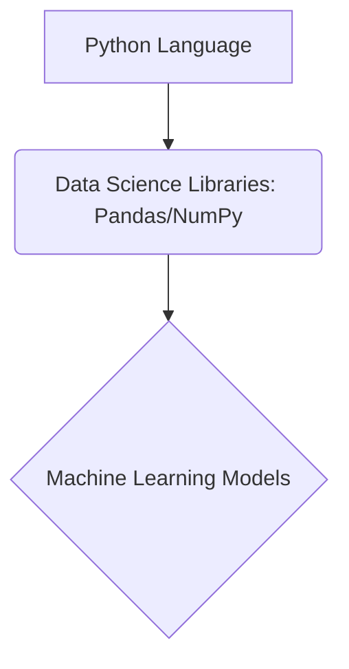

_**Explanation**_

This requires synthesizing the comparative analysis section. While Django/Flask (P1) are for web development, Data Science relies heavily on specialized libraries (P2) to build models (P3). The graph visually reinforces the required skill linkage for this specialized role.

#### Security Terminology Precision: Auth vs. Authz **

_**Question**_

When screening a candidate for a Security Architect role, they mention implementing robust **Authentication** protocols. To ensure the candidate understands the full scope of access control, what is the distinct function of **Authorization**, and how does it differ from Authentication?

_**Solution**_

**Authorization** verifies *what* the user is allowed to do once they are confirmed as legitimate (e.g., access rights).

**Difference:** Authentication verifies *who* you are (e.g., password check), whereas Authorization verifies *permissions* after identity is established.

_**Explanation**_

This addresses a common point of confusion for non-technical screeners. A candidate must understand that logging in (Authentication) is separate from what they can access afterward (Authorization). This precision is vital for Security Architects designing systems.

#### Market Dynamics: Advising on Scarcity Premium ***

_**Question**_

A hiring manager insists on hiring a **Cloud Security Architect (Multi-Cloud Certified: AWS, Azure, GCP)** for a standard Senior Engineer budget of $160k. Based on the market dynamics section, what is the primary risk of ignoring the **Scarcity Premium**, and what strategic advice should you offer regarding compensation or scope?

_**Solution**_

**Primary Risk:** Extended **time-to-fill metrics** due to the high demand/low supply nature of this niche role.

**Strategic Advice:** Advise the manager that compensation must likely increase significantly above $160k to attract the scarce talent, or alternatively, narrow the scope to require deep expertise in only one or two clouds to broaden the available supply pool.

_**Explanation**_

This tests the application of supply/demand economics to recruitment. Multi-cloud certification is explicitly cited as a niche skill commanding a premium. Ignoring this leads to failed searches. The solution requires advising on both compensation (premium) and scope (T-shaped vs. deep vertical).

#### DevOps vs. Development Focus Differentiation **

_**Question**_

Review the following two candidate bullet points. Which one strongly indicates a **DevOps Engineer** focus, and which indicates a **Back-End Developer** focus?

*   Candidate X: "Managed database connections and implemented RESTful APIs using Node.js."
*   Candidate Y: "Automated infrastructure provisioning using Terraform and established Jenkins pipelines."

_**Solution**_

**Candidate X Focus:** Back-End Developer (Focus on application logic, APIs, and server languages like Node.js).

**Candidate Y Focus:** DevOps Engineer (Focus on automation, IaC (Terraform), and CI/CD (Jenkins)).

_**Explanation**_

This requires differentiating between building the application (Back-End) and building the pipeline/infrastructure around the application (DevOps). Terraform and Jenkins are explicitly listed as essential DevOps tools.

#### Data Science vs. General Development Skill Mapping **

_**Question**_

A candidate lists proficiency in Python and MongoDB. To confirm they fit a **Data Scientist** profile rather than a general Back-End Developer profile, what specific ancillary skills or tools mentioned in the Python Ecosystem section must they also possess?

_**Solution**_

They must possess skills related to **Data Science Libraries** (Pandas, NumPy, Scikit-learn, TensorFlow) and potentially familiarity with **Jupyter Notebooks** for statistical analysis and modeling.

_**Explanation**_

This addresses the concept of technology stacks and specialization. While Python and MongoDB are common to both roles, the defining characteristic of a Data Scientist is the use of specialized analytical libraries (P2) for building predictive models (P3), which distinguishes them from a developer using Python for web services.


---

### Chapter 3: Advanced Sourcing Methodologies and Boolean Logic Mastery

#### Reactive vs. Proactive Sourcing Distinction *

_**Question**_

Based on the provided text, identify the primary limitation of **Reactive Posting** that is inherently avoided by adopting **Proactive Candidate Identification** when sourcing for a niche role like a Senior Kubernetes Engineer.

_**Solution**_

Reactive Posting suffers from **Limited Reach**, as it only captures *active job seekers*, whereas Proactive Identification targets the larger pool of *passive candidates*.

_**Explanation**_

Proactive sourcing is defined by its focus on passive talent—those currently employed and performing well. The core limitation of the reactive model is its reliance on candidates actively monitoring the job market, which severely restricts access to specialized IT talent pools.

#### Core Boolean Operator Functionality *

_**Question**_

For a beginner sourcing IT professionals, explain the functional difference between the **AND** operator and the **OR** operator in Boolean logic, providing a brief IT-related example for each.

_**Solution**_

**AND** narrows the search by requiring all terms to be present (e.g., `Java AND Spring`). **OR** broadens the search by requiring at least one term to be present (e.g., `(Python OR Jython)`).

_**Explanation**_

AND is used for mandatory inclusion, ensuring high precision by combining required skills. OR is used for capturing synonyms, alternative technologies, or variations to increase recall (reach). Mastering this distinction is foundational for precision targeting.

#### Constructing a Basic Search String **

_**Question**_

Construct a precise Boolean search string designed to locate candidates who must possess experience with **Docker** AND must have experience with **Kubernetes** OR **OpenShift**. Assume no need for exclusion or exact phrasing at this stage.

_**Solution**_

```
Docker AND (Kubernetes OR OpenShift)
```

_**Explanation**_

This string correctly applies the principle of nesting using parentheses. Docker is mandatory (AND), while the container orchestration technologies (Kubernetes or OpenShift) are grouped using OR to ensure at least one is present. This structure prevents the search engine from incorrectly interpreting the string as `(Docker AND Kubernetes) OR OpenShift`.

#### Identifying Logical Grouping Necessity **

_**Question**_

Analyze the following requirement: We need a Data Scientist proficient in either **R** or **Python**, but they *must* also have experience with **TensorFlow**. Explain why parentheses are mandatory for this requirement, contrasting the correct structure with the incorrect structure.

_**Solution**_

Parentheses are mandatory to enforce the correct order of operations.

**Correct:** `(R OR Python) AND TensorFlow` (Ensures cloud experience is present with *either* language).

**Incorrect:** `R OR Python AND TensorFlow` (This might return profiles with only R, or profiles with Python AND TensorFlow, failing to capture R-only candidates who meet the TensorFlow requirement)." ,title:

_**Explanation**_

Without parentheses, the default operator precedence (often AND before OR) would lead to flawed results. Grouping the language options ensures the OR condition is evaluated first, creating a unified set of language experts to which the mandatory AND condition (TensorFlow) is then applied.

#### Visualizing Boolean Logic Flow **

_**Question**_

Using the provided structure, complete the Mermaid diagram to visually represent the logical flow for sourcing a candidate who must know **Java** AND must know **Spring** OR **Hibernate**.

_**Solution**_

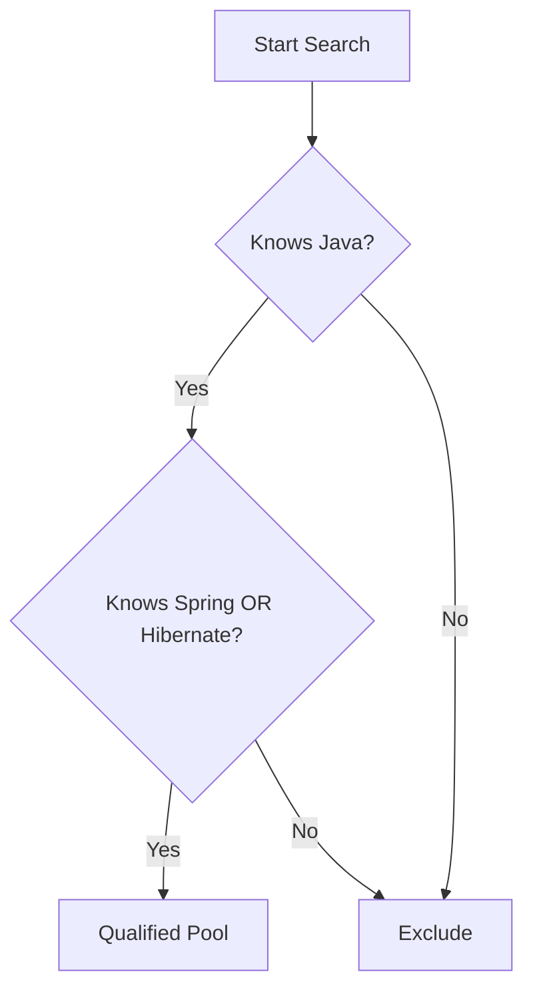

_**Explanation**_

This diagram models the string `Java AND (Spring OR Hibernate)`. The initial check (B) filters for the mandatory term (Java). Only those passing proceed to the secondary check (C), which uses the OR operator to accept either Spring or Hibernate before reaching the final qualified pool (D).

#### Precision Tools: Wildcards and Quotes **

_**Question**_

A recruiter is searching for a **Project Manager** who has experience with **Agile** methodologies. They want to capture variations like 'Project Management' and 'Manager' but must exclude any profiles mentioning the title 'Scrum Master'. Write the optimal Boolean string incorporating the wildcard (\*), quotation marks (" "), and the NOT operator.

_**Solution**_

```
("Project Manag*") AND Agile NOT "Scrum Master"
```

_**Explanation**_

1. `\"Project Manag*\"` uses quotes for the phrase start and the wildcard to capture Manager, Managing, Management, etc., while keeping the context tight. 2. `AND Agile` ensures the methodology is present. 3. `NOT \"Scrum Master\"` uses quotes to exclude that exact title, refining the pool away from a specific sub-role.

#### Talent Mapping Application Scenario **

_**Question**_

If your organization is migrating its infrastructure to **Google Cloud Platform (GCP)**, describe the first two steps of **Talent Mapping** you would execute proactively, referencing the concepts of competitor identification and specialized platforms.

_**Solution**_

1. **Identify Target Organizations:** Systematically research and list competitor firms or organizations publicly known for extensive, mature GCP utilization (e.g., companies heavily invested in Google Workspace migration or specific GCP services).
2. **Market Penetration/Ecosystem Dive:** Utilize specialized platforms (like GitHub or GCP-focused technical forums) to locate engineers listing GCP certifications or contributions within those identified target organizations.

_**Explanation**_

Talent Mapping is systematic research. Step 1 establishes the landscape (where the talent resides). Step 2 involves deep diving into the technical ecosystems where these professionals congregate to validate their expertise beyond a simple resume keyword match, fulfilling the proactive sourcing mandate.

#### Deconstructing Exclusionary Logic ***

_**Question**_

Examine the following Boolean string intended for a Cloud Security Engineer: `(AWS OR Azure OR GCP) AND (Splunk OR Sentinel OR Qualys) NOT (System Administrator OR Desktop Support)`. Explain precisely what the **NOT** clause achieves in terms of candidate filtering and why this is crucial for strategic sourcing.

_**Solution**_

The **NOT** clause (`NOT (System Administrator OR Desktop Support)`) excludes any profile containing *either* of those generalist titles. This is crucial because it refines the pool to focus only on candidates whose primary documented experience aligns with specialized Security Engineering, filtering out potentially misleading profiles where the required security tools are listed incidentally by general IT support staff.

_**Explanation**_

This demonstrates the power of exclusion in achieving high precision. In proactive sourcing, we seek specialists. The NOT operator acts as a negative filter, eliminating noise caused by keyword overlap. If a candidate lists AWS, Splunk, AND 'System Administrator,' they are removed, ensuring the final pool consists of candidates whose primary function aligns with the security mandate.

#### Designing an Initial Contact Cadence ***

_**Question**_

Design a three-touch sequence for engaging a highly passive Senior DevOps Engineer identified via Talent Mapping. Specify the Day, Channel, and the primary **Objective** for each touchpoint, ensuring the approach adheres to the principle of **Relationship Cultivation** over transactional hiring.

_**Solution**_

| Touch Point | Day | Channel | Objective |
| :--- | :--- | :--- | :--- |
| 1 (Initial) | Day 1 | InMail | Establish Contextual Relevance | 
| 2 (Value Add) | Day 5 | Email | Provide Technical Context/Insight | 
| 3 (Re-engagement) | Day 10 | LinkedIn Connection Request | Gentle Nudge & Soft Ask for Openness |

_**Explanation**_

This cadence prioritizes relationship building. Touch 1 must be hyper-personalized. Touch 2 adds value (e.g., sharing a relevant technical article) rather than immediately asking for time. Touch 3 is a low-pressure follow-up, respecting the passive candidate's time while keeping the door open, aligning with the consultative approach required for passive engagement.

#### Evaluating Cold Outreach Call to Action ***

_**Question**_

Which of the following initial outreach statements best adheres to the principle of a **Low-Friction Call to Action** when contacting a passive Machine Learning Engineer? Justify your choice based on the required commitment level.

_**Solution**_

**Statement B** adheres best: \"Given your work on neural network optimization, would you be open to a brief, 10-minute exploratory chat next week to see if our current research challenges align with your expertise?\"

**Justification:** This statement requests only a **10-minute commitment**, which is significantly lower friction than asking for a formal 30-minute interview or a resume submission. It frames the interaction as exploratory and focused on their expertise, respecting their current employment status.

_**Explanation**_

Effective cold outreach minimizes the initial barrier to response. A high-friction ask (like a 30-minute meeting) often results in immediate rejection from passive talent. The low-friction ask focuses on a brief, exploratory conversation centered on the candidate's technical value, making engagement psychologically easier.


---

### Chapter 4: Applicant Tracking Systems (ATS) and Candidate Relationship Management (CRM)

#### Identifying Core ATS Functions *

_**Question**_

An organization is implementing a new enterprise ATS to manage high-volume applications for roles like 'Junior Python Developer.' Based on the text, list the four core functional components of an enterprise ATS and briefly state the primary purpose of the **Candidate Sourcing and Ingestion** component.

_**Solution**_

1. Job Requisition Management
2. Candidate Sourcing and Ingestion
3. Candidate Tracking and Workflow Progression
4. Compliance and Reporting

The primary purpose of Candidate Sourcing and Ingestion is the automated capture of applicant data, critically relying on **Resume Parsing** using NLP algorithms to extract structured data from unstructured resumes.

_**Explanation**_

This exercise tests foundational recall of the ATS structure. For IT recruitment, the ingestion component is vital because the system must accurately parse complex technical terms (e.g., distinguishing between 'Node.js' and general JavaScript) for the system to be useful.

#### Resume Parsing Accuracy Challenge *

_**Question**_

Imagine an ATS parsing an unstructured resume for a Cloud Security Engineer role. The resume contains the phrase: "Expert in AWS Certified Solutions Architect - Professional and Terraform scripting." If the ATS fails to correctly parse 'AWS Certified Solutions Architect - Professional' as a specific certification, which pillar of Data Integrity (Accuracy, Consistency, or Timeliness) is immediately compromised? Provide a brief justification.

_**Solution**_

The pillar of Data Integrity immediately compromised is **Accuracy and Completeness**.

Justification: Accuracy requires that all required fields are populated correctly. If the specific, high-value certification is missed or incorrectly categorized (e.g., as 'General Cloud Knowledge'), the data point itself is inaccurate, leading to flawed search results.

_**Explanation**_

This scenario highlights the practical challenge in IT recruitment. Accuracy is about the correctness of the data extracted. If the NLP algorithm misinterprets a technical credential, the system's ability to accurately represent the candidate's qualifications is lost, directly impacting the quality of the data repository.

#### Evaluating ATS Selection Criteria for Scalability **

_**Question**_

Your company is preparing to launch a major new product requiring the immediate hiring of 50 DevOps Engineers within one quarter. Which two selection criteria for an enterprise ATS are most critical to ensure the system can handle this sudden, high-volume demand without failure? Explain why these two criteria are prioritized over others (like UX) in this specific scenario.

_**Solution**_

The two most critical selection criteria are:
1. **Scalability and Performance**
2. **Integration Capabilities (API Ecosystem)** (to handle rapid job posting/assessment tool integration)

Prioritization Rationale: While UX is important, immediate operational success hinges on **Scalability** to prevent latency or crashes during peak application loads. **Integration** is crucial to quickly connect the ATS to sourcing channels and assessment platforms necessary to fill 50 roles rapidly.

_**Explanation**_

This requires prioritizing selection criteria based on a real-world business need (rapid scaling). Scalability directly addresses the ability to handle peak loads without performance degradation. Integration ensures the system can communicate with the entire talent acquisition stack needed for high-velocity hiring.

#### Data Governance and Retention Policy Application **

_**Question**_

An organization operating under GDPR must define its data retention policy. A candidate applies for a Senior Data Scientist role but is rejected. The company policy states that unsuccessful applicant data must be retained for 12 months for EEO reporting, after which it must be purged. Describe the two specific actions the ATS must facilitate to ensure compliance with both the retention policy and GDPR's 'Right to be Forgotten' principle.

_**Solution**_

1. **Automated Purge/Flagging:** The ATS must automatically flag or purge the PII records after the 12-month retention period expires, adhering to the defined policy.
2. **Verifiable Deletion Mechanism:** The system must possess functionality to execute a verifiable and timely deletion of the record upon an explicit candidate request (exercising the 'Right to be Forgotten'), even if the 12-month period has not elapsed.

_**Explanation**_

This exercise combines Data Retention Policies with Data Privacy Regulations (GDPR). Compliance requires both proactive management (automatic purging after the legal window) and reactive management (handling immediate deletion requests). The audit trail mentioned in the text is also implicitly required to prove deletion occurred.

#### Interpreting the Talent Pipeline Flow Diagram **

_**Question**_

Review the provided Mermaid diagram illustrating the CRM/ATS flow. If a candidate moves from Stage C ('Nurture Pool: CRM Active') to Stage F ('ATS Transfer: Active Application'), what must have occurred at Stage E ('Role Alignment Found?')? Furthermore, what is the likely subsequent status change for this candidate immediately after Stage G ('Hiring Process Completion') if they were rejected?

_**Solution**_

1. **Stage E Outcome:** The condition 'Role Alignment Found?' must have evaluated to **'Yes'**.
2. **Subsequent Status:** If rejected after Stage G, the candidate returns to Stage C ('Nurture Pool: CRM Active'), demonstrating the continuous, non-linear nature of CRM engagement versus a standard ATS funnel.

_**Explanation**_

This tests visual comprehension of the CRM/ATS relationship. The flow shows that CRM nurturing leads to an ATS transfer *only* when alignment is confirmed. A rejection in the active ATS funnel does not end the relationship; it cycles the candidate back into the CRM nurture pool, which is a key strategic difference.

#### CRM Segmentation for Specialized IT Roles **

_**Question**_

As a recruiter focusing on Machine Learning Engineers, you need to build a highly targeted talent pipeline. Propose three distinct, specific segmentation tags (following the format `[Category: Value]`) that would be more effective for long-term nurturing than a generic tag like `[Skill: AI]`. Justify why these specific tags support targeted communication.

_**Solution**_

Three effective segmentation tags:
1. `[Tech Stack: PyTorch/TensorFlow]`
2. `[Seniority: Principal]`
3. `[Aspiration: Research Focus]`

Justification: These granular tags allow for highly relevant nurturing campaigns. For example, only candidates tagged `[Aspiration: Research Focus]` would receive an invitation to a webinar featuring the company's latest research paper publication, maximizing engagement and minimizing irrelevant communication.

_**Explanation**_

Effective CRM relies on detailed segmentation. Generic tags lead to generic communication. By tagging based on specific frameworks (PyTorch), seniority level, and career goals (Research Focus), the recruiter can deliver value-driven content, which is essential for keeping passive, high-demand IT talent engaged over time.

#### Automated Workflow Sequencing **

_**Question**_

Using the automated scheduling workflow diagram provided in the text, identify the step that directly addresses the need for **Mobile Accessibility** in the ATS selection criteria. Explain how this step facilitates mobile usage.

_**Solution**_

The step that directly addresses Mobile Accessibility is **Step D: System Sends Personalized Scheduling Email to Candidate** (which includes a link for selection).

Explanation: Modern scheduling links (often integrated via APIs) allow candidates to select interview slots directly from their mobile devices via email or text link, bypassing the need to log into a complex desktop interface for simple approval actions.

_**Explanation**_

This links the workflow automation concept to the ATS selection criteria. Mobile accessibility is crucial for candidates who manage their schedules dynamically. The ability to click a link in an email (Step D/E) and confirm availability is a key mobile-friendly feature that prevents process friction.

#### The Critical Trade-off in ATS Selection ***

_**Question**_

A startup specializing in niche cybersecurity tools is evaluating two ATS platforms. Platform A offers superior **Customization and Configurability** (allowing unique fields for threat intelligence certifications) but has a dated **User Experience (UX)**. Platform B has a modern, intuitive UX but is highly rigid, offering minimal customization. Given the need to track highly specific IT certifications, which platform presents the greater long-term risk to operational efficiency, and why? (This requires balancing two key selection criteria.)

_**Solution**_

Platform B presents the greater long-term risk to operational efficiency.

Rationale: While poor UX (Platform B) leads to adoption issues, a lack of **Customization** (Platform B) means the system cannot accurately capture the necessary data (specific threat intelligence certifications). For specialized IT hiring, if the ATS cannot accurately track the required technical data points, the entire recruitment process becomes inefficient, forcing recruiters to use external spreadsheets (data silos), negating the ATS's core value.

_**Explanation**_

This is a critical thinking challenge. For specialized IT roles, data accuracy (enabled by customization) often outweighs interface aesthetics. If the system cannot capture the unique data required for the job (e.g., specific AWS certifications), the system is functionally inadequate, regardless of how easy it is to navigate.

#### Audit Trail Necessity in Data Integrity ***

_**Question**_

During an internal audit, it is discovered that a candidate's 'Years of Experience' field was manually changed from 8 years to 3 years, causing them to be filtered out of a senior pipeline search. Which pillar of Data Integrity is directly violated by the *action* of changing the data, and how does the ATS feature of an **Audit Trail** serve as the necessary defense mechanism against this integrity breach?

_**Solution**_

The pillar of Data Integrity violated by the action is **Timeliness** (as the data was incorrectly updated) and potentially **Accuracy** (if the change was erroneous). The **Audit Trail** serves as the defense mechanism by providing an immutable, chronological record logging *who* made the change, *what* the previous value was, and *when* the modification occurred. This transparency allows investigators to trace the source of the data corruption.

_**Explanation**_

This exercise links data quality pillars to compliance features. The Audit Trail is crucial for governance. It doesn't prevent the error, but it provides the necessary transparency and accountability required to investigate and rectify data integrity failures, which is essential for defending hiring decisions.

#### Silver Medalist CRM Strategy Application ***

_**Question**_

Recruiter Alex interviewed three candidates for a critical 'Principal Software Architect' role. Candidate X was hired. Candidate Y performed excellently but lacked one specific legacy system skill required by the hiring manager. Candidate Z performed well but was deemed 'not ready' for the principal level yet. Describe the immediate CRM action for Candidate Y (the silver medalist) and the long-term nurturing strategy for Candidate Z, ensuring both actions align with proactive IT talent pipelining.

_**Solution**_

**Action for Candidate Y (Silver Medalist):** Immediately flag Candidate Y in the CRM as a 'Silver Medalist: Principal Architect' and set a high priority flag for immediate contact when any Principal Architect role opens in the next 6 months. This leverages high interview investment.

**Long-Term Strategy for Candidate Z (Not Ready):** Place Candidate Z into a CRM nurture campaign tagged `[Development Track: Senior to Principal]`. The campaign should focus on sending content related to leadership development, architectural best practices, and company strategy updates over the next 12-18 months to prepare them for the next level.

_**Explanation**_

This requires applying CRM strategy to specific IT scenarios. Silver medalists are low-risk, high-reward targets requiring immediate attention. For candidates not yet ready, the CRM must provide developmental value (nurturing) rather than just job alerts, transforming them into future senior hires.


---

### Chapter 5: Structured Interviewing and Technical Screening Protocols

#### Step 1: Competency Weighting for a Junior Developer *

_**Question**_

A Hiring Manager provides you with the following requirements for a Junior Backend Developer role: 1. Must write clean, documented Python code (50% weight). 2. Must be able to learn new ORM frameworks quickly (25% weight). 3. Must communicate status updates daily (25% weight).

Based on the provided text, categorize these requirements into the core competency clusters (Technical Depth, Adaptability, Collaboration) and confirm the assigned weights align with the general structure discussed for IT roles.

_**Solution**_

| Requirement | Competency Cluster | Assigned Weight |
| :--- | :--- | :--- |
| Write clean, documented Python code | Technical Depth | 50% |
| Learn new ORM frameworks quickly | Adaptability & Learning Agility | 25% |
| Communicate status updates daily | Collaboration & Communication | 25% |

**Alignment Check:** The primary focus (50%) is on Technical Depth, which is appropriate for a developer role. The weights sum to 100%.

_**Explanation**_

This exercise tests the ability to perform Step 1: Competency Identification and Weighting. For IT roles, Technical Depth usually commands the highest weight. The categorization maps the specific JD requirement (e.g., Python code) to the abstract competency cluster (Technical Depth) defined in the chapter.

#### Defining Behavioral Indicators for IaC **

_**Question**_

For the **Technical Depth (IaC)** competency cluster, the chapter provided one Behavioral Indicator: "Candidate consistently designs idempotent and reusable Terraform modules without significant post-deployment modification."

Develop a second, distinct Behavioral Indicator for the same competency, focusing specifically on the use of **Ansible** within a CI/CD pipeline context. What observable action demonstrates success?

_**Solution**_

**Competency:** Technical Depth (IaC - Ansible)

**Behavioral Indicator:** Candidate successfully integrates Ansible playbooks into the CI/CD pipeline to manage configuration drift, demonstrating rollback capability within 15 minutes of failure detection.

_**Explanation**_

Behavioral Indicators must be observable and measurable. The initial example focused on Terraform reusability. This new indicator focuses on Ansible's role in configuration management and operational resilience (rollback speed), providing a clear rubric for evaluating a candidate's practical IaC skills beyond just provisioning.

#### Deconstructing a STAR Response for a Security Engineer ***

_**Question**_

Analyze the following candidate response against the STAR framework. Identify which components (S, T, A, R) are present and which are missing or weak, based on the goal of assessing **Problem Solving & Debugging** under pressure.

*Candidate Response:* "We had a major security vulnerability discovered in a third-party library we used across 50 microservices. It was a huge risk. We patched it quickly, and the security team was happy."

_**Solution**_

| STAR Component | Present/Weak/Missing | Analysis |
| :--- | :--- | :--- |
| **S (Situation)** | Present | Vulnerability in third-party library across 50 services. |
| **T (Task)** | Missing/Weak | The candidate did not state their specific responsibility (e.g., 'My task was to coordinate the patch deployment across all environments'). |
| **A (Action)** | Missing/Weak | The response only states 'We patched it quickly.' It lacks specific diagnostic steps or individual contribution. |
| **R (Result)** | Weak | States 'security team was happy,' which is subjective, not quantified (e.g., 'Vulnerability remediation time was 4 hours, meeting our SLA'). |

_**Explanation**_

This exercise challenges the beginner to apply the STAR structure critically. The candidate provided context (S) but failed to detail their specific role (T) or the precise steps taken (A). A strong response requires the interviewer to probe for the 'Action' steps, as this is the most predictive element of future performance.

#### Formulating a Scalability Question for a CBIG *

_**Question**_

Using the structure provided in the **Example CBIG Snippet** for a Mid-Level Backend Developer, formulate a structured interview question designed to assess the **Problem Solving & Debugging** competency, specifically targeting the ability to diagnose latency issues in distributed systems.

_**Solution**_

| Competency Area | Interview Question (Structured Prompt) |
| :--- | :--- |
| **Problem Solving & Debugging (Latency)** | "Describe a recent instance where you had to troubleshoot a performance degradation (latency spike) in a distributed application. What specific monitoring tools did you use to isolate the bottleneck, and what was the root cause you ultimately identified?" |

_**Explanation**_

This adheres to the principle of asking for specific past performance examples. It directly targets the required outcome (diagnosing latency) and mandates the inclusion of tools/methods used (Action evidence) and the final diagnosis (Result evidence), ensuring the question is structured and comparable across candidates.

#### Applying the 'Translate for the CEO' Technique **

_**Question**_

As a recruiter screening a Senior Cloud Engineer, you need to assess their **Communication** skills. The engineer just finished explaining that they need to halt all feature deployments for 48 hours to refactor the Kubernetes ingress controller due to potential denial-of-service vectors.

Apply the 'Translate for the CEO' Technique. Write the exact prompt you would use to test their ability to articulate this risk to a non-technical executive.

_**Solution**_

"That sounds like a critical technical task. Imagine you are speaking directly to our CEO, who is focused solely on quarterly revenue targets. How would you explain, in under 60 seconds, why we must stop all feature releases for the next two days, and what the direct business risk is if we *don't* perform this refactoring now?"

_**Explanation**_

This technique assesses audience awareness and prioritization. A strong answer will translate technical severity (DoS vector) into business impact (revenue risk, reputational damage) and justify the delay (Action/Task) clearly, rather than just repeating technical jargon.

#### Distinguishing Cultural Alignment from Personality Fit *

_**Question**_

An interviewer suggests rejecting a highly skilled Database Administrator because "they prefer working alone and don't seem like a good fit for our highly collaborative, open-office environment."

Using the inclusivity note from the chapter, explain why this reasoning is flawed for structured interviewing and suggest a *work-style* alignment question that should have been asked instead.

_**Solution**_

**Flaw:** Rejecting a candidate based on personality traits (preference for solitude, office environment fit) rather than alignment with core *operating principles* (values like integrity, quality, documentation). This introduces bias.

**Alternative Work-Style Question:** "This role requires significant cross-functional work with the Data Science team. Describe a time you had to deliver a complex database schema change where you needed significant input from stakeholders who were not technical experts. How did you manage that collaboration process?"

_**Explanation**_

Cultural alignment must focus on *how* work gets done (values, work style, autonomy needs), not *who* the person is socially. The suggested question probes their ability to collaborate effectively (a work style) rather than judging their social preference.

#### Analyzing Feedback Loop Data for Process Correction **

_**Question**_

As the recruiter, you review the standardized scorecards for three candidates interviewed for a **Cloud Security Architect** role. The HM consistently rated the candidates 4.5/5 on 'AWS Security Services Knowledge' but 2.0/5 on 'Experience with Compliance Frameworks (SOC 2).'

What two potential issues (Issue A and Issue B) does this data aggregation signal, according to the chapter's discussion on feedback loops?

_**Solution**_

**Issue A (Sourcing/Screening):** The recruiter is presenting candidates who meet the technical knowledge requirement but lack the critical compliance experience, suggesting the initial sourcing strategy or screening criteria were insufficient for the compliance requirement.

**Issue B (Interviewing/CBIG Flaw):** The Hiring Manager (HM) or interview panel might be applying standards inconsistently, or the initial competency definition for 'Compliance' was not clearly defined or weighted correctly in the CBIG.

_**Explanation**_

This tests the understanding of data-driven feedback loops. Consistent low scores on a specific competency (2.0/5) across multiple candidates forces the recruiter and HM to investigate the process upstream (sourcing) or the process execution (interviewing/CBIG definition). This prevents the process from continuing to fail silently.

#### Kinesthetic Practice: Probing for Missing STAR Components **

_**Question**_

An interviewer asks a candidate about handling a production incident. The candidate provides only the **Situation** and **Result** (S & R). Write the two precise follow-up probes, one targeting the **Task (T)** and one targeting the **Action (A)**, as described in the STAR application example.

_**Solution**_

**Probe for Task (T):** "In that high-pressure situation, what exactly was *your* specific responsibility or mandate regarding the resolution timeline?"

**Probe for Action (A):** "Can you walk me through the exact diagnostic steps you executed sequentially before you implemented the final fix? What alternatives did you consider?"

_**Explanation**_

This exercise simulates the active probing required when a candidate gives an incomplete STAR response. The goal is to force them to articulate their individual contribution (T) and the specific steps taken (A), which are the most valuable data points for predicting future behavior.

#### Mapping JD Outcomes to Competency Clusters (Visual Flow) **

_**Question**_

Translate the following three required outcomes from a Job Description for a **Site Reliability Engineer (SRE)** into the appropriate Competency Clusters (Technical Depth, Problem Solving, Collaboration, Adaptability). Visualize this mapping using the structure of a simple flow diagram (Mermaid syntax required).

_**Solution**_

**JD Outcomes:**
1. Maintain 99.99% uptime for core services.
2. Implement automated failover mechanisms using Kubernetes.
3. Mentor junior staff on incident response procedures.

```mermaid
graph LR
    A[JD Outcome 1: Uptime 99.99%] --> B(Technical Depth / Problem Solving)
    C[JD Outcome 2: Automated Failover: K8s] --> D(Technical Depth)
    E[JD Outcome 3: Mentor Junior Staff] --> F(Collaboration & Communication)
```

_**Explanation**_

This tests the initial translation step (JD to Competency). Maintaining uptime requires both deep technical knowledge (Technical Depth) and robust debugging skills (Problem Solving). Automation is purely Technical Depth. Mentoring directly maps to Collaboration and Communication.

#### Identifying a Flawed Structured Question ***

_**Question**_

A recruiter is designing a CBIG for a Security Analyst role. They propose the following question for the **Adaptability & Learning Agility** competency: "Do you enjoy learning new security tools? (Yes/No)"

Explain why this question violates the core principle of structured, competency-based interviewing, and rewrite it as a predictive, behavioral question.

_**Solution**_

**Violation:** The proposed question is hypothetical and elicits a simple, non-evidential 'Yes/No' answer, failing to prompt for past performance evidence. It assesses stated preference, not demonstrated behavior.

**Rewritten Behavioral Question:** "Describe the most recent significant security vulnerability or threat landscape change that required you to rapidly acquire expertise in a new domain (e.g., a new cloud provider's security posture or a novel attack vector). Walk me through your self-directed learning process and how you applied that new knowledge to protect your systems."

_**Explanation**_

This challenges the critical thinking required to move beyond superficial screening. Structured interviewing demands behavioral evidence (STAR). The original question is subjective and easily answered with a positive affirmation, whereas the rewritten question forces the candidate to detail their *Action* steps in learning, which is the true measure of Learning Agility.


---

### Chapter 6: Legal Compliance, Diversity, Equity, and Inclusion (DEI) in Hiring

#### Identifying Protected Characteristics in Screening *

_**Question**_

A recruiter for a remote Cybersecurity Analyst role is reviewing initial application forms. Which of the following characteristics, if used as a basis for immediate rejection, would most likely violate foundational employment legislation principles?

A) Lack of 5 years of experience with SIEM tools.
B) Stating a preference for working only on Linux systems.
C) Declining to state their religious affiliation.
D) Being over the age of 55.

_**Solution**_

D) Being over the age of 55.

_**Explanation**_

Foundational employment law prohibits discrimination based on protected characteristics, which typically include age. While lack of experience (A) or technical preference (B) can be job-related criteria, using age (D) as a basis for rejection without a demonstrable business necessity violates anti-discrimination principles. Declining to state religious affiliation (C) is a candidate's right and not a basis for rejection.

#### Regional Compliance Comparison: US vs. EU *

_**Question**_

When recruiting a Software Developer based in Germany (EU) for a US-based tech company, which legal framework imposes the strictest constraints on how the recruiter can handle the candidate's resume data post-rejection?

_**Solution**_

The General Data Protection Regulation (GDPR) applicable in Germany/EU.

_**Explanation**_

While US law addresses discrimination, the EU (via GDPR) imposes stringent requirements on data governance, including explicit rules on data minimization and storage limitation (retention schedules). For an EU resident, GDPR compliance dictates the data handling process, often requiring stricter deletion protocols than general US state laws might mandate for rejected candidates.

#### Timing of Work Authorization Verification **

_**Question**_

An IT recruiter is interviewing a highly qualified candidate for a US-based role. During the second-round interview, the candidate asks, "What documentation do I need to provide to prove I am legally authorized to work here?" Based on US regulations, what is the legally compliant response regarding the *timing* of this verification?

_**Solution**_

The recruiter must state that verification of legal work authorization (Form I-9) occurs *after* the offer of employment has been accepted, not during the interview stages.

_**Explanation**_

In the United States, inquiring about or requiring documentation for legal work authorization before an offer is accepted can lead to discrimination claims. The mandatory verification process (Form I-9) must be completed only after the candidate has accepted the employment offer. This timing rule ensures the focus remains on qualifications during the screening process.

#### De-biasing Job Descriptions for IT Roles *

_**Question**_

Review the following phrase from a job description for a Cloud Engineer: "We seek an aggressive, rockstar engineer who dominates complex infrastructure challenges." Identify two examples of potentially exclusionary, gender-coded language and suggest a neutral, competency-focused replacement for the entire phrase.

_**Solution**_

Exclusionary Language: 'Aggressive,' 'rockstar,' 'dominates.'

Neutral Replacement: "We seek a highly proficient engineer capable of leading and resolving complex infrastructure challenges."

_**Explanation**_

'Aggressive' and 'dominates' are often perceived as masculine-coded terms, while 'rockstar' is informal jargon that can deter candidates seeking a professional environment. The mitigation strategy is to focus on required competencies (proficient, leading, resolving) rather than subjective personality traits, ensuring broader appeal.

#### Identifying Evaluation Bias in Technical Interviews **

_**Question**_

During the final evaluation of two equally qualified candidates for a Data Scientist position, Interviewer A strongly favors Candidate X because they both graduated from the same small, specialized university program, despite Candidate Y having superior scores on the standardized technical assessment rubric. Which specific unconscious bias is Interviewer A demonstrating, and what structured protocol is designed to counteract this?

_**Solution**_

The bias demonstrated is **Affinity Bias**. The protocol designed to counteract this is the **Structured Candidate Evaluation Protocol** using a standardized scoring rubric.

_**Explanation**_

Affinity Bias occurs when an interviewer favors candidates who share similarities (like alma mater) with themselves. The structured evaluation framework, which mandates asking identical questions and scoring responses against an objective rubric (as shown in the framework diagram), forces the interviewer to focus on measurable performance rather than personal connection.

#### Interpreting the Structured Evaluation Flow **

_**Question**_

Analyze the provided Structured Evaluation Framework diagram. If the review step (E) detects statistical anomalies suggesting that Interviewer Z consistently scores candidates lower than the peer average, which subsequent step (F or G) is triggered, and what is the immediate goal of that step?

_**Solution**_

Step **F (Re-calibrate Interviewer Training)** is triggered. The immediate goal is to address potential systemic bias or inconsistency in the application of the rubric by that specific interviewer.

_**Explanation**_

Step E is the quality control check. If anomalies (potential bias) are detected, the process loops back to Step F, which involves training or calibration to ensure consistent application of the objective scoring rubric (C) across all interviewers, thereby maintaining fairness before reaching the final ranking (G).

#### Developing an Inclusive Sourcing Plan for Niche IT Roles ***

_**Question**_

Your organization needs to hire a Senior DevOps Engineer, but traditional sourcing channels yield only candidates from three major, established tech firms. Develop a two-pronged inclusive sourcing strategy that targets underrepresented groups (URGs) in IT, specifying one targeted professional organization/community and one alternative sourcing channel mentioned in the text. Additionally, state the key metric you would use to measure the success of this new strategy.

_**Solution**_

**Targeted Organization:** Engage with organizations like the National Society of Black Engineers (NSBE) or Women in Technology International (WITI) by sponsoring their events or posting directly to their job boards.

**Alternative Channel:** Ethically engage in relevant open-source communities or specialized technical forums where practical skills are demonstrated.

**Key Metric:** Source Diversity Ratio (SDR).

_**Explanation**_

Inclusive sourcing requires moving beyond established networks. Targeting organizations like NSBE or WITI directly engages URGs. Utilizing niche technical forums taps into demonstrated skill sets outside traditional corporate pipelines. The SDR metric is crucial because it quantifies whether the new efforts are successfully diversifying the top of the recruitment funnel.

#### GDPR: Data Minimization in IT Screening **

_**Question**_

For an entry-level IT Support Technician role, a recruiter collects the following data points: Name, Phone, CV, Salary Expectation, and Proof of Citizenship. Which data point is most likely to violate the GDPR principle of **Data Minimization** if collected during the initial screening phase, and why?

_**Solution**_

**Salary Expectation** is the most likely violation. Data minimization requires collecting only data strictly necessary for the recruitment process. While necessary for negotiation later, salary expectation is often considered non-essential PII during the initial technical screening phase for an entry-level role.

_**Explanation**_

Proof of Citizenship/Work Authorization is mandatory eventually, and contact details/CV are essential. Salary expectation, however, is often deemed excessive PII at the *initial* screening stage, especially if the role is entry-level and salary bands are standardized. Collecting it prematurely risks non-compliance with the principle that data processing must be limited to what is necessary.

#### Advanced Consent Management for IT Pipeline ***

_**Question**_

A recruiter screens a highly skilled Python Developer who is not suitable for the current role but is excellent for a future role anticipated in 15 months. Under GDPR, the recruiter cannot automatically add this candidate to the general talent pool. Outline the *two distinct consent actions* the recruiter must obtain from the candidate to legally retain their profile data for future consideration, referencing the required time frame.

_**Solution**_

1. **Consent for Current Role Processing:** Explicit consent must be obtained to process their data for the *current* Cloud Architect position.
2. **Consent for Future Pipeline Retention:** A *separate, specific* affirmative consent must be obtained to retain their profile data for up to 18 months (or a defined period exceeding the immediate hiring cycle) for consideration in future, similar roles.

_**Explanation**_

GDPR requires explicit, affirmative consent for each distinct purpose of data processing. Consent for the current application does not automatically grant consent for future marketing or pipeline building. Since the future role is 15 months away, the recruiter must secure specific consent for that extended retention period, adhering to the principle of transparency regarding storage limitation.

#### Defending Screening Criteria Against Disparate Impact ***

_**Question**_

Your organization mandates that all candidates for a new Financial IT Auditor role must pass a credit history check, arguing that financial integrity is paramount. If this criterion disproportionately screens out candidates from a specific protected class (disparate impact), what is the recruiter's primary legal defense requirement, based on the principles of employment law for screening specifics?

_**Solution**_

The primary legal defense requirement is demonstrating that the credit history check is **demonstrably job-related and consistent with business necessity** for the Financial IT Auditor role.

_**Explanation**_

When a screening criterion (like a credit check) results in a disparate impact on a protected class, the burden shifts to the employer to rigorously defend the practice. The defense must prove that the criterion is not arbitrary but is directly necessary for the successful and safe performance of the specific job duties. For non-financial IT roles, this defense often fails, but for a Financial Auditor, the justification must be clearly established.


---

### Chapter 7: Compensation Benchmarking, Negotiation, and Offer Management

#### Data Source Triangulation Identification *

**Question**

A recruiter is sourcing a specialized Cybersecurity Analyst. They consult three sources: 1) Last year's internal salary spreadsheet for similar roles; 2) The latest Mercer compensation report; and 3) Anecdotal salary figures found on a popular tech forum. Classify each source according to the methodologies described in the text (Proprietary Internal Data, Third-Party Compensation Surveys, or Publicly Available Aggregators).

**Solution**

1. Internal Salary Spreadsheet: Proprietary Internal Data
2. Mercer Report: Third-Party Compensation Surveys
3. Tech Forum Figures: Publicly Available Aggregators

**Explanation**

This exercise tests the foundational knowledge of data source integrity. Proprietary data is internal; Third-Party Surveys (like Mercer) are verified, aggregated reports; and Public Aggregators (like forums) are generally self-reported and require caution due to lower data integrity.

#### Applying Geographic Differential Index (GDI) * *

**Question**

A national compensation survey indicates the 50th percentile (Midpoint) for a Data Scientist role is \$150,000 nationally. Your organization is hiring for this role in a region where the established Geographic Differential Index (GDI) is 0.85 (representing a lower cost of labor). Calculate the normalized target Midpoint compensation for this specific location.

**Solution**

Normalized Midpoint = National Midpoint * GDI
Normalized Midpoint = \$150,000 * 0.85 = \$127,500

**Explanation**

The GDI is used to normalize national benchmark data to local market conditions. A GDI below 1.0 indicates the local cost of labor is lower than the national average used in the survey, resulting in a lower target compensation midpoint. This ensures internal equity across distributed teams.

#### Establishing a Defensible Compensation Band * *

**Question**

For a Mid-Level Cloud Architect role, external survey data (P50) adjusted for geography yields a Target Midpoint of \$175,000. Based on internal policy, the Minimum acceptable offer is set at 90% of the Midpoint, and the Maximum reserved for exceptional talent is set at 110% of the Midpoint. Determine the resulting Compensation Band (Minimum, Midpoint, Maximum).

**Solution**

Target Midpoint: \$175,000
Minimum: \$175,000 * 0.90 = \$157,500
Maximum: \$175,000 * 1.10 = \$192,500

Resulting Band: \$157,500 (Min) to \$192,500 (Max)

**Explanation**

Effective benchmarking results in a structured band. The Midpoint is the target market rate (often P50). The Minimum and Maximum define the acceptable range for hiring, ensuring that offers are both competitive and internally equitable relative to the established target.

#### Monetization of Total Rewards Package (TRP) * *

**Question**

A Senior DevOps Engineer is offered a \$160,000 base salary. Their Total Rewards Package (TRP) also includes: an Annual Bonus Target of 12% of base, an estimated Year 1 RSU vesting value of \$35,000, and a 401(k) match valued at \$8,000 annually. Calculate the Total Quantified Value of the TRP for the first year.

**Solution**

Base Salary: \$160,000
Annual Bonus: \$160,000 * 0.12 = \$19,200
RSU Value: \$35,000
401(k) Match: \$8,000

Total Quantified Value: \$160,000 + \$19,200 + \$35,000 + \$8,000 = \$222,200

**Explanation**

Monetization of Benefits is crucial for presenting the full value proposition. By quantifying variable compensation (bonus), long-term incentives (RSUs), and benefits (401k match), the recruiter shifts the focus from the base salary alone to the comprehensive \$222,200 package.

#### Categorizing Total Rewards Components *

**Question**

Match the following IT professional incentives to the correct Total Rewards Package (TRP) category:

A. AWS Certification Reimbursement
B. 4% Employer 401(k) Contribution
C. Annual Performance Bonus
D. Restricted Stock Units (RSUs)

**Solution**

A. Professional Development Stipend (Perks/Work-Life Integration)
B. Retirement Plans (Benefits)
C. Variable Compensation
D. Long-Term Incentives (LTI) and Equity

**Explanation**

This tests the ability to segment the TRP components. Professional Development Stipends address quality of life and continuous learning (Perks). 401(k) is a foundational Benefit. Bonuses are performance-based Variable Compensation, and RSUs are a form of Long-Term Incentive (Equity).

#### Anchoring Strategy in Negotiation * *

**Question**

A candidate for a specialized AI Engineer role states their expectation is \$220,000. Your validated market data suggests the top of the range (Maximum) is \$205,000. Following the recommended strategy, what is the immediate, consultative response to this high anchor?

**Solution**

Immediate Response: \"That figure is slightly above our established range for this level of responsibility. Could you elaborate on what specific market data or competing offer led you to that expectation?\"

**Explanation**

The strategy is to avoid immediate rejection and instead use active listening and inquiry to understand the *why* behind the candidate's anchor. This pivots the discussion from a simple demand to a data-driven dialogue, allowing the recruiter to later present the organization's validated data (\$205,000 Maximum).

#### Leveraging Non-Salary Levers During Negotiation * *

**Question**

During negotiation for a Senior Software Developer, you have reached the absolute maximum base salary of \$170,000, which is still \$5,000 below the candidate's final request. Based on the tactical framework, what is the appropriate next step to secure acceptance?

**Solution**

The appropriate next step is to pivot to leveraging non-salary components of the Total Rewards Package. For example: \"While we cannot increase the base beyond \$170,000 due to internal equity constraints, we can enhance the package by increasing the RSU grant by 20% or offering an accelerated performance review timeline.\"

**Explanation**

When the base salary ceiling is hit, the recruiter must pivot to other tangible or intangible levers (Equity, Bonus, PTO, Flexibility). This demonstrates flexibility while respecting internal compensation governance, often satisfying the candidate's need for increased overall value.

#### Interpreting the Negotiation Flowchart * *

**Question**

Referencing the Negotiation Flowchart provided in the material, if the candidate states a desired compensation (X) that is *not* within the approved range (B -> No), and the recruiter determines that the internal maximum (Y) *cannot* be increased (F -> No), what is the final decision point before concluding the negotiation path?

**Solution**

The final decision point is **I {Candidate Accepts Revised TRP?}**. This occurs after the recruiter pivots to non-salary levers (H).

**Explanation**

This tests visual comprehension of the structured process. When the base salary is fixed (F -> No), the process moves to exploring non-salary options (H). The success of that pivot is determined by the candidate's acceptance of the revised Total Rewards Package (I).

#### Verbal Offer Contingency Disclosure *

**Question**

When extending the verbal offer to a newly hired Kubernetes Administrator, which of the following elements *must* be explicitly disclosed as a condition precedent to employment?

**Solution**

The recruiter must explicitly state contingencies, such as the successful completion of a background check and verification of employment eligibility (I-9 compliance).

**Explanation**

The verbal offer stage is critical for managing expectations. While the written letter formalizes everything, the verbal call must clearly communicate all conditions that must be met *before* the employment relationship is finalized, preventing surprises later in the process.

#### Balancing Internal Equity vs. Market Demand ***

**Question**

You are benchmarking a highly sought-after Machine Learning Engineer. Proprietary Internal Data shows the highest current salary for a similar role is \$185,000 (ensuring internal equity). However, Third-Party Survey Data, adjusted for geography and targeting the 75th percentile (P75), indicates the market rate is \$205,000. The hiring manager insists on staying at \$185,000. As a strategic talent advisor, what is the primary risk of adhering strictly to the proprietary data, and what data point should you use to advocate for the higher offer?

**Solution**

Primary Risk: The risk of offer decline due to being significantly below market rate, leading to failure to secure top-tier IT talent. The organization risks losing the candidate to a competitor who pays closer to the P75 market rate.

Advocacy Data Point: The Third-Party Survey Data (\$205,000 at P75).

**Explanation**

This advanced scenario challenges the beginner to prioritize. While internal equity is vital, relying solely on lagging internal data in fast-moving IT fields (like ML) risks losing competitive talent. The recruiter must use the external, validated P75 benchmark to argue that the cost of *not* hiring the right talent outweighs the short-term internal equity concern.

#### Data Source Triangulation Identification *

**Question**

A recruiter is sourcing a specialized Cybersecurity Analyst. They consult three sources: 1) Last year's internal salary spreadsheet for similar roles; 2) The latest Mercer compensation report; and 3) Anecdotal salary figures found on a popular tech forum. Classify each source according to the methodologies described in the text (Proprietary Internal Data, Third-Party Compensation Surveys, or Publicly Available Aggregators).

**Solution**

1. Internal Salary Spreadsheet: Proprietary Internal Data
2. Mercer Report: Third-Party Compensation Surveys
3. Tech Forum Figures: Publicly Available Aggregators


#### Applying Geographic Differential Index (GDI) * *

**Question**

A national compensation survey indicates the 50th percentile (Midpoint) for a Data Scientist role is \$150,000 nationally. Your organization is hiring for this role in a region where the established Geographic Differential Index (GDI) is 0.85 (representing a lower cost of labor). Calculate the normalized target Midpoint compensation for this specific location.

**Solution**

Normalized Midpoint = National Midpoint * GDI  
Normalized Midpoint = \$150,000 * 0.85 = \$127,500


#### Establishing a Defensible Compensation Band * *

**Question**

For a Mid-Level Cloud Architect role, external survey data (P50) adjusted for geography yields a Target Midpoint of \$175,000. Based on internal policy, the Minimum acceptable offer is set at 90% of the Midpoint, and the Maximum reserved for exceptional talent is set at 110% of the Midpoint. Determine the resulting Compensation Band (Minimum, Midpoint, Maximum).

**Solution**

Target Midpoint: \$175,000  
Minimum: \$175,000 * 0.90 = \$157,500  
Maximum: \$175,000 * 1.10 = \$192,500

Resulting Band: \$157,500 (Min) to \$192,500 (Max)


#### Monetization of Total Rewards Package (TRP) * *

**Question**

A Senior DevOps Engineer is offered a \$160,000 base salary. Their Total Rewards Package (TRP) also includes: an Annual Bonus Target of 12% of base, an estimated Year 1 RSU vesting value of \$35,000, and a 401(k) match valued at \$8,000 annually. Calculate the Total Quantified Value of the TRP for the first year.

**Solution**

Base Salary: \$160,000  
Annual Bonus: \$160,000 * 0.12 = \$19,200  
RSU Value: \$35,000  
401(k) Match: \$8,000

Total Quantified Value: \$160,000 + \$19,200 + \$35,000 + \$8,000 = \$222,200


#### Categorizing Total Rewards Components *

**Question**

Match the following IT professional incentives to the correct Total Rewards Package (TRP) category:

A. AWS Certification Reimbursement
B. 4% Employer 401(k) Contribution
C. Annual Performance Bonus
D. Restricted Stock Units (RSUs)

**Solution**

A. Professional Development Stipend (Perks/Work-Life Integration)
B. Retirement Plans (Benefits)
C. Variable Compensation
D. Long-Term Incentives (LTI) and Equity


#### Anchoring Strategy in Negotiation * *

**Question**

A candidate for a specialized AI Engineer role states their expectation is \$220,000. Your validated market data suggests the top of the range (Maximum) is \$205,000. Following the recommended strategy, what is the immediate, consultative response to this high anchor?

**Solution**

Immediate Response: \"That figure is slightly above our established range for this level of responsibility. Could you elaborate on what specific market data or competing offer led you to that expectation?\"


#### Leveraging Non-Salary Levers During Negotiation * *

**Question**

During negotiation for a Senior Software Developer, you have reached the absolute maximum base salary of \$170,000, which is still \$5,000 below the candidate's final request. Based on the tactical framework, what is the appropriate next step to secure acceptance?

**Solution**

The appropriate next step is to pivot to leveraging non-salary components of the Total Rewards Package. For example: \"While we cannot increase the base beyond \$170,000 due to internal equity constraints, we can enhance the package by increasing the RSU grant by 20% or offering an accelerated performance review timeline.\"


#### Interpreting the Negotiation Flowchart * *

**Question**

Referencing the Negotiation Flowchart provided in the material, if the candidate states a desired compensation (X) that is *not* within the approved range (B -> No), and the recruiter determines that the internal maximum (Y) *cannot* be increased (F -> No), what is the final decision point before concluding the negotiation path?

**Solution**

The final decision point is **I {Candidate Accepts Revised TRP?}**. This occurs after the recruiter pivots to non-salary levers (H).


#### Verbal Offer Contingency Disclosure *

**Question**

When extending the verbal offer to a newly hired Kubernetes Administrator, which of the following elements *must* be explicitly disclosed as a condition precedent to employment?

**Solution**

The recruiter must explicitly state contingencies, such as the successful completion of a background check and verification of employment eligibility (I-9 compliance).


#### Balancing Internal Equity vs. Market Demand ***

**Question**

You are benchmarking a highly sought-after Machine Learning Engineer. Proprietary Internal Data shows the highest current salary for a similar role is \$185,000 (ensuring internal equity). However, Third-Party Survey Data, adjusted for geography and targeting the 75th percentile (P75), indicates the market rate is \$205,000. The hiring manager insists on staying at \$185,000. As a strategic talent advisor, what is the primary risk of adhering strictly to the proprietary data, and what data point should you use to advocate for the higher offer?

**Solution**

Primary Risk: The risk of offer decline due to being significantly below market rate, leading to failure to secure top-tier IT talent. The organization risks losing the candidate to a competitor who pays closer to the P75 market rate.

Advocacy Data Point: The Third-Party Survey Data (\$205,000 at P75).


---

### Chapter 8: AI Tools and Automation for Modern Recruiters

#### Tool Categorization Match-Up *

_**Question**_

Match the following automated recruitment activities to the correct technological segment: Sourcing Automation (S), Screening Automation (Sc), or Scheduling Automation (Sh).

1. An AI analyzes a candidate's GitHub profile to assess their proficiency in Go language.
2. An automated system integrates with the hiring manager's calendar to book a final interview slot.
3. An NLP tool extracts '5 years experience with Kubernetes' from a PDF resume and assigns a skills score.
4. A system proactively identifies passive candidates with AWS Certified Solutions Architect credentials.

_**Solution**_

1. S
2. Sh
3. Sc
4. S

This exercise tests the foundational understanding of the three pillars of recruitment automation:
*   **Sourcing (S):** Proactive identification and engagement (GitHub analysis, finding passive talent).
*   **Screening (Sc):** Initial evaluation of submitted applications (Resume parsing, skills scoring).
*   **Scheduling (Sh):** Logistical coordination of interviews (Calendar integration).

#### The Core Function of Sourcing Automation in IT *

_**Question**_

For a modern recruiter focused on filling a niche role, such as a Senior Rust Developer, what is the primary advantage Sourcing Automation provides over traditional manual searching, according to the text?

_**Solution**_

Sourcing Automation leverages machine learning to scan vast, specialized datasets (like code repositories) to locate passive candidates possessing specific, in-demand technical proficiencies, often inferring skill levels more accurately than simple keyword searches on resumes.

The key concept here is the depth of analysis. For IT roles, automation moves beyond surface-level keywords. It uses ML to analyze contributions (like on GitHub) to infer actual proficiency in complex languages like Rust, which is a significant efficiency gain for finding passive, specialized talent.

#### Tracing the Automated Recruitment Funnel **

_**Question**_

Referencing the provided Mermaid diagram illustrating the recruitment technology flow. If a candidate successfully passes the stage marked 'D{Screening Automation}', what is the immediate next stage in the process flow before human interviews are conducted, and which automation category does that next stage belong to?

_**Solution**_

The immediate next stage after 'D{Screening Automation}' is 'E[Interview Scheduling]'. This stage is then optimized by 'F{Scheduling Automation}', which falls under the Scheduling Automation category.

This requires tracing the flow:
1.  The candidate moves from Screening (D) to the general step of Interview Scheduling (E).
2.  The text explicitly states that **Scheduling Automation (F)** addresses the logistical friction in coordinating interviews, meaning the automation intervenes directly at step E to execute the scheduling.

#### Calculating Screening System Precision **

_**Question**_

An AI screening tool processes 500 applications for a Cloud Architect role. The recruiter reviews the top 50 candidates ranked by the AI. Upon review, 40 of those 50 candidates were genuinely qualified (True Positives), and 10 were unqualified (False Positives). Calculate the **Precision** score for this screening run. Show the formula used.

_**Solution**_

**Formula:**
$$\\text{Precision} = \\frac{\\text{True Positives}}{\\text{True Positives} + \\text{False Positives}}$$

**Calculation:**
$$\\text{Precision} = \\frac{40}{40 + 10} = \\frac{40}{50} = 0.80$$

The Precision score is 0.80 or 80%.

Precision measures the accuracy of the positive predictions made by the system. In this context, it answers: 'Of all the candidates the AI presented as good fits, how many actually were?' A high precision (80%) indicates the recruiter is spending minimal time reviewing unqualified applicants (low false positives).

#### Semantic vs. Keyword Matching in Parsing **

_**Question**_

For a job description requiring 'Cloud Infrastructure Management,' explain the fundamental difference between a simple **Keyword Weighting** algorithm and a **Semantic Matching** algorithm when evaluating a candidate resume that lists 'Azure Virtual Machine deployment.'

_**Solution**_

**Keyword Weighting:** A simple model might assign a low or zero score because the exact phrase 'Cloud Infrastructure Management' is absent. It relies on exact string matching.

**Semantic Matching:** A superior model understands the conceptual relationship. It recognizes that 'Azure Virtual Machine deployment' is a highly relevant synonym or example of 'Cloud Infrastructure Management,' thus assigning a high similarity score even without the exact keywords.

Semantic matching utilizes NLP to grasp context and synonyms, moving beyond literal text comparison. This is crucial in IT recruitment where candidates often use varied terminology (e.g., 'CI/CD' vs. 'pipeline automation') to describe similar technical competencies.

#### Prioritizing Metrics for Niche IT Sourcing ***

_**Question**_

Your organization is sourcing for an extremely rare role: a penetration tester with specific expertise in legacy mainframe security protocols. The applicant pool is very small (only 20 known experts globally). If you must choose between optimizing for high **Precision** or high **Recall** in your initial AI sourcing phase, which metric should you prioritize and why? Reference the potential negative outcome of the unchosen metric.

_**Solution**_

**Priority Metric:** **Recall**.

**Justification:** When the total pool of qualified candidates is extremely small (20 experts), the primary goal is to ensure *none* are missed (minimizing False Negatives). High Recall ensures that the system successfully identifies the largest possible percentage of those 20 experts.

**Negative Outcome of Ignoring Recall:** If you prioritize Precision, you risk a high rate of False Negatives—missing several of the few available experts because the system was too strict, resulting in an empty shortlist.

This challenges the recruiter to apply the metrics contextually. For niche, low-volume sourcing, Recall is paramount to maximize discovery. Precision becomes more critical when dealing with massive volumes where manual review time is the bottleneck (e.g., 5,000 entry-level developer applications).

#### Mitigating Algorithmic Bias in Screening ***

_**Question**_

An ML screening model consistently ranks candidates who attended one of three historically dominant universities higher for Senior Software Architect roles, despite candidates from other reputable institutions having identical technical skills. This reflects **Historical Data Bias**. As the responsible recruiter, describe two specific actions you must take to mitigate this bias, referencing concepts from the text.

_**Solution**_

1.  **Bias Auditing:** Regularly test the system by submitting synthetic, equally qualified profiles where the only variable changed is the university name (non-skill attribute). If the ranking shifts based on the university, the bias is confirmed and the model needs adjustment.
2.  **Human-in-the-Loop (HITL) Review:** Mandate that the recruiter manually review a statistically significant sample of candidates rejected by the AI, specifically looking for highly skilled individuals from the underrepresented universities, ensuring automation does not create a feedback loop of systemic exclusion.

This exercise focuses on ethical responsibility. Bias mitigation requires proactive testing (Auditing) and mandatory human oversight (HITL) to override learned historical prejudices embedded in the training data. The goal is to ensure technology augments, rather than replaces, fair judgment.

#### Chatbot Functionality Assessment **

_**Question**_

An IT candidate asks the career site chatbot: 'What is the required minimum version of Python for the Data Scientist role?' Later, the candidate asks, 'Can you describe your personal experience working with distributed systems?' Categorize the first query as **FAQ Resolution** or **Pre-screening Qualification**, and explain why the second query necessitates an immediate **Hand-off Protocol**.

_**Solution**_

1.  **First Query:** This is **FAQ Resolution**. It seeks factual, pre-programmed information directly linked to the job record (e.g., required tech stack).
2.  **Second Query:** This requires an immediate **Hand-off Protocol** because it is a complex, subjective, or unrecognized intent. The chatbot lacks the context or programming to offer a meaningful response about 'personal experience,' and attempting to answer would likely result in a poor Candidate Experience (CX).

Chatbots excel at structured data retrieval (FAQs). When a query moves into subjective territory or requires nuanced understanding beyond the knowledge base, the system must immediately escalate to a human recruiter, capturing the conversation context to prevent the candidate from having to repeat themselves.

#### Designing the Critical Chatbot Hand-off ***

_**Question**_

Based on the provided Chatbot Interaction Flow Diagram, describe the essential data capture step that must occur immediately before the system routes an unresolved query to a human recruiter (Step F). Why is this step vital for maintaining positive CX?

_**Solution**_

The essential data capture step immediately preceding the escalation (F) is capturing the **full context and transcript of the conversation** up to that point.

**CX Importance:** This is vital because it ensures the human recruiter receives the necessary background information. If the context is lost, the candidate will be forced to repeat their complex query to the human agent, leading to frustration and negating the efficiency benefit of the initial automation.

This exercise focuses on the 'Human-in-the-Loop' aspect of conversational AI. A successful hand-off is not just routing the ticket; it is routing the *context*. This prevents the candidate from experiencing the common frustration of automated systems failing and forcing repetition.

#### Technical Nuance in Resume Parsing *

_**Question**_

Advanced resume parsing for IT roles relies on **entity recognition**. Provide an example from the text of a technical entity that a robust parser must correctly identify and explain what the parser must differentiate between when processing this entity.

_**Solution**_

**Technical Entity Example:** 'Kubernetes'.

**Differentiation Required:** The parser must differentiate between the mere mention of 'Kubernetes' (perhaps in a project list) and contextual usage that implies expertise, such as using it as a container orchestration technology within a specific deployment context. It should assign a confidence score based on this context, rather than treating it as just another string of characters.

This exercise tests recall of the specific technical challenge mentioned in the text. Simple parsing sees text; advanced parsing uses entity recognition to understand the *role* of the technical term within the document structure, which is essential for accurately assessing specialized IT skills.


---

### Chapter 9: Personal Branding and Professional Network Cultivation

#### Identifying Credibility Components *

_**Question**_

Based on the 'Architecture of Digital Credibility,' list the three foundational pillars required to build a credible professional persona for an IT Talent Acquisition Specialist.

_**Solution**_

The three foundational pillars are:
1. Consistency in Presentation
2. Demonstrating Domain Fluency
3. Authenticity and Transparency

Credibility hinges on these three elements. For a beginner recruiter targeting IT professionals, consistency (e.g., professional headshot, specialized headline) builds initial trust, domain fluency (using keywords like 'Kubernetes') proves understanding, and authenticity ensures long-term reliability.

#### Domain Fluency Keyword Integration *

_**Question**_

If your specialization is recruiting for roles focused on modern cloud infrastructure, which set of keywords should you prioritize integrating into your LinkedIn summary to demonstrate domain fluency to potential candidates?

_**Solution**_

Prioritized Keywords: AWS Lambda, Terraform, CI/CD Pipelines, Infrastructure as Code (IaC).

To resonate with discerning IT professionals, generic terms are insufficient. Integrating specific, current technology stack keywords (like those related to DevOps and serverless computing) signals that the recruiter understands the technical landscape they are recruiting within, moving beyond superficial knowledge.

#### Analyzing the Network Cultivation Flow **

_**Question**_

Analyze the provided Network Cultivation Framework diagram. If a connection request (Step C) receives 'No Response,' what is the immediate subsequent action prescribed by the model, and what is the strategic goal of this step?

_**Solution**_

The immediate subsequent action is **F [Re-engagement Cadence (Delayed, Different Angle)]**. The strategic goal is to avoid immediate abandonment and attempt to establish engagement (Step D) later using a modified approach, respecting the candidate's initial silence.

This exercise tests understanding of the structured networking cycle. Step F acknowledges that initial outreach often fails. Instead of moving directly to nurturing (E), the model mandates a strategic pause and re-attempt using a different value proposition or angle, which is crucial when dealing with skeptical passive IT talent.

#### Applying the 90-Day Nurturing Cadence **

_**Question**_

Assume you connected with a Senior Cybersecurity Analyst specializing in Zero Trust Architecture last month. Outline the specific, non-transactional action you should take this month (Month 1) and the action you should plan for Month 3, according to the 90-Day Nurturing Cadence.

_**Solution**_

**Month 1 Action (Monthly):** Share a recently published article or whitepaper specifically discussing advancements or regulatory changes in Zero Trust implementation, adding a brief, personalized note.

**Month 3 Action (Quarterly):** Send a brief, personalized message acknowledging their work anniversary or a recent professional certification they obtained (if known), focusing purely on professional recognition.

This applies the maintenance strategy. Month 1 requires sharing relevant technical content (Domain Fluency demonstration). Month 3 requires a personalized check-in acknowledging a milestone, which reinforces the relationship without soliciting immediate action (Nurturing).

#### Quantifying Persona Value Proposition **

_**Question**_

Transform the following weak LinkedIn headline into a Strong Credible Persona Headline, ensuring it includes specialization, value articulation, and a quantifiable metric, as demonstrated in the chapter example.

*Weak Headline:* Recruiter specializing in finding great software developers.

_**Solution**_

*Strong Credible Persona Headline:* IT Talent Acquisition Specialist | Sourcing Elite Full-Stack Engineers (React/Node) | Reduced Average Offer Acceptance Time by 15%.

A strong persona headline must move beyond generic descriptions. The transformation incorporates specialization (React/Node), value articulation (Sourcing Elite), and a quantifiable result (15% reduction), aligning the recruiter's brand with measurable success in the IT domain.

#### Categorizing Employer Branding Content **

_**Question**_

Categorize the following three potential social media posts into the three core Employer Branding Content Pillars (Technology & Innovation, Culture & People, Impact & Mission).

_**Solution**_

1. Post about the team successfully deploying a new container orchestration system: **Technology & Innovation**
2. Post featuring a photo of the engineering team volunteering at a local food bank: **Culture & People**
3. Post detailing how the company's new AI tool is reducing diagnostic errors in healthcare: **Impact & Mission**

Effective employer branding requires balanced content. Posts focusing on the 'how' (tech stack, projects) are Innovation; posts focusing on the 'who' (events, D&I) are Culture; and posts focusing on the 'why' (organizational purpose) are Mission. This balance attracts candidates motivated by different factors.

#### Identifying an Authenticity Breach **

_**Question**_

An IT candidate, skeptical of unsolicited outreach, reviews your LinkedIn profile. You have listed 'Expert in Blockchain Development' in your Skills section, but your Experience section only details 18 months of generalist recruiting experience. Which core principle of digital credibility is immediately challenged, and why?

_**Solution**_

The challenged principle is **Authenticity and Transparency**. The discrepancy between claiming 'Expert in Blockchain Development' (Domain Fluency) and having only generalist recruiting experience in the narrative suggests overstatement, which erodes trust with discerning passive candidates.

Authenticity requires the curation to be rooted in reality. While a recruiter should list relevant *recruiting* skills, claiming deep technical expertise they do not possess—especially when recruiting for highly technical roles—is a direct violation of transparency and will likely lead to immediate skepticism from the candidate pool.

#### Consultative Partnership Application ***

_**Question**_

Your Hiring Manager (HM) insists on hiring a 'Senior Java Developer with 8 years of experience using only J2EE 6.' Using the 'Consultative Intervention' model, formulate a data-backed counter-proposal that addresses the three pillars of consultative partnership (Market Intelligence, Strategic Planning, Process Influence).

_**Solution**_

**Counter-Proposal:** "HM, my market intelligence indicates J2EE 6 expertise is scarce and commands a 30% premium. Strategically, our roadmap requires Spring Boot proficiency. I propose we adjust the requirement to target engineers proficient in modern Java frameworks (Spring Boot) and offer targeted internal training for legacy system familiarity. This shifts our focus from scarce legacy skills to future-proof talent, potentially securing three high-quality hires within 60 days, thus influencing our long-term workforce capability."

This response demonstrates consultative mastery. It uses **Market Intelligence** (scarcity/premium), addresses **Strategic Planning** (roadmap alignment), and influences the **Process** (adjusting requirements/timeline) rather than simply taking the order, positioning the recruiter as a strategic advisor.

#### Determining Optimal IT Networking Nodes ***

_**Question**_

If your primary goal is to source passive candidates for a highly specialized role—a Principal Site Reliability Engineer (SRE) focused on Kubernetes cluster management—which of the three IT networking nodes (Technical Peers, Community Leaders, Alumni) should receive the highest initial engagement priority, and what specific engagement tactic should be used?

_**Solution**_

**Highest Priority Node:** Community Leaders (specifically organizers of local Cloud Security or Kubernetes User Groups).

**Specific Tactic:** Engage by offering to sponsor a future meetup or by providing a brief, insightful presentation on 'Market Compensation Trends for SREs in Q4,' positioning yourself as a resource to the community leadership.

Community Leaders are gatekeepers to highly specialized, passive talent pools. While Technical Peers are valuable, Community Leaders often have a broader, curated view of active and passive experts within that specific technology niche (Kubernetes/SRE). The tactic must be value-driven (sponsorship/insight) to align with the 'Reciprocation is Key' principle.

#### Developing a Strategic Reciprocation Plan ***

_**Question**_

An elite, passive DevOps Engineer you admire has just published a well-received technical article on Twitter about optimizing CI/CD pipelines. Outline a multi-step reciprocal action plan that leverages this event to strengthen your network relationship without immediately soliciting a job interview.

_**Solution**_

**Reciprocal Action Plan:**
1. **Acknowledge & Validate (Immediate):** Share the engineer's article on your LinkedIn, tagging them, and adding a specific, intelligent comment praising their methodology (e.g., "Excellent breakdown of artifact caching strategies in Jenkins."). (Amplification/Endorsement)
2. **Offer Market Data (Delayed):** Within one week, send a direct message offering to share proprietary, anonymized market data regarding compensation benchmarks for their specific skill set (Kubernetes/CI/CD) in your region. (Value Exchange/Resource Provision)
3. **Future Introduction (Long-Term):** Note to follow up in six months to see if they require an introduction to any specific engineering leaders you know who are tackling similar pipeline challenges.

This advanced exercise combines personal branding (sharing insightful content) with network nurturing and reciprocation. Step 1 builds visibility and validates their expertise. Step 2 offers tangible, non-transactional value (market data), establishing the recruiter as a knowledgeable resource, which is the essence of a strong professional network.


---

### Chapter 10: Recruitment Analytics and Performance Optimization

#### Basic Time-to-Fill Calculation for a Junior Developer *

_**Question**_

A recruiter initiates the hiring process for a Junior Python Developer on March 5th. The candidate formally accepts the offer on March 29th of the same year. Calculate the Time-to-Fill (TTF) in calendar days, adhering strictly to the formula provided in the module.

_**Solution**_

TTF = 24 days

Calculation:
Offer Acceptance Date (29) - Requisition Approval Date (5) = 24 days.

_**Explanation**_

The Time-to-Fill (TTF) metric measures the duration from requisition approval to offer acceptance. For this Junior Developer role, the duration is 24 days. A lower TTF is generally desirable, indicating process efficiency, though this must be balanced against the Quality-of-Hire (QoH).

#### Interpreting TTF vs. QoH Trade-off *

_**Question**_

Recruitment data shows that hiring a specialized Cloud Architect took 75 days (High TTF), but the manager rated the new hire 5/5 on technical proficiency after six months (High QoH). Conversely, a Help Desk Technician was hired in 15 days (Low TTF) but failed probation (Low QoH). Which scenario represents a more significant process failure from a strategic talent acquisition perspective, and why?

_**Solution**_

The Help Desk Technician scenario represents the more significant process failure. A low TTF that results in a low QoH indicates that speed was prioritized over value, leading to wasted resources and potential operational disruption.

_**Explanation**_

Quality-of-Hire (QoH) is arguably the most critical metric because it measures the *value* delivered. A fast hire (low TTF) who performs poorly (low QoH) means the entire recruitment effort was ineffective. The Cloud Architect, despite a long TTF, delivered high value, suggesting the process was effective, even if slow. Strategic talent acquisition prioritizes QoH over speed when scarcity is high.

#### Calculating Conversion Rate in the Technical Funnel **

_**Question**_

A talent acquisition specialist is tracking candidates for a Senior Data Scientist position. In the last cycle, 80 candidates were initially Sourced/Applied. Of those, 32 proceeded to the Screened stage, and 16 successfully completed the Technical Interview stage. Calculate the conversion rate from the **Screened** stage to the **Technical Interview** stage. Express the result as a percentage.

_**Solution**_

The conversion rate is 50%.

Conversion Rate (Screened to Technical Interview) = (16 / 32) * 100 = 50%

_**Explanation**_

Conversion rate analysis is vital for diagnosing pipeline health. The formula is (Candidates Entering Stage B / Candidates Entering Stage A) * 100. In this case, 16 candidates successfully moved from the initial screening pool (Stage A) to the technical assessment (Stage B), resulting in a 50% conversion rate for that specific transition.

#### Identifying the Primary Bottleneck in an IT Pipeline **

_**Question**_

Analyze the following funnel data for a recent DevOps Engineer search and identify the stage where the most significant bottleneck likely exists, justifying your choice based on conversion rates:

| Stage | Candidates | Conversion Rate from Previous Stage |
| :--- | :--- | :--- |
| Sourced/Applied | 150 | N/A |
| Screened | 60 | 40% |
| Technical Interview | 45 | 75% |
| Hiring Manager Interview | 10 | 22.2% |
| Offer Accepted | 4 | 40% |

_**Solution**_

The primary bottleneck is between the **Technical Interview** stage (45 candidates) and the **Hiring Manager Interview** stage (10 candidates), yielding a conversion rate of 22.2%.

_**Explanation**_

While the conversion from Hiring Manager Interview to Offer Accepted (40%) is also low, the drop from 45 to 10 candidates (a 65-point percentage drop from the previous 75% conversion) represents the most severe attrition point. This suggests misalignment between the technical assessment criteria and the final decision-maker's expectations, or perhaps issues with interviewer availability causing delays (impacting TTF).

#### Selecting the Appropriate Visualization for Executive Reporting **

_**Question**_

As a recruiter, you must present quarterly results to the Executive Leadership Team (ELT). The ELT is primarily concerned with strategic resource allocation and overall efficiency. Which visualization technique is most appropriate for demonstrating which sourcing channels (e.g., Referrals, LinkedIn, Job Boards) yielded the highest *volume* of successful hires for your specialized IT roles, and why?

_**Solution**_

A **Bar Chart** is the most appropriate visualization technique. It excels at comparing discrete categories (sourcing channels) based on a quantitative measure (Number of Hires).

_**Explanation**_

Executive stakeholders require high-impact, easily comparable data. A bar chart allows for immediate visual comparison of the volume generated by each source. Line charts track trends over time, pie charts show composition (best used sparingly), and scatter plots show correlation. For comparing categorical performance volume, the bar chart is superior for executive dashboards.

#### Applying Segmented TTF Targets for IT Roles **

_**Question**_

Your organization has established target Time-to-Fill benchmarks: 20 days for standard roles and 55 days for highly specialized roles like AI/Machine Learning Scientists. A requisition for a Senior DevOps Engineer (considered specialized) was approved on June 1st and accepted on July 15th. Did the recruitment team meet the target TTF for this specialized role? Show your calculation.

_**Solution**_

The actual TTF was 45 days. The team met the target TTF of 55 days.

Calculation: June has 30 days. Days in June: 30 - 1 = 29 days. Days in July: 15 days. Total TTF = 29 + 15 = 44 days. (If counting the start date as Day 1, the duration is 45 days. Using the example's subtraction method: July 15th (Day 196) - June 1st (Day 152) = 44 days. We will use 44 days for precision, which is less than the 55-day target.)

_**Explanation**_

This exercise emphasizes the necessity of segmenting KPIs by role complexity. A 44-day TTF for a specialized DevOps role is acceptable because it falls under the 55-day benchmark for scarce technical talent. If the target had been 30 days, the process would require immediate review.

#### Calculating the Composite Quality-of-Hire Index ***

_**Question**_

A recruiter needs to calculate the composite QoH Index for a newly onboarded Cybersecurity Analyst using the simplified formula: $\text{QoH Index} = (0.4 \times \text{HM Satisfaction}) + (0.3 \times \text{Performance Score}) + (0.3 \times \text{Retention Indicator})$. Assume the following scores (on a 5.0 scale, where 5.0 is perfect): Hiring Manager Satisfaction = 4.0; Performance Review Score = 4.5; Retention Indicator (based on 6-month tenure) = 5.0. Calculate the final QoH Index.

_**Solution**_

The composite QoH Index is 4.35.

Calculation:
QoH Index = (0.4 \times 4.0) + (0.3 \times 4.5) + (0.3 \times 5.0)
QoH Index = 1.6 + 1.35 + 1.5
QoH Index = 4.35

_**Explanation**_

This demonstrates how QoH is quantified using weighted factors. The Hiring Manager Satisfaction score carries the highest weight (40%), reflecting its importance in immediate team integration and perceived value. A score of 4.35 indicates a high-quality hire based on this composite model.

#### Mapping a Process Failure to the PDCA Cycle ***

_**Question**_

Your funnel analysis reveals a severe bottleneck: the conversion rate from 'Offer Extended' to 'Offer Accepted' for Frontend Engineers has dropped to 10% over the last month. You hypothesize that competing offers are poaching candidates due to slow internal offer approval times (impacting TTF). Outline the specific actions you would take for the **'Do'** and **'Check'** phases of the PDCA cycle to address this issue.

_**Solution**_

**Do Phase (Implementation):** Implement a temporary, expedited approval workflow for Frontend Engineer offers, requiring the VP of Engineering to sign off within 24 hours, bypassing standard HR review queues for a pilot group of 5 candidates.

**Check Phase (Measurement):** Track the conversion rate (Offer Extended to Accepted) specifically for the 5 candidates processed under the expedited workflow. Simultaneously, collect qualitative data (interviews) from candidates who declined offers to confirm if the delay was the primary reason for declining.

_**Explanation**_

The PDCA cycle requires structured intervention and measurement. The 'Do' phase must be a controlled experiment (pilot group) to test the hypothesis that slow approval is the root cause. The 'Check' phase must then empirically measure if the intervention (faster approval) directly correlates with an improvement in the target metric (offer acceptance rate) before moving to the 'Act' phase to standardize the change.

#### Analyzing Conflicting KPIs: The High TTF/High QoH Edge Case ***

_**Question**_

For a highly sought-after role like a Principal Security Architect, the average TTF is 90 days, significantly exceeding the company target of 45 days. However, the QoH for these hires consistently scores above 4.8/5.0. A stakeholder suggests immediately cutting sourcing time by 30 days to meet the TTF target. Critically evaluate this suggestion based on the provided KPI information.

_**Solution**_

The suggestion to cut sourcing time by 30 days should be rejected or approached with extreme caution. Reducing TTF by forcing speed risks severely degrading the QoH, which is currently excellent (4.8+). For scarce, high-impact IT roles, the market dictates that high QoH justifies a higher TTF.

_**Explanation**_

This challenges the misconception that low TTF is *always* the primary goal. When hiring for roles where technical scarcity is high (like Principal Architects), the market demands a longer search time to find the right fit. The data shows a positive correlation: more time spent (high TTF) results in higher value delivered (high QoH). Reducing TTF prematurely would likely cause the QoH to drop below acceptable thresholds, leading to greater long-term costs.

#### Visualizing Funnel Attrition with Mermaid Diagram **

_**Question**_

Using the following data for a recent Java Developer hiring campaign, construct a Mermaid `graph TD` diagram that visually represents the flow through the funnel stages and explicitly labels the conversion rate between each stage. Identify the stage with the lowest conversion rate by styling its node red.

_**Solution**_


```mermaid
graph TD
    A[120: Sourced/Applied] -->|41.6% Conversion| B[50: Screened]
    B -->|60% Conversion| C[30: Technical Interview]
    C -->|33.3% Conversion| D[10: Offer Extended]
    D -->|70% Conversion| E[7: Offer Accepted]
```
```mermaid
graph TD
    style C fill:#f66,stroke:#333,stroke-width:2px
    subgraph Funnel Flow Analysis
        C -- Lowest Conversion --> F(Bottleneck: Technical Interview Stage)
    end
```

_**Explanation**_

This exercise requires synthesizing numerical data into a visual flow model. The conversion rates are calculated as follows: A to B (50/120 ≈ 41.6%); B to C (30/50 = 60%); C to D (10/30 ≈ 33.3%); D to E (7/10 = 70%). The lowest rate (33.3%) occurs between the Technical Interview and Offer Extended stages, which is highlighted in red to visually pinpoint the bottleneck for reporting purposes.


---

## Quiz

### Chapter 1: Foundations of Talent Acquisition and the Recruiter Role

#### Evolution of Hiring: From Admin to Strategy *

_**Question**_

What is the contemporary term for the function of hiring that is recognized as a strategic imperative directly linked to achieving organizational objectives, moving beyond historical administrative personnel management?

- **A**: Personnel Administration
- **B**: Workforce Optimization
- **C**: Talent Acquisition (TA)
- **D**: Human Resources Logistics
- **E**: Operational Staffing


_**Correct answer**_: _**C**_:  Talent Acquisition (TA)

_**Explanation**_

The text explicitly states that recruitment is formally recognized as Talent Acquisition (TA), which is a strategic imperative, contrasting it with its historical roots in administrative personnel management.

#### TA's Strategic Focus in IT *

_**Question**_

In highly competitive sectors like Information Technology (IT), where skill shortages are acute (e.g., Senior Cloud Architects), Talent Acquisition is fundamentally about which two core strategic activities?

- **A**: Compensation benchmarking and compliance reporting.
- **B**: Workforce planning and risk mitigation.
- **C**: Internal training and succession planning.
- **D**: Vendor management and contract negotiation.
- **E**: Administrative processing and payroll integration.


_**Correct answer**_: _**B**_:  Workforce planning and risk mitigation.

_**Explanation**_

The content identifies that TA in competitive global marketplaces is fundamentally about workforce planning (securing necessary capabilities) and risk mitigation (avoiding critical skill gaps that threaten market leadership).

#### Consultative Recruiter Action ***

_**Question**_

A Hiring Manager (HM) requests a candidate with ten years of experience in a specific containerization technology that has only existed in the market for seven years. What is the strategic recruiter's primary consultative action in this scenario?

- **A**: Immediately create a Boolean search string using the 10-year requirement to test market availability.
- **B**: Inform the HM that the requisition is unfillable and cancel the process.
- **C**: Diplomatically guide the HM toward a realistic, market-validated specification.
- **D**: Immediately engage a Retained Agency to handle the specialized search.
- **E**: Adjust the compensation package to attract a candidate with 10 years of related, but not identical, experience.


_**Correct answer**_: _**C**_:  Diplomatically guide the HM toward a realistic, market-validated specification.

_**Explanation**_

This tests the recruiter's role as a business consultant. The strategic recruiter must challenge unrealistic requirements based on market realities (like the age of a technology) to prevent the creation of an unfillable requisition, ensuring the job description reflects genuine organizational needs.

#### Impact of Poor Hiring Decisions *

_**Question**_

Which key performance indicator (KPI) is directly safeguarded by a strategic TA function employing robust assessment methodologies, as poor hiring decisions are cited as a leading cause of attrition?

- **A**: Time-to-Productivity
- **B**: Quality of Hire (QoH)
- **C**: Employee Retention
- **D**: Requisition Approval Cycle Time
- **E**: Candidate Net Promoter Score (CNPS)


_**Correct answer**_: _**C**_:  Employee Retention

_**Explanation**_

The text explicitly states: "Poor hiring decisions are a leading cause of attrition. By employing robust assessment methodologies, recruiters safeguard the investment made in onboarding and training," directly linking assessment quality to Employee Retention.

#### Recruitment Model Comparison **

_**Question**_

Compared to the Agency Recruitment Model, what is a primary advantage of utilizing the Internal (In-house) Recruitment Model, especially when considering long-term organizational culture?

- **A**: Immediate scalability during hyper-growth phases.
- **B**: Lower cost-per-hire over the long term and stronger alignment with employer brand.
- **C**: Access to specialized market intelligence across multiple client sectors.
- **D**: Compensation based purely on successful placement fees.
- **E**: Reduced need for internal stakeholder management.


_**Correct answer**_: _**B**_:  Lower cost-per-hire over the long term and stronger alignment with employer brand.

_**Explanation**_

The Internal Model's advantages listed are deep institutional knowledge, strong brand alignment, and lower long-term cost-per-hire, contrasting with the higher fees associated with external agency models.

#### Freelance Model Flexibility **

_**Question**_

For a large corporation needing temporary surge capacity to launch a new development center quickly, which recruitment model offers the most extreme flexibility and specialized expertise on demand?

- **A**: Retained Agency Model
- **B**: Internal Recruitment Model
- **C**: Contingent Agency Model
- **D**: Freelance Recruitment Model
- **E**: Executive Search Model


_**Correct answer**_: _**D**_:  Freelance Recruitment Model

_**Explanation**_

The Freelance Model is characterized by its extreme flexibility and utilization for project-based needs or temporary surge capacity, often involving independent consultants engaged via a Statement of Work (SOW).

#### Agency Model Cost Edge Case ***

_**Question**_

When engaging a Retained Agency for a confidential search for a Chief Information Security Officer (CISO), what is the typical financial disadvantage compared to using an Internal Recruiter for the same role?

- **A**: The risk of the candidate failing the background check.
- **B**: The necessity of paying the agency fee upfront, regardless of hire success.
- **C**: The agency's lack of institutional knowledge.
- **D**: The agency's inability to source passive candidates.
- **E**: The requirement for the organization to manage the ATS workflow.


_**Correct answer**_: _**B**_:  The necessity of paying the agency fee upfront, regardless of hire success.

_**Explanation**_

Retained agencies are paid upfront for exclusive mandates, which is a significant cost implication regardless of the final hiring outcome, unlike contingent agencies (paid on success) or internal recruiters (salaried).

#### IT Recruiter Technical Literacy **

_**Question**_

To effectively partner with an HM seeking a backend developer proficient in modern cloud-native practices, which specific technical concept must an entry-level IT recruiter understand to demonstrate credibility?

- **A**: The principles of Waterfall project management.
- **B**: The function of containerization technologies like Docker or Kubernetes.
- **C**: The difference between GAAP and IFRS accounting standards.
- **D**: The historical evolution of mainframe computing.
- **E**: Advanced principles of organizational change management.


_**Correct answer**_: _**B**_:  The function of containerization technologies like Docker or Kubernetes.

_**Explanation**_

The text emphasizes that technical fluency is essential for credibility with IT HMs. Understanding concepts like containerization (Docker/Kubernetes) is necessary to speak the language of modern development roles, distinguishing a strategic recruiter from a novice.

#### Process Management Foundation *

_**Question**_

Which tool is described as the non-negotiable "system of record" for all candidate data, workflow management, and compliance reporting within the Talent Acquisition function?

- **A**: Customer Relationship Management (CRM) Software
- **B**: Enterprise Resource Planning (ERP) System
- **C**: Applicant Tracking System (ATS)
- **D**: Project Management Software (PMS)
- **E**: Human Capital Management (HCM) Suite


_**Correct answer**_: _**C**_:  Applicant Tracking System (ATS)

_**Explanation**_

Mastery of the Applicant Tracking System (ATS) is highlighted as non-negotiable, as it serves as the central repository for all candidate information and workflow adherence.

#### Lifecycle Critical Juncture for Passive Talent ***

_**Question**_

When recruiting highly specialized, passive IT professionals (e.g., Machine Learning Engineers), which stage of the Talent Acquisition Lifecycle requires the most sophisticated recruiter intervention, often involving advanced Boolean searching on specialized platforms?

- **A**: Requisition Initiation and Approval
- **B**: Sourcing and Attraction
- **C**: Selection and Offer Management
- **D**: Onboarding and Integration
- **E**: Pre-Boarding and Compliance


_**Correct answer**_: _**B**_:  Sourcing and Attraction

_**Explanation**_

The text identifies Sourcing and Attraction (Stage 2) as particularly sensitive for IT recruitment because passive professionals are hard to reach via standard boards, necessitating advanced techniques like Boolean searching on specialized platforms (GitHub, Stack Overflow profiles).


---

### Chapter 2: Navigating the Information Technology Talent Ecosystem

#### Core Mandate Identification *

_**Question**_

Which core IT job family is fundamentally concerned with translating business requirements into functional code and maintaining software applications?

- **A**: Cybersecurity
- **B**: Data Science and Analytics
- **C**: Software Development (Engineering)
- **D**: DevOps
- **E**: Infrastructure Management


_**Correct answer**_: _**C**_:  Software Development (Engineering)

The Software Development family is defined by its mandate to create, build, and maintain software applications by converting requirements into executable code.

#### DevOps Primary Goal *

_**Question**_

What is the core function of the DevOps movement as described in the context of software delivery?

- **A**: Ensuring strict adherence to the CIA Triad.
- **B**: Designing secure infrastructure from the ground up.
- **C**: Automating and streamlining the software delivery pipeline for rapid, reliable releases.
- **D**: Building predictive statistical models from unstructured data.
- **E**: Focusing exclusively on user interface (UI) development.


_**Correct answer**_: _**C**_:  Automating and streamlining the software delivery pipeline for rapid, reliable releases.

DevOps emphasizes collaboration to automate and streamline the software delivery pipeline, aiming for rapid and reliable software releases.

#### Security Principle Recall *

_**Question**_

Cybersecurity roles are critical for protecting systems based on the CIA Triad. If a recruiter is sourcing for a role focused on ensuring data is accessible only to authorized users, which component of the CIA Triad is primarily being addressed?

- **A**: Integrity
- **B**: Availability
- **C**: Confidentiality
- **D**: Scalability
- **E**: Latency


_**Correct answer**_: _**C**_:  Confidentiality

Confidentiality in the CIA Triad ensures that information is not disclosed to unauthorized individuals, entities, or processes.

#### Role Differentiation by Focus **

_**Question**_

A job description heavily emphasizes skills in React hooks and state management for building responsive interfaces. Which specific development segment should the recruiter prioritize sourcing for?

- **A**: Back-End Developer
- **B**: Security Architect
- **C**: Front-End Developer
- **D**: DevOps Engineer utilizing IaC
- **E**: Data Scientist using NumPy


_**Correct answer**_: _**C**_:  Front-End Developer

Front-End Developers focus on the user interface (UI) and user experience (UX), utilizing technologies like React, which is explicitly mentioned.

#### Terminology Application in Screening **

_**Question**_

If a hiring manager states they need candidates experienced in automating the build, test, and deployment cycle using tools like Jenkins, which technical term from the glossary is the recruiter screening for?

- **A**: Containerization
- **B**: API (Application Programming Interface)
- **C**: Version Control (Git)
- **D**: CI/CD (Continuous Integration/Continuous Delivery)
- **E**: NoSQL Database


_**Correct answer**_: _**D**_:  CI/CD (Continuous Integration/Continuous Delivery)

CI/CD refers to the practice of automating the software release process, and Jenkins is a primary tool used to implement CI/CD pipelines.

#### Technology Stack Association **

_**Question**_

When sourcing for a Data Scientist role, which combination of technologies is most indicative of proficiency within the Python Ecosystem, as opposed to the Java Ecosystem?

- **A**: Spring Boot and Oracle Database
- **B**: Pandas, NumPy, and Scikit-learn
- **C**: JVM Performance Tuning and Multithreading
- **D**: Terraform and Kubernetes
- **E**: SQL Server and Enterprise Design Patterns


_**Correct answer**_: _**B**_:  Pandas, NumPy, and Scikit-learn

Pandas, NumPy, and Scikit-learn are essential libraries explicitly listed as supporting the Python Ecosystem, particularly for Data Science and Machine Learning roles.

#### Security Concept Differentiation **

_**Question**_

In a security screening conversation, a candidate correctly distinguishes between verifying identity and granting permissions. Which pair of terms correctly maps to verifying *who* you are versus verifying *what* you can access?

- **A**: Authorization vs. Authentication
- **B**: Latency vs. API
- **C**: Authentication vs. Authorization
- **D**: Containerization vs. Cloud Computing
- **E**: SQL vs. NoSQL


_**Correct answer**_: _**C**_:  Authentication vs. Authorization

Authentication verifies *who* the user is (e.g., password check), while Authorization verifies *what* the authenticated user is permitted to do (access rights).

#### Scenario-Based Role Identification ***

_**Question**_

A job description requires expertise in designing secure infrastructure from the ground up, establishing security policies, and monitoring systems for breaches using SIEM tools. Which two distinct job functions are being combined in this sourcing requirement?

- **A**: Front-End Developer and Data Analyst
- **B**: Security Architect and Security Analyst
- **C**: Back-End Developer and Penetration Tester
- **D**: DevOps Engineer and Full-Stack Developer
- **E**: Cloud Computing Specialist and Agile Coach


_**Correct answer**_: _**B**_:  Security Architect and Security Analyst

Designing secure infrastructure and establishing policies aligns with a Security Architect, while monitoring systems and responding to alerts aligns with a Security Analyst. Both functions are critical within the Cybersecurity discipline.

#### Market Dynamics Application ***

_**Question**_

If a company seeks a Cloud Security Architect certified across AWS, Azure, *and* GCP—a combination noted as having extremely low supply relative to demand—what immediate recruitment strategy implication must the recruiter advise the hiring manager about?

- **A**: Focus solely on local candidates to reduce relocation costs.
- **B**: Expect extended time-to-fill metrics and a significant Scarcity Premium in compensation.
- **C**: Prioritize candidates proficient only in basic log aggregation tools.
- **D**: Immediately pivot the role to focus only on Front-End development.
- **E**: Assume that proficiency in Java automatically qualifies them for this niche role.


_**Correct answer**_: _**B**_:  Expect extended time-to-fill metrics and a significant Scarcity Premium in compensation.

When demand significantly outstrips supply for niche skills (like multi-cloud security expertise), candidates command a Scarcity Premium, and the time required to secure them (time-to-fill) will increase.

#### Conceptualizing the T-Shaped Professional ***

_**Question**_

According to market analysis, the 'T-Shaped' professional is highly valued. If a candidate's deep vertical expertise is in Kubernetes administration, what must the horizontal bar of their 'T' broadly represent to align with DevOps principles?

- **A**: Deep expertise in statistical analysis and machine learning models.
- **B**: Proficiency in HTML, CSS, and JavaScript frameworks.
- **C**: A broad understanding of related disciplines like basic scripting, cloud fundamentals, and security awareness.
- **D**: Mastery of Oracle database administration and legacy system maintenance.
- **E**: Exclusive focus on penetration testing methodologies.


_**Correct answer**_: _**C**_:  A broad understanding of related disciplines like basic scripting, cloud fundamentals, and security awareness.

The horizontal bar of the 'T' represents a broad understanding of related disciplines. For a DevOps specialist, this includes foundational knowledge outside their core toolset, such as scripting, cloud platforms, and security awareness.


---

### Chapter 3: Advanced Sourcing Methodologies and Boolean Logic Mastery

#### Reactive vs. Proactive Sourcing *

_**Question**_

Which sourcing methodology primarily relies on waiting for candidates who are actively seeking new employment opportunities to apply via job board postings?

- **A**: Strategic Talent Mapping
- **B**: Proactive Candidate Identification
- **C**: Reactive Posting (The Traditional Model)
- **D**: Market Penetration Strategy
- **E**: Relationship Cultivation


_**Correct answer**_: _**C**_:  Reactive Posting (The Traditional Model)

_**Explanation**_

Reactive sourcing is defined by publishing a job requisition and waiting for *active job seekers* to apply. Proactive sourcing targets *passive candidates*.

#### Target Pool for Strategic Sourcing *

_**Question**_

For niche IT roles, such as a Senior Kubernetes Engineer, where does the vast majority of qualified talent reside, necessitating a proactive sourcing approach?

- **A**: Candidates who have recently been laid off.
- **B**: The pool of active job seekers on public career pages.
- **C**: Passive candidates who are currently employed and performing well.
- **D**: Candidates who only apply through referral programs.
- **E**: Individuals who have never updated their professional profiles.


_**Correct answer**_: _**C**_:  Passive candidates who are currently employed and performing well.

_**Explanation**_

The text explicitly states that for niche IT roles, the majority of qualified talent is found within the passive pool—those currently employed and not actively looking unless presented with a compelling opportunity.

#### Boolean Operator for Narrowing Search **

_**Question**_

If a recruiter is searching for a Data Scientist who must possess expertise in *both* Python and TensorFlow, which core Boolean operator is used to enforce the presence of all required terms?

- **A**: OR
- **B**: NOT
- **C**: NEAR/3
- **D**: AND
- **E**: EXACT


_**Correct answer**_: _**D**_:  AND

_**Explanation**_

The AND operator narrows the search by requiring that *all* specified terms (Python AND TensorFlow) must be present in the resulting profile or document.

#### Boolean Operator for Synonyms **

_**Question**_

A recruiter needs to find candidates proficient in any variation of the JavaScript language, including 'JavaScript', 'ECMAScript', or 'JS'. Which operator is essential for broadening the search to include these alternatives?

- **A**: NOT
- **B**: AND
- **C**: OR
- **D**: Wildcard (*)
- **E**: Proximity (NEAR)


_**Correct answer**_: _**C**_:  OR

_**Explanation**_

The OR operator broadens the search by requiring that *at least one* of the specified terms must be present, making it ideal for capturing synonyms or alternative technology names like different dialects of a programming language.

#### Mastering Boolean Nesting **

_**Question**_

Which of the following Boolean strings correctly identifies a candidate proficient in *either* AWS *or* Azure, AND who *must* also have experience with Docker?

- **A**: AWS OR Azure AND Docker
- **B**: (AWS OR Azure) AND Docker
- **C**: AWS AND (Azure OR Docker)
- **D**: AWS OR (Azure AND Docker)
- **E**: AWS AND Azure OR Docker


_**Correct answer**_: _**B**_:  (AWS OR Azure) AND Docker

_**Explanation**_

Parentheses dictate the order of operations. The OR condition (AWS OR Azure) must be evaluated first to create a combined set of cloud-proficient candidates, which is then narrowed by the mandatory AND condition (AND Docker).

#### Using Quotation Marks for Precision **

_**Question**_

When searching for a candidate holding the specific certification "Certified Information Systems Security Professional" on a database, what is the primary function of using quotation marks around the phrase?

- **A**: To exclude profiles that mention any of the individual words.
- **B**: To capture variations in spelling of the words.
- **C**: To search for the exact sequence of words as a single phrase.
- **D**: To indicate that the terms must appear within 3 words of each other.
- **E**: To broaden the search to include related certifications.


_**Correct answer**_: _**C**_:  To search for the exact sequence of words as a single phrase.

_**Explanation**_

Quotation marks (" ") are used to search for an exact phrase. This ensures that the system returns results where those words appear consecutively in that precise order, which is crucial for titles or specific certification names.

#### Applying Talent Mapping in IT Sourcing **

_**Question**_

If a company is migrating its infrastructure to AWS, what is the most strategic application of 'Talent Mapping' in proactive sourcing?

- **A**: Posting a job description on AWS career portals.
- **B**: Systematically identifying professionals at competitor firms known for extensive AWS utilization.
- **C**: Waiting for AWS certification holders to apply organically.
- **D**: Using the NOT operator to exclude all current AWS employees.
- **E**: Only engaging candidates who have publicly criticized AWS architecture.


_**Correct answer**_: _**B**_:  Systematically identifying professionals at competitor firms known for extensive AWS utilization.

_**Explanation**_

Talent Mapping involves systematically researching the landscape to identify where specific skill sets reside. For an AWS migration, this means finding current AWS experts, often at organizations already using the technology extensively, to build a living database.

#### Analyzing Exclusionary Boolean Logic ***

_**Question**_

Analyze the following Boolean string designed for a Cloud Security Engineer: `(AWS OR Azure OR GCP) AND (Splunk OR Sentinel) NOT (System Administrator OR Desktop Support)`. What is the intended outcome of the final NOT clause?

- **A**: To ensure the candidate has experience with at least one of the listed security tools.
- **B**: To broaden the search to include candidates who list any of the excluded titles.
- **C**: To eliminate profiles that primarily identify as generalist IT support roles, thereby increasing technical precision.
- **D**: To prioritize candidates who have never held a System Administrator role.
- **E**: To search only within profiles that mention the word 'Cloud' near 'Security'.


_**Correct answer**_: _**C**_:  To eliminate profiles that primarily identify as generalist IT support roles, thereby increasing technical precision.

_**Explanation**_

The NOT operator excludes results containing the specified terms. By excluding 'System Administrator' or 'Desktop Support', the recruiter refines the pool to focus on specialized Cloud Security Engineers rather than general IT staff who might only have tangential knowledge of the required cloud/security tools.

#### Motivation for Passive IT Talent ***

_**Question**_

When engaging a highly sought-after, passive Senior DevOps Engineer, what value proposition is generally more effective than salary alone, according to strategic sourcing principles?

- **A**: A guarantee of a 50% increase in annual vacation days.
- **B**: The opportunity to work on complex technical challenges or cutting-edge technology stacks.
- **C**: A promise of immediate promotion to a management position.
- **D**: A standardized, generic job description outlining basic responsibilities.
- **E**: A request for a 60-minute technical interview on the first contact.


_**Correct answer**_: _**B**_:  The opportunity to work on complex technical challenges or cutting-edge technology stacks.

_**Explanation**_

Passive candidates are often motivated by technical challenge, career trajectory, and impact. The text emphasizes framing the opportunity around the complexity of the technical problem they would solve or working with advanced technology, rather than purely transactional benefits like salary.

#### Purpose of a Contact Cadence ***

_**Question**_

What is the primary strategic goal of implementing a structured, multi-touch contact cadence when reaching out to passive IT professionals?

- **A**: To ensure the recruiter sends at least five messages within 24 hours.
- **B**: To maximize response rates over time without becoming intrusive by varying channels and timing.
- **C**: To immediately force the candidate into a formal interview process.
- **D**: To gather market intelligence on competitor salary bands.
- **E**: To use aggressive follow-up to overcome the candidate's initial reluctance.


_**Correct answer**_: _**B**_:  To maximize response rates over time without becoming intrusive by varying channels and timing.

_**Explanation**_

A cadence is a structured sequence over several days/weeks, using channel switching (email, InMail) to increase the probability of contact while maintaining a respectful, non-intrusive tone necessary for engaging passive talent.


---

### Chapter 4: Applicant Tracking Systems (ATS) and Candidate Relationship Management (CRM)

#### ATS Core Functionality *

_**Question**_

What is the foundational role of an Applicant Tracking System (ATS) in modern talent acquisition, especially when moving away from legacy methods like spreadsheets?

- **A**: Primarily managing payroll and benefits administration.
- **B**: Serving as the centralized repository and management tool for candidate data throughout the recruitment lifecycle.
- **C**: Solely responsible for conducting initial candidate interviews.
- **D**: Generating marketing content for employer branding initiatives.
- **E**: Acting as the primary interface for background check processing.


_**Correct answer**_:

_**B**_: Serving as the centralized repository and management tool for candidate data throughout the recruitment lifecycle.

_**Explanation**_

The ATS is described as the 'central nervous system' that transitions recruitment from disparate methods into a structured, auditable workflow by centralizing all candidate-related data.

#### IT Parsing Accuracy *

_**Question**_

Which core ATS function utilizes Natural Language Processing (NLP) algorithms to convert unstructured resume text into structured data fields, a process critical for distinguishing specific IT skills like 'Node.js' versus general JavaScript?

- **A**: Job Requisition Management.
- **B**: Compliance and Reporting.
- **C**: Resume Parsing during Candidate Sourcing and Ingestion.
- **D**: User Experience (UX) Configuration.
- **E**: Mobile Accessibility setup.


_**Correct answer**_:

_**C**_: Resume Parsing during Candidate Sourcing and Ingestion.

_**Explanation**_

Resume Parsing is the specific feature within Candidate Sourcing that uses NLP to extract structured data. The text highlights that accuracy in parsing complex technical terms is a primary determinant of system utility for IT recruitment.

#### ATS Selection Criteria: Interoperability **

_**Question**_

When evaluating an enterprise ATS for a complex IT hiring environment, which selection criterion is deemed 'non-negotiable' for ensuring the system works within a modern, interconnected talent acquisition stack?

- **A**: High degree of Customization for internal branding colors.
- **B**: Robust Application Programming Interface (API) availability for Integration Capabilities.
- **C**: Guaranteed 100% mobile functionality for all administrative tasks.
- **D**: Ability to store candidate data indefinitely without retention policies.
- **E**: Exclusive use of proprietary internal sourcing tools.


_**Correct answer**_:

_**B**_: Robust Application Programming Interface (API) availability for Integration Capabilities.

_**Explanation**_

Robust API availability is explicitly stated as 'non-negotiable' under Integration Capabilities, ensuring seamless connection with HRIS, assessment platforms, and external sourcing tools necessary for specialized IT hiring.

#### Data Integrity Challenge **

_**Question**_

To maintain data integrity, a recruiter must ensure consistency in skill entry. If a candidate's resume lists expertise as 'Cpp', but the ATS validation rule requires the standardized entry 'C++', what pillar of data integrity is being enforced by the system?

- **A**: Timeliness.
- **B**: Audit Trail Generation.
- **C**: Accuracy and Completeness.
- **D**: Consistency through mandatory picklists or validation rules.
- **E**: Scalability.


_**Correct answer**_:

_**D**_: Consistency through mandatory picklists or validation rules.

_**Explanation**_

Consistency refers to maintaining uniform data formats. The scenario describes enforcing a standard format ('C++') over an inconsistent entry ('Cpp') using validation rules, which is a key method for ensuring consistency.

#### Compliance and Data Governance **

_**Question**_

Under regulations like GDPR, what specific requirement must an ATS facilitate regarding candidate data that is no longer needed or upon candidate request?

- **A**: Automatic migration to a separate, non-auditable archive server.
- **B**: Mandatory transfer of data to the HRIS system immediately.
- **C**: Timely and verifiable deletion of records (Right to be Forgotten).
- **D**: Increasing the data retention period to 5 years for EEO purposes.
- **E**: Encrypting the data and making it accessible only to external auditors.


_**Correct answer**_:

_**C**_: Timely and verifiable deletion of records (Right to be Forgotten).

_**Explanation**_

Data privacy regulations like GDPR mandate strict rules regarding consent and the 'Right to be Forgotten,' meaning the ATS must facilitate the timely and verifiable deletion of candidate records upon request or expiration of retention periods.

#### CRM vs. ATS Focus **

_**Question**_

While the ATS manages the active hiring process, what is the primary strategic focus of the Candidate Relationship Management (CRM) functionality, particularly relevant when sourcing scarce talent like Machine Learning Engineers?

- **A**: Automating the final offer extension and onboarding paperwork.
- **B**: Nurturing passive or future talent through long-term engagement and pipeline building.
- **C**: Generating mandatory EEO compliance reports monthly.
- **D**: Enforcing strict data retention policies post-rejection.
- **E**: Managing the internal approval routing for new job requisitions.


_**Correct answer**_:

_**B**_: Nurturing passive or future talent through long-term engagement and pipeline building.

_**Explanation**_

The CRM extends engagement beyond the immediate job opening to focus on cultivating relationships with passive talent, ensuring a warm pipeline for future, specialized IT roles.

#### Workflow Automation Efficiency **

_**Question**_

In the context of workflow automation, which task within the recruitment process typically offers the most significant time-saving benefit by leveraging integrated calendar tools to cross-reference availability?

- **A**: Initial job description publishing across social media.
- **B**: Automated candidate acknowledgement emails.
- **C**: Interview Scheduling involving multiple internal stakeholders and the candidate.
- **D**: Generating the immutable audit trail log.
- **E**: Setting up custom fields for AWS certifications.


_**Correct answer**_:

_**C**_: Interview Scheduling involving multiple internal stakeholders and the candidate.

_**Explanation**_

Interview scheduling is highlighted as perhaps the most significant time-saver, as automation can coordinate the availability of the candidate and multiple interviewers (e.g., Engineering Lead and Product Manager) automatically.

#### Impact of Poor Parsing ***

_**Question**_

A recruiter is searching for a Senior Backend Developer expert in Go (Golang). If the ATS parsing engine incorrectly categorizes the candidate's 'Go' experience as 'General Programming' and misses the specific microservices architecture skill, what is the direct consequence described in the text?

- **A**: The candidate's PII is exposed due to a compliance breach.
- **B**: The system's Scalability and Performance are degraded during peak load.
- **C**: Data integrity is compromised, leading to flawed decision-making and overlooking a highly qualified candidate.
- **D**: The system fails to meet Mobile Accessibility requirements.
- **E**: The Audit Trail becomes incomplete, preventing future hiring defense.


_**Correct answer**_:

_**C**_: Data integrity is compromised, leading to flawed decision-making and overlooking a highly qualified candidate.

_**Explanation**_

This scenario directly illustrates the link between poor data quality (compromised integrity) and hiring failure. Incorrectly logged skills mean the system fails its primary function, causing qualified IT talent to be overlooked.

#### Strategic CRM Application ***

_**Question**_

Which CRM strategy is specifically designed to leverage candidates who performed exceptionally well in interviews for a critical IT role but were narrowly not selected, ensuring they are immediately contacted for the next similar opening?

- **A**: Implementing mandatory Data Retention Policies.
- **B**: Utilizing the Audit Trail to review past interview feedback.
- **C**: Creating a 'Silver Medalist Program' for immediate future engagement.
- **D**: Increasing the Job Requisition Management approval routing complexity.
- **E**: Disabling Resume Parsing for all future applicants.


_**Correct answer**_:

_**C**_: Creating a 'Silver Medalist Program' for immediate future engagement.

_**Explanation**_

The 'Silver Medalist Program' is the CRM strategy explicitly mentioned for retaining candidates who were narrowly beaten in the selection process. These individuals represent low-hanging fruit for future, similar requisitions.

#### Analyzing Automated Workflow Triggers ***

_**Question**_

Referencing the automated scheduling workflow diagram provided in the text, what specific action by the recruiter initiates the entire automated sequence (Steps A through H)?

- **A**: The candidate submits their initial application.
- **B**: The system detects a peak load of 500 new applications.
- **C**: The recruiter marks the candidate status as 'Ready for Technical Screen'.
- **D**: The hiring manager submits their feedback form.
- **E**: The system automatically sends the GDPR consent request.


_**Correct answer**_:

_**C**_: The recruiter marks the candidate status as 'Ready for Technical Screen'.

_**Explanation**_

The provided Mermaid diagram for the automated scheduling workflow clearly shows that the process is triggered when the recruiter performs action **A**: '[Recruiter Marks Candidate Status: 'Ready for Technical Screen']', which then leads to system trigger **B**.


---

### Chapter 5: Structured Interviewing and Technical Screening Protocols

#### Competency Definition Basics *

_**Question**_

In the context of designing a Competency-Based Interview Guide (CBIG) for an IT role, what is the formal definition of a 'competency'?

- **A**: A list of required programming languages and frameworks.
- **B**: A measurable characteristic that predicts superior performance in a specific role.
- **C**: The candidate's salary expectation for the position.
- **D**: A subjective assessment of the candidate's personality traits.
- **E**: The total weight assigned to the technical depth cluster.


_**Correct answer**_: _**B**_: A measurable characteristic that predicts superior performance in a specific role.

_**Explanation**_

A competency is defined as a measurable characteristic that predicts superior performance. For IT roles, this includes technical proficiency, problem-solving, and professional behaviors, not just a list of technologies.

#### CBIG Foundation *

_**Question**_

What is the foundational document that must be meticulously deconstructed before creating a Competency-Based Interview Guide (CBIG)?

- **A**: The candidate's resume and LinkedIn profile.
- **B**: The Job Description (JD), focusing on required outcomes.
- **C**: The organizational budget allocation for the role.
- **D**: The standard company policy on conflict resolution.
- **E**: The previous incumbent's performance review.


_**Correct answer**_: _**B**_: The Job Description (JD), focusing on required outcomes.

_**Explanation**_

The process begins with a meticulous deconstruction of the Job Description (JD). The goal is to translate the required *outcomes* outlined in the JD into observable, measurable competencies.

#### STAR Method Core Action **

_**Question**_

When utilizing the STAR method to evaluate a candidate's past performance, which component specifically requires the candidate to detail the *individual steps* they took to address the task?

- **A**: Situation (S)
- **B**: Task (T)
- **C**: Action (A)
- **D**: Result (R)
- **E**: Resolution (The final step, not part of STAR)


_**Correct answer**_: _**C**_: Action (A)

_**Explanation**_

The 'Action' (A) component is the most crucial part of the STAR response, as it must focus on the candidate's specific, individual contribution to solving the problem or achieving the goal.

#### Assessing Non-Technical Skills **

_**Question**_

A recruiter needs to assess a DevOps Engineer candidate's ability to communicate technical risks clearly to non-technical executives. Which technique is specifically recommended in the text for probing this skill?

- **A**: Asking them to write a formal compliance audit report.
- **B**: The 'Translate for the CEO' Technique.
- **C**: Requiring them to pair-program a complex Terraform module.
- **D**: Assessing their knowledge of organizational hierarchy charts.
- **E**: Asking them to define 'idempotency' in Infrastructure as Code.


_**Correct answer**_: _**B**_: The 'Translate for the CEO' Technique.

_**Explanation**_

The 'Translate for the CEO' Technique involves presenting a technical scenario (like database timeouts) and asking the candidate to explain the severity and timeline to a non-technical executive, assessing clarity and audience awareness.

#### Behavioral Indicator Purpose **

_**Question**_

In Step 2 of designing the CBIG, what is the primary function of defining 'Behavioral Indicators' for a competency like 'Technical Depth (IaC)'?

- **A**: To set the minimum acceptable salary range.
- **B**: To serve as the rubric for evaluating what successful demonstration of the competency looks like.
- **C**: To determine the weighting percentage (e.g., 40%) of the competency cluster.
- **D**: To list all potential follow-up questions for the candidate.
- **E**: To ensure the candidate has experience with both AWS and Azure.


_**Correct answer**_: _**B**_: To serve as the rubric for evaluating what successful demonstration of the competency looks like.

_**Explanation**_

Behavioral Indicators define what success looks like for a specific competency. For example, for IaC, success is defined as designing 'idempotent and reusable Terraform modules without significant post-deployment modification.'

#### Cultural Alignment Focus **

_**Question**_

When assessing 'Cultural Alignment' for an IT profile, the text advises focusing strictly on certain aspects to maintain inclusivity. Which of the following should be prioritized over others?

- **A**: Shared hobbies and social interests.
- **B**: Alignment with the company's operating principles (e.g., speed of iteration, integrity).
- **C**: The candidate's preferred office location.
- **D**: Their ability to work with minimal supervision regardless of team structure.
- **E**: Their preference for synchronous vs. asynchronous communication styles.


_**Correct answer**_: _**B**_: Alignment with the company's operating principles (e.g., speed of iteration, integrity).

_**Explanation**_

Cultural alignment should focus on work style and values alignment (like integrity or commitment to quality), not personality traits or hobbies. This structured approach mitigates bias.

#### STAR Flow Visualization Check **

_**Question**_

If an interviewer probes a candidate who only provided the 'Situation' and 'Result' of an incident, which component of the STAR framework are they attempting to elicit through follow-up questions like, "What exactly was *your* specific responsibility?"

- **A**: The initial Competency Identification.
- **B**: The Task (T).
- **C**: The Behavioral Indicator.
- **D**: The Learning Agility score.
- **E**: The Collaboration weight.


_**Correct answer**_: _**B**_: The Task (T).

_**Explanation**_

The text explicitly mentions that if a candidate omits details, the recruiter must probe for the 'Task': 'What exactly was *your* specific responsibility in that scenario?' This corresponds to the 'T' in STAR.

#### Feedback Loop Diagnosis ***

_**Question**_

A recruiter observes that for a Cloud Security Architect search, three consecutive candidates scored highly (4.5/5) on 'AWS Security Services' but poorly (2.0/5) on 'Compliance Frameworks (SOC 2)'. If the Hiring Manager confirms SOC 2 experience is critical, what does this data aggregation primarily signal?

- **A**: The candidates are generally weak problem-solvers.
- **B**: The interview panel is applying standards inconsistently.
- **C**: The initial sourcing strategy needs immediate adjustment regarding compliance keywords.
- **D**: The role requires a 50% weighting for Technical Depth.
- **E**: The candidate drop-off rate is too low.


_**Correct answer**_: _**C**_: The initial sourcing strategy needs immediate adjustment regarding compliance keywords.

_**Explanation**_

A low aggregate score (like 2.5 for System Design) points to two possibilities: Issue A (Sourcing/Screening: presenting candidates who lack depth) or Issue B (Interviewing: the panel applying standards inconsistently, or the competency definition being flawed).

#### Mitigating Subjectivity ***

_**Question**_

What is the primary mechanism described for transforming the interview process from a subjective conversation into an objective assessment tool for IT roles?

- **A**: Increasing the number of interview rounds to 7.
- **B**: Ensuring every interviewer asks the same set of core questions tied to competencies.
- **C**: Only interviewing candidates with 10+ years of experience.
- **D**: Relying solely on hypothetical questions rather than past performance examples.
- **E**: Allowing candidates to choose which competencies they wish to be evaluated on.


_**Correct answer**_: _**B**_: Ensuring every interviewer asks the same set of core questions tied to competencies.

_**Explanation**_

The text states that the CBIG mandates that every interviewer asks the *same* set of core questions tied to competencies, which ensures fairness and comparability across candidates, transforming the process into an objective assessment.

#### Feedback Loop Adjustment ***

_**Question**_

If the data aggregation in the recruiter/HM feedback loop shows that the average score for 'System Design' is consistently 2.5 across multiple candidates, this signals a potential flaw in which two areas, according to the text?

- **A**: Candidate compensation and offer acceptance rate.
- **B**: Sourcing/Screening effectiveness OR Interviewing standard consistency.
- **C**: The candidate's Learning Agility score and collaboration weight.
- **D**: The use of the 'Translate for the CEO' technique.
- **E**: The definition of the 'Result' component in STAR.


_**Correct answer**_: _**B**_: Sourcing/Screening effectiveness OR Interviewing standard consistency.

_**Explanation**_

A low aggregate score (like 2.5 for System Design) points to two possibilities: Issue A (Sourcing/Screening: presenting candidates who lack depth) or Issue B (Interviewing: the panel applying standards inconsistently, or the competency definition being flawed).


---

### Chapter 6: Legal Compliance, Diversity, Equity, and Inclusion (DEI) in Hiring

#### Foundational Legal Compliance in Screening *

_**Question**_

Which of the following is a core principle underlying employment legislation that dictates the parameters for candidate screening across various geographies?

- **A**: Maximizing the use of proprietary candidate assessment scores.
- **B**: Preventing discrimination based on protected characteristics.
- **C**: Ensuring all candidates have prior experience with the specific programming language listed.
- **D**: Collecting salary history to benchmark compensation offers.
- **E**: Prioritizing candidates sourced from established, traditional recruitment channels.


_**Correct answer**_: _**B**_: Preventing discrimination based on protected characteristics.

_**Explanation**_

The foundational philosophy of employment law, regardless of specific regional statutes, centers on preventing discrimination based on protected characteristics such as race, sex, age, disability, and national origin.

#### Screening IT Roles: Work Authorization Timing *

_**Question**_

For a recruiter hiring a remote Software Developer in the United States, when is the legally mandated time to verify the candidate's legal right to work (e.g., Form I-9 documentation)?

- **A**: During the initial resume screening phase.
- **B**: Immediately after the first technical interview.
- **C**: After an offer of employment has been formally accepted.
- **D**: Only if the candidate voluntarily discloses their authorization status.
- **E**: During the final reference check process.


_**Correct answer**_: _**C**_: After an offer of employment has been formally accepted.

_**Explanation**_

In the U.S., verification of legal work authorization (Form I-9) must occur after an offer has been accepted, not during initial screening or interview stages, to prevent premature discrimination based on perceived status.

#### De-biasing Job Descriptions **

_**Question**_

Which of the following phrases in a job description for a Cybersecurity Analyst is most likely to introduce gender-coded language that could deter qualified applicants?

- **A**: "Must possess strong analytical skills."
- **B**: "Requires proficiency in SIEM tools and threat modeling."
- **C**: "Seeking a rockstar performer to dominate the threat landscape."
- **D**: "Experience with compliance frameworks (e.g., ISO 27001) is required."
- **E**: "Ability to document security procedures clearly."


_**Correct answer**_: _**C**_: "Seeking a rockstar performer to dominate the threat landscape."

_**Explanation**_

Terms like 'rockstar,' 'ninja,' or 'dominate' are often perceived as traditionally masculine-coded language, which research suggests can skew applicant demographics away from qualified candidates who might otherwise apply if the language focused purely on competencies and outcomes.

#### Structured Evaluation Framework **

_**Question**_

According to the structured evaluation framework diagram provided in the material, what is the immediate step following the establishment of an objective scoring rubric (Step C)?

- **A**: Defining the core competencies for the role.
- **B**: Reviewing scores for statistical anomalies/bias.
- **C**: Applying the rubric consistently across all candidates.
- **D**: Re-calibrating interviewer training.
- **E**: Developing standardized behavioral/situational questions.


_**Correct answer**_: _**C**_: Applying the rubric consistently across all candidates.

_**Explanation**_

The flow chart indicates the sequence: A (Define Competencies) -> B (Develop Questions) -> C (Establish Rubric) -> D (Apply Rubric Consistently). Step D follows Step C directly.

#### Inclusive Sourcing for IT Talent **

_**Question**_

Which sourcing strategy best exemplifies the deliberate expansion of outreach to attract qualified individuals from underrepresented groups (URGs) in the technology sector?

- **A**: Increasing the budget for LinkedIn Recruiter searches targeting candidates from the top five global universities.
- **B**: Relying exclusively on employee referrals from existing, homogenous teams.
- **C**: Sponsoring events and posting job boards for organizations like the National Society of Black Engineers (NSBE).
- **D**: Only posting job openings on mainstream, high-traffic tech job sites.
- **E**: Requiring candidates to submit a portfolio demonstrating skills acquired outside formal education.


_**Correct answer**_: _**C**_: Sponsoring events and posting job boards for organizations like the National Society of Black Engineers (NSBE).

_**Explanation**_

Inclusive sourcing involves strategically diversifying channels to reach URGs. Engaging with targeted professional organizations like NSBE is explicitly mentioned as a method to broaden the candidate pool beyond traditional channels.

#### GDPR Data Minimization **

_**Question**_

When screening a candidate for an entry-level IT role, which action best demonstrates adherence to the GDPR principle of Data Minimization?

- **A**: Collecting detailed salary expectations for future negotiation leverage.
- **B**: Retaining the candidate's CV and interview notes for 24 months for pipeline building.
- **C**: Collecting only the PII strictly necessary for assessing fitness for the specific role.
- **D**: Requesting genetic information to assess long-term health risk for the company.
- **E**: Storing all application materials on an unencrypted local hard drive for easy access.


_**Correct answer**_: _**C**_: Collecting only the PII strictly necessary for assessing fitness for the specific role.

_**Explanation**_

Data Minimization dictates that recruiters should only collect data that is strictly necessary for the recruitment process. Collecting extensive financial history or retaining data indefinitely without explicit consent violates this principle.

#### Legal Compliance Synthesis: Credit Checks ***

_**Question**_

A recruiter is screening candidates for a mid-level DevOps Engineer role that involves managing cloud infrastructure but has no direct access to sensitive financial systems. In many jurisdictions, what is the legal risk associated with using the candidate's credit history as a screening criterion for this non-financial IT role?

- **A**: It is universally required under Title VII of the Civil Rights Act.
- **B**: It is permissible only if the candidate consents verbally during the first interview.
- **C**: It is prohibited or heavily restricted because it can lead to disparate impact on protected demographic groups.
- **D**: It is only permissible if the role requires security clearance above a certain government threshold.
- **E**: It is mandatory if the role involves handling proprietary source code.


_**Correct answer**_: _**C**_: It is prohibited or heavily restricted because it can lead to disparate impact on protected demographic groups.

_**Explanation**_

The text explicitly states that using credit history as a screening criterion for non-financial IT roles is often prohibited or restricted because such criteria can disproportionately affect certain demographic groups, potentially leading to claims of disparate impact.

#### Identifying Evaluation Biases ***

_**Question**_

A hiring manager for a Senior Data Scientist position interviews two candidates. They immediately form a positive impression of Candidate X because X attended the same university. During the interview, the manager focuses only on questions that allow Candidate X to elaborate on their shared university experiences, overlooking weak answers on statistical modeling. Which two biases are primarily demonstrated here?

- **A**: Confirmation Bias and Halo Effect.
- **B**: Affinity Bias and Confirmation Bias.
- **C**: Horns Effect and Data Minimization.
- **D**: Disparate Impact and Transparency Violation.
- **E**: Aggressive Language and Storage Limitation.


_**Correct answer**_: _**B**_: Affinity Bias and Confirmation Bias.

_**Explanation**_

Favoring Candidate X due to shared university background is **Affinity Bias**. Seeking only information that confirms this initial positive impression (ignoring weak answers) is **Confirmation Bias**.

#### GDPR Data Security Protocol ***

_**Question**_

A recruiter discovers that an unsecured laptop containing the PII (resumes, contact details) of 50 recent IT applicants has been lost. According to GDPR mandates regarding data governance, what is the immediate critical procedural requirement?

- **A**: Wait 10 days to see if the laptop is returned before taking action.
- **B**: Securely delete all remaining candidate data from the ATS.
- **C**: Notify the relevant Supervisory Authority within 72 hours and notify affected individuals without undue delay.
- **D**: Only notify the affected individuals if the data included salary expectations.
- **E**: Begin the process of anonymizing the data immediately, as reporting is optional.


_**Correct answer**_: _**C**_: Notify the relevant Supervisory Authority within 72 hours and notify affected individuals without undue delay.

_**Explanation**_

GDPR mandates strict protocols for data breaches. The recruiter must report the breach to the Supervisory Authority within 72 hours and notify the affected individuals without undue delay.

#### Sourcing Effectiveness Measurement ***

_**Question**_

A talent acquisition team implements new outreach strategies targeting specialized open-source communities to find niche Python developers. Which metric is essential for determining if these inclusive sourcing efforts are successfully broadening the pipeline?

- **A**: The average time-to-hire for referred candidates.
- **B**: The Source Diversity Ratio (SDR).
- **C**: The percentage of candidates who accept the final offer.
- **D**: The number of candidates who request reasonable accommodation during technical assessments.
- **E**: The total number of candidates sourced from traditional LinkedIn searches.


_**Correct answer**_: _**B**_: The Source Diversity Ratio (SDR).

_**Explanation**_

The Source Diversity Ratio (SDR) is the key metric mentioned for measuring inclusive sourcing success. It compares the demographic representation of candidates sourced from inclusive channels versus traditional channels to gauge the impact of diversification efforts.


---

### Chapter 7: Compensation Benchmarking, Negotiation, and Offer Management

#### Data Source Reliability for IT Roles *

_**Question**_

When validating the market rate for a specialized IT role, such as a Cybersecurity Analyst, which data source is generally considered to have the lowest inherent data integrity due to reliance on self-reporting and lack of scope verification?

- **A**: Proprietary Internal Data
- **B**: Third-Party Compensation Surveys (e.g., Mercer)
- **C**: Publicly Available Aggregators (e.g., Glassdoor)
- **D**: Specialized Industry Salary Guides published by niche tech consultancies
- **E**: Data derived from recent internal promotion records


_**Correct answer**_: _**C**_:  Publicly Available Aggregators (e.g., Glassdoor)

_**Explanation**_

Publicly available aggregators often suffer from lower data integrity because the data is self-reported by individuals, and there is no verification regarding the actual scope of the job, the candidate's tenure, or the accuracy of the reported organizational size. Proprietary and Third-Party Survey data undergo more rigorous aggregation and validation processes.

#### Targeting Talent with Percentiles *

_**Question**_

In the context of utilizing Third-Party Compensation Surveys for benchmarking a highly sought-after Cloud Architect role, what is the strategic implication of targeting compensation at the 75th percentile (P75) versus the 50th percentile (Median)?

- **A**: Offering at P75 ensures compliance with internal pay equity standards.
- **B**: Offering at P75 typically targets attracting top-tier talent by exceeding the median market rate.
- **C**: Offering at P75 is only appropriate for entry-level administrative roles.
- **D**: P75 data is generally less reliable than P50 data because fewer organizations participate at higher percentiles.
- **E**: P75 represents the minimum acceptable offer for any professional role.


_**Correct answer**_: _**B**_:  Offering at P75 typically targets attracting top-tier talent by exceeding the median market rate.

_**Explanation**_

Targeting a higher percentile, such as the 75th, signals a commitment to securing candidates at the upper end of the market spectrum. For highly competitive IT roles, offering above the median (P50) is a common strategy to attract the most skilled professionals.

#### Geographic Adjustment Application **

_**Question**_

A national compensation survey indicates the median salary for a Data Scientist is \$150,000. If the Geographic Differential Index (GDI) for your hiring location (a lower cost-of-labor region) is 0.80 relative to the survey's base location, what is the adjusted target midpoint for the compensation band?

- **A**: \$187,500
- **B**: \$150,000
- **C**: \$120,000
- **D**: \$135,000
- **E**: \$140,000


_**Correct answer**_: _**C**_:  \$120,000

_**Explanation**_

The Geographic Differential Index (GDI) is used to normalize national data to the local market. Calculation: Market Rate * GDI = Adjusted Rate. \$150,000 * 0.80 = \$120,000. This adjustment ensures internal equity across distributed teams by reflecting local cost of labor.

#### Compensation Band Structure **

_**Question**_

In establishing a formal compensation band for a Mid-Level Python Developer, which of the following points typically represents the target market rate, often aligned with the 50th percentile of benchmark data?

- **A**: The Maximum
- **B**: The Minimum
- **C**: The Midpoint
- **D**: The Geographic Differential Index (GDI)
- **E**: The Proprietary Data Floor


_**Correct answer**_: _**C**_:  The Midpoint

_**Explanation**_

The Midpoint of a compensation band is conventionally set as the target market rate, frequently corresponding to the 50th percentile (median) derived from validated market surveys. The Minimum is the lowest acceptable offer, and the Maximum is reserved for exceptional candidates.

#### Total Rewards Package Components *

_**Question**_

Which component of the Total Rewards Package (TRP) for an IT professional is characterized by contingent, non-guaranteed payments tied to future performance or tenure, such as Stock Options or Restricted Stock Units (RSUs)?

- **A**: Fixed Compensation
- **B**: Variable Compensation
- **C**: Long-Term Incentives (LTI) and Equity
- **D**: Foundational Benefits
- **E**: Technology Allowances


_**Correct answer**_: _**C**_:  Long-Term Incentives (LTI) and Equity

_**Explanation**_

Long-Term Incentives (LTI) include equity instruments like Stock Options and RSUs. These are crucial for retaining high-demand IT talent as they vest over time (e.g., 4-year cliff vesting), linking the employee's long-term financial success to the company's growth.

#### Monetizing Non-Salary Value **

_**Question**_

A recruiter needs to present the full value of an offer to a Kubernetes Administrator. If the base salary is \$160,000, the target annual bonus is 10% (\$16,000), and the estimated first-year RSU vesting value is \$24,000, what is the Total Quantified Value (Year 1 Estimate) of the Total Rewards Package?

- **A**: \$160,000
- **B**: \$180,000
- **C**: \$200,000
- **D**: \$210,000
- **E**: \$220,000


_**Correct answer**_: _**C**_:  \$200,000

_**Explanation**_

The Total Quantified Value is the sum of all monetized components: Base Salary + Target Bonus + Year 1 Equity Value. \$160,000 + \$16,000 + \$24,000 = \$200,000. This process, Monetization of Benefits, shifts focus from base salary alone.

#### Negotiation Anchoring Strategy ***

_**Question**_

During the initial screening call for a Senior Data Scientist, the candidate states their required compensation is \$250,000. The internal approved midpoint for this role is \$210,000. According to best practice negotiation strategy, what is the most effective immediate response for the recruiter?

- **A**: Immediately counter-offer with the internal maximum salary.
- **B**: State that the figure is too high and end the discussion to save time.
- **C**: Acknowledge the figure, then pivot to presenting the organization's validated compensation band to establish a counter-anchor.
- **D**: Ask the candidate to provide documentation for their \$250,000 expectation.
- **E**: Agree to the figure provisionally, pending hiring manager approval.


_**Correct answer**_: _**C**_:  Acknowledge the figure, then pivot to presenting the organization's validated compensation band to establish a counter-anchor.

_**Explanation**_

When a candidate anchors high, the recruiter must immediately introduce their own data-backed range (the employer's anchor) through active listening and inquiry. This reframes the discussion around validated market data rather than an unverified expectation, allowing for a consultative negotiation framework.

#### Pivoting During Negotiation ***

_**Question**_

After presenting the maximum base salary of \$170,000 for a DevOps Engineer, the candidate insists on a higher base due to a competing offer. If internal equity constraints prevent any further base salary increase, what is the recommended tactical pivot?

- **A**: Re-run the Geographic Differential Index (GDI) calculation.
- **B**: Immediately withdraw the offer due to non-alignment.
- **C**: Pivot the discussion to leverage non-salary components of the Total Rewards Package, such as increasing LTI grants or professional development stipends.
- **D**: Request the candidate to provide the full details of the competing offer.
- **E**: State that the organization only negotiates on the base salary component.


_**Correct answer**_: _**C**_:  Pivot the discussion to leverage non-salary components of the Total Rewards Package, such as increasing LTI grants or professional development stipends.

_**Explanation**_

When the base salary hits its ceiling due to internal constraints (like equity), the tactical framework dictates pivoting to non-salary levers. This allows the recruiter to enhance the overall Total Rewards Package value without violating internal pay structures, often satisfying the candidate's need for increased total compensation.

#### Data Triangulation Necessity *

_**Question**_

Why is it critical for an IT recruiter to triangulate compensation data from Proprietary Data, Third-Party Surveys, AND Public Aggregators, rather than relying solely on one source?

- **A**: To ensure the candidate receives the highest possible offer.
- **B**: To satisfy legal requirements for all data sources to be documented.
- **C**: To mitigate the risk of over-offering or under-offering by cross-referencing data strengths and weaknesses.
- **D**: Because proprietary data is always outdated for fast-moving fields like AI.
- **E**: To guarantee the offer is at the 90th percentile.


_**Correct answer**_: _**C**_:  To mitigate the risk of over-offering or under-offering by cross-referencing data strengths and weaknesses.

_**Explanation**_

Relying on a single data point introduces significant risk. Triangulation allows the recruiter to balance the verified structure of survey data against the internal context of proprietary data and the broad market view of public aggregators, leading to a more defensible and accurate market rate determination.

#### Written Offer Letter Contingencies **

_**Question**_

When extending a formal written offer to a newly hired Cloud Architect, which element must be explicitly disclosed as a condition precedent to employment, especially common in the IT sector?

- **A**: The candidate's first day of vacation accrual.
- **B**: The exact date the 401(k) matching begins.
- **C**: Successful completion of a background check and employment eligibility verification.
- **D**: The specific name of the hiring manager's direct supervisor.
- **E**: A guarantee of a salary review within the first 90 days.


_**Correct answer**_: _**C**_:  Successful completion of a background check and employment eligibility verification.

_**Explanation**_

The written offer letter must clearly state all contingencies. For IT roles, successful completion of background checks (which may include technical verification or security clearance checks) and I-9 compliance (employment eligibility) are standard, non-negotiable conditions precedent to the employment relationship commencing.

#### Managing Post-Acceptance Anxiety ***

_**Question**_

A candidate has verbally accepted an offer for a specialized role but expresses anxiety about the 4-week gap before their start date. What is the most strategic action for the recruiter to take to reinforce the candidate's decision and manage expectations during this period?

- **A**: Immediately increase the base salary by 5% to alleviate stress.
- **B**: Instruct the candidate to contact HR directly for all future communication.
- **C**: Schedule a brief, informal virtual introduction between the candidate and their future team lead or manager (facilitating pre-boarding).
- **D**: Advise the candidate to resign from their current role immediately to show commitment.
- **E**: Send a detailed 50-page benefits enrollment manual.


_**Correct answer**_: _**C**_:  Schedule a brief, informal virtual introduction between the candidate and their future team lead or manager (facilitating pre-boarding).

_**Explanation**_

Post-offer anxiety ('buyer's remorse') is common. The best strategy is proactive engagement that reinforces the positive aspects of the career move, not compensation. Facilitating early, informal connections (pre-boarding) builds engagement and confirms the cultural fit, solidifying the candidate's decision until the official start date.


---

### Chapter 8: AI Tools and Automation for Modern Recruiters

#### Categorizing Automation: Sourcing *

_**Question**_

Which primary category of recruitment technology focuses on proactively identifying passive candidates by analyzing external datasets like GitHub repositories for specific IT proficiencies (e.g., Rust programming)?

- **A**: Screening Automation
- **B**: Scheduling Automation
- **C**: Sourcing Automation
- **D**: Offer Management Automation
- **E**: Compliance Automation


_**Correct answer**_:

**C**: Sourcing Automation

_**Explanation**_:

Sourcing Automation tools leverage AI to proactively search vast external datasets, such as professional networks and code repositories like GitHub, to locate individuals possessing niche technical skills required for IT roles.

#### Core Function: Screening Automation *

_**Question**_

An automated system instantly evaluates hundreds of applications for a Senior DevOps Engineer role, scoring them based on the density and context of required skills like Terraform and Ansible. This process falls under which technological segmentation?

- **A**: Sourcing Automation
- **B**: Scheduling Automation
- **C**: Screening Automation
- **D**: Candidate Engagement
- **E**: Data Normalization


_**Correct answer**_:

**C**: Screening Automation

_**Explanation**_:

Screening Automation is responsible for the initial evaluation of applicants against job requirements, often using resume parsing and skills inference to reduce the volume of unqualified applications before human review.

#### Logistical Efficiency: Scheduling **

_**Question**_

Which automation category is specifically designed to eliminate administrative friction by integrating with calendars (like Google Calendar) to coordinate mutually available time slots for technical interviews with multiple stakeholders?

- **A**: Screening Automation
- **B**: Sourcing Automation
- **C**: Offer Automation
- **D**: Scheduling Automation
- **E**: Compliance Automation


_**Correct answer**_:

**D**: Scheduling Automation

_**Explanation**_:

Scheduling Automation directly addresses logistical friction by managing calendar coordination, confirmations, and rescheduling requests for interviews without requiring direct recruiter intervention.

#### Algorithm Evaluation: Precision Metric **

_**Question**_

When evaluating an AI matching system for sourcing niche penetration testers, a recruiter prioritizes minimizing the presentation of unqualified candidates to the hiring manager. Which metric should the recruiter aim to maximize?

- **A**: Recall
- **B**: Precision
- **C**: Confidence Score
- **D**: Entity Recognition Rate
- **E**: Semantic Density


_**Correct answer**_:

**B**: Precision

_**Explanation**_:

Precision measures the proportion of highly ranked candidates who are genuinely qualified (True Positives / (True Positives + False Positives)). Maximizing precision reduces false positives, meaning fewer unqualified candidates reach the hiring manager.

#### Algorithm Evaluation: Recall Priority **

_**Question**_

For a highly specialized IT role where missing a single qualified expert (a false negative) is extremely costly, a recruiter might initially prioritize maximizing which information retrieval metric, even if it slightly increases the manual review workload?

- **A**: Explainability (XAI)
- **B**: Precision
- **C**: Recall
- **D**: Keyword Weighting
- **E**: Contextual Nuance


_**Correct answer**_:

**C**: Recall

_**Explanation**_:

Recall measures the system's ability to find all truly qualified candidates (True Positives / (True Positives + False Negatives)). Prioritizing recall ensures that few, if any, qualified experts are missed (false negatives) during the initial automated sweep.

#### Parsing Mechanics: Technical Nuance **

_**Question**_

In the context of resume parsing for IT roles, what advanced technique allows a system to correctly identify 'Kubernetes' as a container orchestration technology and assign it a confidence score based on its contextual usage, rather than treating it as a random string?

- **A**: Keyword Weighting
- **B**: Semantic Matching
- **C**: Entity Recognition
- **D**: Calendar Integration
- **E**: Historical Data Amplification


_**Correct answer**_:

**C**: Entity Recognition

_**Explanation**_:

Entity Recognition is a component of advanced parsing that uses NLP to tag specific technical entities (like software names or certifications) and assess their contextual relevance within the document.

#### Ethical Risk: Historical Bias ***

_**Question**_

If an ML model used for screening Senior Software Architect roles is trained predominantly on historical hiring data where most successful hires were male, what is the primary ethical risk created for new applicants?

- **A**: Over-reliance on keyword matching
- **B**: Inability to assess motivation
- **C**: Amplification of historical data bias, potentially penalizing equally qualified female candidates
- **D**: Failure in the scheduling automation flow
- **E**: Low precision in sourcing niche Rust developers


_**Correct answer**_:

**C**: Amplification of historical data bias, potentially penalizing equally qualified female candidates

_**Explanation**_:

Machine learning models learn patterns from historical data. If that data reflects past biases (e.g., favoring one demographic for a role), the AI will inadvertently learn and amplify that bias in future screening decisions, creating a feedback loop of systemic unfairness.

#### Mitigation Strategy: Human Oversight ***

_**Question**_

To ensure responsible deployment of AI screening tools and mitigate algorithmic bias, what critical oversight mechanism requires recruiters to review a statistically significant sample of candidates the AI has rejected?

- **A**: Semantic Matching
- **B**: Human-in-the-Loop (HITL)
- **C**: Automated Scheduling
- **D**: Entity Tagging
- **E**: Knowledge Base Iteration


_**Correct answer**_:

**B**: Human-in-the-Loop (HITL)

_**Explanation**_:

Human-in-the-Loop (HITL) mandates that automation acts as a filter, not a final decision-maker. Reviewing rejected candidates is essential to catch 'false negatives'—qualified talent erroneously discarded by the algorithm.

#### Chatbot Functionality: IT Specific Queries **

_**Question**_

For a candidate applying for a Backend Developer position, what type of question is best handled by an AI chatbot integrated with the ATS knowledge base, providing immediate support across time zones?

- **A**: Negotiating salary expectations
- **B**: Assessing cultural fit during a panel interview
- **C**: Determining the primary database technology used in the project
- **D**: Providing nuanced feedback on a complex coding challenge
- **E**: Finalizing the offer letter terms


_**Correct answer**_:

**C**: Determining the primary database technology used in the project

_**Explanation**_:

Chatbots excel at handling role-specific FAQs and process queries by retrieving structured data from integrated knowledge bases. Questions about specific technologies (like database types) are ideal for immediate, automated resolution, improving Candidate Experience (CX).

#### Advanced Matching: Semantic vs. Keyword ***

_**Question**_

If a Job Description requires 'Cloud Infrastructure Management,' which type of matching algorithm is superior because it recognizes 'AWS EC2 administration' or 'Azure Virtual Machine deployment' as highly relevant matches, even without exact keyword overlap?

- **A**: Simple Keyword Weighting
- **B**: Entity Recognition
- **C**: Semantic Matching
- **D**: Resume Parsing
- **E**: Historical Bias Modeling


_**Correct answer**_:

**C**: Semantic Matching

_**Explanation**_:

Semantic Matching algorithms utilize NLP to understand synonyms and related concepts, allowing them to calculate similarity scores based on meaning rather than requiring exact keyword matches. This is crucial for accurately assessing complex IT skills.


---

### Chapter 9: Personal Branding and Professional Network Cultivation

#### Digital Credibility Architecture *

_**Question**_

For a beginner IT recruiter establishing digital credibility, which foundational element is paramount for signaling reliability to discerning candidates like software engineers?

- **A**: Posting daily job openings across all social media platforms.
- **B**: Ensuring uniformity in professional presentation (headshot, headline) across all platforms.
- **C**: Only engaging with candidates who have applied directly through the company portal.
- **D**: Focusing exclusively on salary negotiation statistics in the profile summary.
- **E**: Maintaining a private, unlisted professional profile to control information flow.


_**Correct answer**_: _**B**_:  Ensuring uniformity in professional presentation (headshot, headline) across all platforms.

_**Explanation**_

The architecture of digital credibility is built upon consistency, authenticity, and demonstrated knowledge. Consistency in presentation, including a professional headshot and a specialized headline, is the first step in signaling professionalism and reliability to sophisticated IT talent.

#### Demonstrating IT Domain Fluency *

_**Question**_

To demonstrate domain fluency and resonate with specialized IT professionals (e.g., Cybersecurity Analysts), what specific action should a recruiter integrate into their LinkedIn narrative?

- **A**: Listing every programming language known, regardless of relevance to current roles.
- **B**: Integrating relevant technology stack keywords like "Kubernetes" or "AWS Lambda".
- **C**: Only sharing content related to recruitment best practices.
- **D**: Avoiding technical terms to keep the profile accessible to non-technical HR staff.
- **E**: Posting generic motivational quotes weekly.


_**Correct answer**_: _**B**_:  Integrating relevant technology stack keywords like "Kubernetes" or "AWS Lambda".

_**Explanation**_

Demonstrating domain fluency requires moving beyond superficial knowledge. Integrating specific, relevant technology stack keywords (like Kubernetes or React) into the profile narrative validates the recruiter's understanding of the IT landscape they recruit for, which builds trust with technical candidates.

#### Primary Professional Hub **

_**Question**_

According to the chapter, which platform is designated as the recruiter's primary hub for optimizing their professional persona and managing their digital footprint?

- **A**: GitHub repositories for code samples.
- **B**: LinkedIn.
- **C**: Specialized IT certification forums like CompTIA.
- **D**: Internal Applicant Tracking System (ATS).
- **E**: Twitter for real-time industry commentary.


_**Correct answer**_: _**B**_:  LinkedIn.

_**Explanation**_

LinkedIn is explicitly identified as the primary hub for recruiters to manage their professional persona. Optimization here includes detailing experience, skills, and endorsements relevant to both talent acquisition and the IT domains covered.

#### Network Nurturing Cadence **

_**Question**_

Within the structured 90-Day Nurturing Cadence designed to maintain a robust network without being intrusive, what action is recommended on a **monthly** basis for a known Kubernetes expert?

- **A**: Sending a formal request for a referral to a new open role.
- **B**: Sharing an article highly relevant to their specific technology stack or role.
- **C**: Asking for feedback on the company's latest quarterly earnings report.
- **D**: Sending a generic 'checking in' email every 30 days.
- **E**: Requesting a formal informational interview.


_**Correct answer**_: _**B**_:  Sharing an article highly relevant to their specific technology stack or role.

_**Explanation**_

The 90-Day Nurturing Cadence suggests a monthly action of sharing content relevant to the contact's specialization (e.g., a DevOps article for a Kubernetes expert). This keeps the recruiter visible as a resource, transitioning away from transactional outreach.

#### Transactional vs. Consultative Recruiting **

_**Question**_

If a recruiter's success metric is primarily focused on 'time-to-fill' and they primarily act as an administrative intermediary taking orders from hiring managers, they are operating under which recruiting mindset?

- **A**: Strategic Workforce Planning.
- **B**: Consultative Partnership.
- **C**: Relationship-Based Recruiting.
- **D**: Transactional Recruiting.
- **E**: Thought Leadership.


_**Correct answer**_: _**D**_:  Transactional Recruiting.

_**Explanation**_

Transactional recruiting is defined as reactive, focused on immediate fulfillment, and prioritizing speed over fit, with success often measured by 'time-to-fill.' This contrasts sharply with the proactive, strategic approach of Consultative Partnership.

#### Employer Branding Content Pillars **

_**Question**_

When utilizing social media for employer branding to attract sophisticated IT talent, which content pillar directly addresses the engineering challenges and the specific technology stack being utilized by the team?

- **A**: Culture & People Spotlights.
- **B**: Impact & Mission Statements.
- **C**: Technology & Innovation.
- **D**: Diversity and Inclusion Metrics.
- **E**: Compensation Transparency Reports.


_**Correct answer**_: _**C**_:  Technology & Innovation.

_**Explanation**_

The 'Technology & Innovation' pillar focuses on showcasing cutting-edge projects, the tech stack utilized (e.g., microservices architecture), and the engineering challenges being solved. This directly appeals to technical professionals motivated by the work itself.

#### Persona Headline Optimization ***

_**Question**_

Analyze the following two LinkedIn headlines for an IT recruiter. Which one best exemplifies the shift toward a 'Strong Credible Persona' as described in the text?

- **A**: Recruiter at Global Tech Corp | Helping People Find Jobs.
- **B**: Talent Acquisition Partner | Bridging the Gap Between Innovative Startups and Elite Backend Developers (Go/Rust Specialist) | Driving 90-Day Time-to-Hire Reduction.
- **C**: IT Staffing Expert | Available for New Opportunities.
- **D**: Specialist in Cloud Engineering Recruitment and HR Compliance.
- **E**: Experienced Recruiter | Focused on Volume Hiring for Entry-Level Roles.


_**Correct answer**_: _**B**_:  Talent Acquisition Partner | Bridging the Gap Between Innovative Startups and Elite Backend Developers (Go/Rust Specialist) | Driving 90-Day Time-to-Hire Reduction.

_**Explanation**_

The strong example provided in the text emphasizes specialization (Go/Rust Specialist), value proposition (Bridging the Gap), and quantified results (90-Day Time-to-Hire Reduction), moving far beyond the generic nature of the weak headline.

#### Network Cultivation Framework Application ***

_**Question**_

In the Network Cultivation Framework diagram, if a connection request (C) receives a positive response (D), what is the immediate subsequent step required to strengthen the relationship and prevent it from becoming purely transactional?

- **A**: Immediately adding them to the list of passive candidates for the next open requisition.
- **B**: Moving directly to Reciprocation (G) without any intermediate steps.
- **C**: Entering the Nurturing phase (E) with regular, non-transactional check-ins.
- **D**: Identifying new Target Segments (A) to focus on instead.
- **E**: Sending a formal request for a testimonial regarding the recruiter's service.


_**Correct answer**_: _**C**_:  Moving directly to the Nurturing phase (E) with regular, non-transactional check-ins.

_**Explanation**_

The flow chart indicates that after positive engagement (D), the next step is Nurturing (E): Regular, Non-Transactional Check-ins. This consistent, low-pressure interaction is what differentiates a robust network from a mere contact list.

#### Consultative Authority Edge Case ***

_**Question**_

A hiring manager insists on sourcing a 'Senior C++ Developer with 10 years of experience in embedded systems,' despite market data showing extreme scarcity. Which action best demonstrates the recruiter's **Market Intelligence Authority** in a consultative partnership?

- **A**: Immediately submitting candidates who only meet 7 of the 10 criteria.
- **B**: Accepting the requirement verbatim and prioritizing speed over fit.
- **C**: Presenting data on market scarcity and proposing a strategic pivot to a viable alternative skill set (e.g., Rust proficiency) backed by cost/availability data.
- **D**: Informing the manager that the role cannot be filled and closing the requisition.
- **E**: Asking the manager to personally source candidates for the next two weeks.


_**Correct answer**_: _**C**_:  Presenting data on market scarcity and proposing a strategic pivot to a viable alternative skill set (e.g., Rust proficiency) backed by cost/availability data.

_**Explanation**_

Market Intelligence Authority involves advising stakeholders based on superior market knowledge. The consultative approach requires challenging outdated requirements by providing data-driven alternatives that align with future business needs, as exemplified by suggesting a pivot to Rust expertise.

#### Measuring Consultative Success **

_**Question**_

Which metric is explicitly cited in the text as the key indicator of success when a recruiter transitions from a Transactional mindset to a Consultative Partnership?

- **A**: Total number of LinkedIn connections established monthly.
- **B**: Candidate Sentiment regarding the interview process.
- **C**: Quality-of-Hire and retention rates.
- **D**: Engagement Rate on employer branding posts.
- **E**: Reduction in the number of required interview stages.


_**Correct answer**_: _**C**_:  Quality-of-Hire and retention rates.

_**Explanation**_

While transactional recruiting success is measured by 'time-to-fill,' the text states that Consultative Partnership success is measured by 'quality-of-hire' and retention rates, signifying a focus on long-term organizational impact rather than just immediate fulfillment.


---

### Chapter 10: Recruitment Analytics and Performance Optimization

#### Time-to-Fill (TTF) Definition *

_**Question**_

For an IT recruiter tracking the Time-to-Fill (TTF) metric for a new Cloud Architect role, what is the precise starting point for measuring this duration?

- **A**: The date the job description was first drafted.
- **B**: The date the candidate accepted the formal offer.
- **C**: The date the job requisition was officially approved.
- **D**: The date the sourcing campaign began.
- **E**: The date the hiring manager first interviewed a candidate.


_**Correct answer**_: _**C**_:  The date the job requisition was officially approved.

_**Explanation**_

Time-to-Fill (TTF) measures efficiency from the moment the need is formally recognized and approved (Requisition Approval Date) until the candidate commits to the role (Offer Acceptance Date). Starting earlier, like job description drafting, inflates the metric inappropriately.

#### Basic TTF Calculation *

_**Question**_

A requisition for a Mid-Level Python Developer was approved on October 1st. The selected candidate accepted the offer on October 28th. Based on the standard calculation, what was the Time-to-Fill in days?

- **A**: 28 days
- **B**: 27 days
- **C**: 26 days
- **D**: 29 days
- **E**: 30 days


_**Correct answer**_: _**B**_:  27 days

_**Explanation**_

The calculation is: Offer Acceptance Date (28) - Requisition Approval Date (1) = 27 days. This reflects the duration the position remained open post-approval.

#### Primary Goal of Quality-of-Hire (QoH) *

_**Question**_

While Time-to-Fill (TTF) measures recruitment speed, what fundamental aspect of the hiring outcome does the Quality-of-Hire (QoH) metric primarily evaluate for a newly onboarded Cybersecurity Analyst?

- **A**: The total cost incurred to source the candidate.
- **B**: The candidate's initial salary negotiation success.
- **C**: The value and effectiveness delivered by the new employee post-hire.
- **D**: The number of interviews conducted before the final decision.
- **E**: The diversity representation of the final candidate pool.


_**Correct answer**_: _**C**_:  The value and effectiveness delivered by the new employee post-hire.

_**Explanation**_

QoH moves beyond speed to assess the *value* delivered. For IT roles, this means assessing technical competency, team integration, and performance milestones achieved within a defined post-hire period.

#### Components of QoH Index **

_**Question**_

In the simplified composite formula for Quality-of-Hire (QoH Index), which factor is assigned the highest weighting (0.4) in the provided model?

- **A**: New Hire Performance Ratings (0.3)
- **B**: First-Year Retention Rate (0.3)
- **C**: Ramp-Up Time to full productivity.
- **D**: Hiring Manager Satisfaction Score (0.4)
- **E**: Time-to-Fill (TTF) variance.


_**Correct answer**_: _**D**_:  Hiring Manager Satisfaction Score (0.4)

_**Explanation**_

The provided simplified formula weights Hiring Manager Satisfaction at 0.4, Performance Score at 0.3, and Retention Indicator at 0.3. This suggests that immediate managerial perception of fit and performance is the most heavily weighted component in this specific index.

#### Funnel Conversion Calculation **

_**Question**_

A recruiter tracks 100 candidates for a DevOps role. 50 pass the initial screen, and 20 proceed to the Technical Interview. What is the conversion rate from the 'Screened' stage to the 'Technical Interview' stage?

- **A**: 50%
- **B**: 20%
- **C**: 40%
- **D**: 25%
- **E**: 10%


_**Correct answer**_: _**C**_:  40%

_**Explanation**_

The conversion rate is calculated as (Candidates Entering Stage B / Candidates Entering Stage A) * 100. Here: (20 Technical Interviews / 50 Screened) * 100 = 40%. This measures the efficiency of the initial technical screening process.

#### Identifying Process Bottlenecks **

_**Question**_

If analysis of an IT recruitment funnel shows the conversion rate drops from 50% (Sourced to Screened) to 20% (Technical Interview to Offer Extended), where should the recruiter focus their immediate process improvement efforts?

- **A**: The initial sourcing strategy, as too many unqualified candidates are applying.
- **B**: The Offer Extension process, as candidates are rejecting offers frequently.
- **C**: The stages leading up to the Technical Interview, as the drop-off is too early.
- **D**: The Technical Interview stage, as the subsequent drop-off suggests evaluation inconsistency or assessment difficulty.
- **E**: The Offer Acceptance rate, as this is the final stage.


_**Correct answer**_: _**D**_:  The Technical Interview stage, as the subsequent drop-off suggests evaluation inconsistency or assessment difficulty.

_**Explanation**_

A significant, unexpected drop between two sequential stages indicates a bottleneck. The transition from 'Technical Interview' to 'Offer Extended' having a low conversion rate suggests issues within the interview process itself (e.g., poor interviewer alignment, overly difficult technical assessments, or delays impacting TTF).

#### Visualization for Executive Reporting **

_**Question**_

A VP of Engineering needs a high-level overview to approve next year's recruitment budget. Which visualization type is most appropriate for concisely communicating the overall trend of average Time-to-Fill for all Engineering roles over the last four quarters?

- **A**: A Pie Chart showing the composition of the current pipeline.
- **B**: A Scatter Plot correlating TTF with Ramp-Up Time.
- **C**: A Bar Chart detailing hires by specific sourcing channel.
- **D**: A Line Chart tracking the metric over sequential time periods.
- **E**: A Funnel Diagram showing stage-by-stage conversion.


_**Correct answer**_: _**D**_:  A Line Chart tracking the metric over sequential time periods.

_**Explanation**_

Line charts are superior for trend analysis, allowing executives to quickly see performance trajectory (improvement or degradation) over time, which is crucial for strategic budget planning related to efficiency metrics like TTF.

#### Applying PDCA to IT Sourcing ***

_**Question**_

A recruiter observes that candidates sourced via GitHub yield a 50% higher Quality-of-Hire (QoH) than those from LinkedIn for Senior Backend Developer roles. They decide to implement mandatory advanced Boolean search training for the sourcing team focused on niche repositories. In the PDCA cycle, what phase does the *measurement of QoH for the next batch of internally sourced candidates* fall under?

- **A**: Plan
- **B**: Do
- **C**: Check
- **D**: Act
- **E**: Standardize


_**Correct answer**_: _**C**_:  Check

_**Explanation**_

The 'Check' phase involves measuring and analyzing the results of the implemented change ('Do' phase). Since the recruiter is measuring the outcome (QoH) of the new training intervention, this action directly corresponds to verifying the effectiveness of the change.

#### KPI Trade-off Analysis ***

_**Question**_

A recruiter hires a highly specialized AI/Machine Learning Scientist with a Time-to-Fill (TTF) of 75 days (significantly above the 60-day target). However, 180 days post-hire, the manager rates the new hire's technical contribution as exceptional, indicating a very high Quality-of-Hire (QoH). What is the most appropriate strategic conclusion?

- **A**: The recruitment process failed because the TTF target was missed.
- **B**: The high TTF indicates the sourcing channels used were inefficient and must be replaced.
- **C**: The high QoH justifies the extended TTF, suggesting that for scarce, high-value IT talent, effectiveness outweighs speed.
- **D**: The 60-day TTF target must be immediately lowered to 45 days to enforce discipline.
- **E**: The Hiring Manager Satisfaction Score must be artificially lowered to balance the metrics.


_**Correct answer**_: _**C**_:  The high QoH justifies the extended TTF, suggesting that for scarce, high-value IT talent, effectiveness outweighs speed.

_**Explanation**_

The text explicitly states: "If the TTF was high but the QoH is excellent, the process was effective, even if slow." For scarce, specialized IT roles, securing the right talent (high QoH) is often more critical than speed (low TTF).

#### Visualization for Source ROI ***

_**Question**_

To persuade leadership to increase the budget for niche job boards that target specific DevOps talent, which visualization technique best demonstrates the *return on investment* by comparing the volume of hires from that board against other channels?

- **A**: A Line Chart showing monthly TTF trends.
- **B**: A Scatter Plot showing the correlation between sourcing cost and ramp-up time.
- **C**: A Bar Chart comparing the absolute Number of Hires by Source Channel.
- **D**: A Pie Chart showing the percentage breakdown of current pipeline seniority.
- **E**: A simple table listing all candidate names.


_**Correct answer**_: _**C**_:  A Bar Chart comparing the absolute Number of Hires by Source Channel.

_**Explanation**_

To justify budget based on volume and effectiveness (ROI), a Bar Chart is ideal for comparing discrete categories (Sourcing Channels) based on a quantifiable outcome (Number of Hires). This directly supports the narrative that the niche board delivered tangible results.
