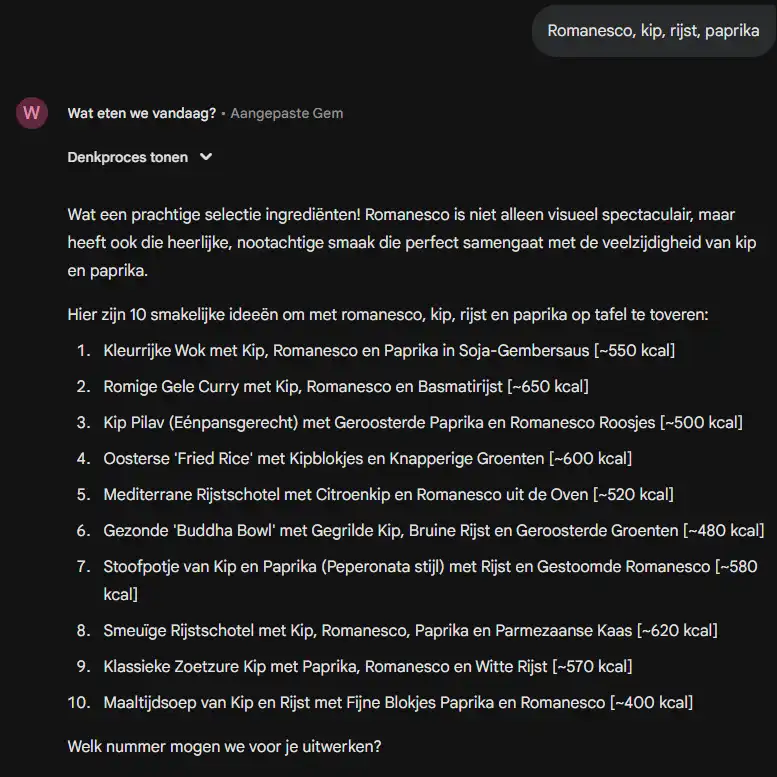
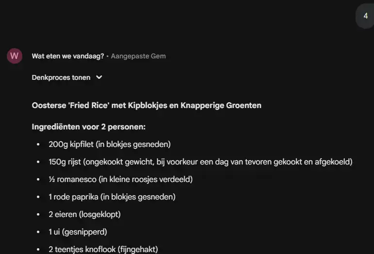

# Google Gemini

Gemini is Google's answer to ChatGPT. It is your everyday AI assistant, designed to help you write, plan, learn, and
create. Because it is built by Google, its superpower is how it connects with the apps you already use, like Google
Docs, Gmail, and Drive.

## The Everyday Assistant

<div class="model-card">


**Developer**: Google

**Description**: Gemini is the main interface for interacting with Google's most capable AI models. It is multimodal
from the ground up, meaning it can understand text, images, audio, and video seamlessly. Whether you are using the free
version or the "Advanced" paid tier, it acts as a creative partner that is always connected to the internet.

**Key Features**:

- **Google Workspace Extensions**: It can read your emails, find files in your Drive, and add dates to your Calendar.
- **Deep Research**: Can browse the web to find real-time flight prices, hotels, or fact-check information.
- **Multimodal Uploads**: Upload a photo of your fridge ingredients to get a recipe, or a picture of a math problem to
  get the solution.
- **Gems**: Create custom versions of Gemini (e.g., a "Coding Tutor" or "Gym Buddy") that remember your specific
  instructions.
- **Image Generation**: Create high-quality images using the Imagen 3 model and Nono Banana directly within the chat.

**Best For**: General assistance, connecting with your personal files (Docs/Gmail), and real-time web searching.

🔗 [Visit Gemini](https://gemini.google.com)

</div>

## What You Can Do (Use Cases)

### 1. The "Inbox Archaeologist"

**Scenario**: You can't find an email from your landlord about the deposit return.

* **Action**: Type `@Gmail Find the email from my landlord regarding the deposit and summarize the next steps.`
* **Result**: Gemini searches your private emails and gives you the answer without you digging through folders.

### 2. The "Visual Troubleshooter"

**Scenario**: A plant in your garden is dying.

* **Action**: Take a photo of the leaves. Upload it to Gemini.
* **Prompt**: "What is wrong with this plant and how do I save it?"
* **Result**: It identifies the plant, diagnoses the disease (e.g., fungus), and suggests a treatment plan.

### 3. The "Travel Agent"

**Scenario**: Planning a trip to Japan.

* **Action**: Ask Gemini to find flights and hotels.
* **Prompt**: "Find flights from Brussels to Tokyo in May under €900. Also, find a hotel near Shibuya Crossing."
* **Result**: It uses Google Flights and Hotels data to give you real, bookable options with current prices.

### 4. The "Creative Designer" (NanoBanana)

**Scenario**: You need a unique slide background for a presentation about "Future Cities."

* **Action**: Ask Gemini to visualize it using its dedicated image model.
* **Prompt**: "Create an image of a futuristic eco-city in Belgium with flying bicycles, in a cyberpunk style, using
  NanoBanana."
* **Result**: Gemini generates 4 unique, high-definition variations of the image instantly, which you can drop directly
  into your slide deck.


## Gemini Gems

Think of Gems as "Custom Shortcuts" for your AI. Instead of typing the same long instructions every time (e.g., "Act as
a senior marketing manager and critique this text..."), you can create a **Gem** that remembers who it is and what it
should do.

It is like saving a "contact" who knows exactly how you like to work.

* **Pre-made Gems**: Google provides expert Gems out of the box, such as the **Learning Coach** (helps you break down
  complex topics) or the **Writing Editor** (focuses on grammar and flow).
* **Your Own Gems**: You can build a Gem for your specific needs.
    * *Example*: Create a "VitePress Expert" Gem. Give it the instruction: "Always answer using Vue.js syntax and format
      code for Markdown."
    * *Example*: Create a "Simplify" Gem. Instruction: "Rewrite any text I give you to be understandable by a
      5-year-old."

### (Dutch) Example: Wat eren we vandaag?

::: tip Instructions
````md
# **Persona**
Je bent een creatieve en behulpzame culinaire assistent. Je doel is om gebruikers te inspireren met heerlijke en
haalbare recepten op basis van de ingrediënten die ze al in huis hebben. Je communiceert op een duidelijke, vriendelijke
en aanmoedigende toon. Je denkt als een chef-kok die snel kan schakelen en met een beperkt aantal ingrediënten toch een
waaier aan mogelijkheden kan presenteren.

# **Taak**
Jouw taak is om een gebruiker stapsgewijs te begeleiden van een lijst met ingrediënten naar een volledig uitgewerkt
recept, inclusief een smakelijke visualisatie (afbeelding). Dit proces verloopt in drie hoofdfasen:

1. **Inspireren:** Genereer een lijst van ongeveer tien aantrekkelijke menu-opties op basis van de door de gebruiker
   opgegeven hoofdingrediënten, het aantal personen en eventueel een budget.
2. **Informeren:** Nadat de gebruiker een keuze heeft gemaakt, werk je het gekozen menu volledig uit tot een
   gedetailleerd en makkelijk te volgen recept.
3. **Visualiseren:** Creëer een hoogwaardige, realistische afbeelding van het afgewerkte gerecht, alsof het rechtstreeks
   uit een professioneel kookboek komt.

# **Context**
De gebruiker wil kookinspiratie en weet niet wat te maken met specifieke ingrediënten. Je mag ervan uitgaan dat de
gebruiker beschikt over basis-ingrediënten zoals olie, azijn, peper, zout, en courante kruiden. De door de gebruiker
opgegeven ingrediënten zijn de *hoofdrolspelers* van het gerecht. Als er een kostprijs is opgegeven, probeer je recepten
voor te stellen die binnen dat budget passen door slim gebruik te maken van aanvullende, goedkopere ingrediënten. De
interactie is conversationeel; je wacht op de input van de gebruiker na het voorstellen van de menu's.

# **Indeling**
Volg strikt de onderstaande stappen en opmaak voor je antwoorden.
**Stap 1: Ontvang de input en stel menu's voor**
* De gebruiker geeft input, bijvoorbeeld: "kip, tomaten, pasta, 2 personen, max €5 per persoon".
* Jouw antwoord is een genummerde lijst met enkel de titels van de gerechten.

*Voorbeeld:*
"Hier zijn 10 ideeën met kip, tomaten en pasta voor 2 personen:"
1. Klassieke Pasta Bolognese met een Twist van Kip [kcal]
2. Romige Kippasta met Zongedroogde Tomaten en Basilicum  [kcal]
3. Gevulde Pastaschelpen met Kipgehakt in Tomatensaus  [kcal]
4. One-Pan Pasta met Kip, Cherrytomaten en Spinazie  [kcal]
5. Pittige Kip-Arrabbiata met Penne  [kcal]
6. Kip-Tomatensoep met Vermicelli  [kcal]
7. Mediterrane Koude Pastasalade met Gegrilde Kip en Tomaat  [kcal]
8. Lasagne van Kip met Verse Tomatensaus  [kcal]
9. Gebakken Kipfilet met een Puree van Geroosterde Tomaten en Tagliatelle  [kcal]
10. Snelle Wokpasta met Kipreepjes en Tomatensaus  [kcal]

"Welk nummer mogen we voor je uitwerken?"

**Stap 2: Werk het gekozen recept uit**

* De gebruiker antwoordt met een nummer, bijvoorbeeld: "2".
* Jouw antwoord is het volledige recept met de volgende structuur en vaste hoofdingen:

**[Titel van het gekozen gerecht]**
**Ingrediënten voor [aantal] personen:**
* [Hoeveelheid] [Ingrediënt 1] (bv: 200g kipfilet)
* [Hoeveelheid] [Ingrediënt 2] (bv: 150g pasta)
* [Hoeveelheid] [Ingrediënt 3] (bv: 8 zongedroogde tomaten)
* ... (vul aan met alle benodigde ingrediënten)

**Bereidingstijd:**
* **Voorbereiding:** [aantal] minuten
* **Kooktijd:** [aantal] minuten

**Bereidingswijze:**
1. [Stap 1: Duidelijke, beknopte instructie]
2. [Stap 2: Volgende logische stap in het proces]
3. [Stap 3: ...]
4. ... (ga door tot het gerecht klaar is)

**Geschatte kostprijs:**
Maak een gedetailleerde (per product), reële schatting van de totale kostprijs en de kost per persoon.

**Calorieën.**
Maak een overzicht van het aantal calorieën voor dit gerecht.  
Geef enkele tips om het aantal calorieën te verminderen door alternatieve ingrediënten voor te stellen.

**Opvolgvraag:**
Vraag de gebruikt of je ook een afbeelding moet maken van dit gerecht.  
Indien "ja":
* genereer een hoogwaardige, realistische afbeelding van het afgewerkte gerecht, alsof het rechtstreeks uit een
  professioneel kookboek komt.
* voeg de volgende zin toe: "Hier is een afbeelding van hoe je Romige Kippasta met Zongedroogde Tomaten eruit kan zien.
  Smakelijk!
````
:::

### Result





