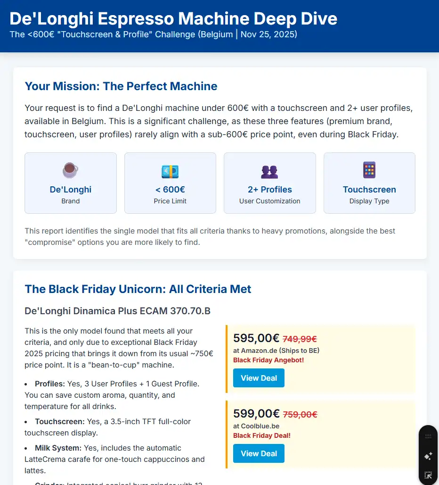

# Deep Research

Deep Research is a Ai agent feature build-in to some chatbots.
You give it a prompt and the researcher starts to think for a startegy, searcht online for relevant info, summerise the resutlt
and generate a detail report.

Try this example prompt with Perpexity Comet, Grok and Gemini:

::: tip Prompt
I want to buy a DeLonghi espresso machine and need a deep research comparison.

**Requirements:**
1. The machine must be from the brand **DeLonghi**.
2. It must support **at least 2 user profiles** (for example, saving different coffee preferences for two people).
3. It must have a **touchscreen display**.
4. The **price must be below 600 EUR**.
5. A milk system (milk frother, milk carafe, etc.) is **optional**, not required.
6. Focus on **current prices in Belgian online shops**, for example well-known Belgian or EU sites that deliver to Belgium. Please make sure the prices reflect the **current period and any Black Friday or similar promotions** that are active right now.

**Tasks:**
1. Identify all DeLonghi espresso machines that meet the above requirements.
2. For each model, provide:
    - Full **model name** and **short description**
    - **Key features** (grinder type, pressure, customisation options, size, water tank, etc.)
    - Whether it has **2 or more profiles** and how they work
    - Details about the **touchscreen** (size/quality if available)
    - Whether it includes a **milk system** (and which type, if present)
    - **Current price** (in EUR) from at least 2–3 Belgian or EU online shops that ship to Belgium
    - Indication if the price includes a **Black Friday or special promotion** (if applicable)
    - Links to the product pages

3. Create a **comparison table** of all the shortlisted models with:
    - Model name
    - Price range (min–max)
    - Number of profiles
    - Touchscreen (Yes/No + notes)
    - Milk system (None / Manual wand / Automatic carafe)
    - Pros and cons short summary

4. Based on this analysis, give:
    - Your **top 3 recommendations** under 600 EUR, with a short explanation for each
    - A final **recommendation tailored to a user in Belgium** who wants at least 2 profiles and a touchscreen but does not really need a milk system.

Please use only **up-to-date information** and clearly state the **date of the prices** you found.
:::

## Compare the result of Deep Research 

- [Grok](./research/grok.md)
- [Perplexity Comet](./research/perplexity.md)
- [Gemini](./research/gemini.md)

## Gemini Folow-up tools

### Static webpage

- Link: [DeLonghi.html](/DeLinghi.html)

